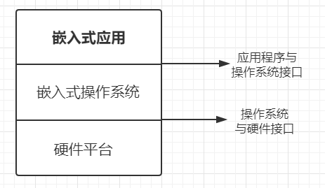
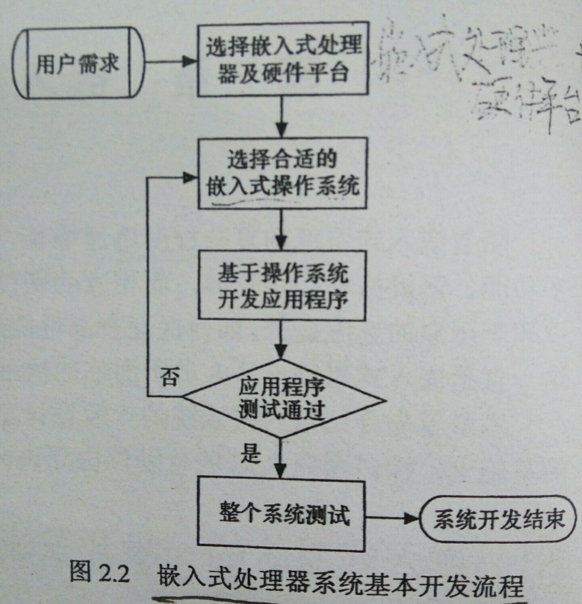
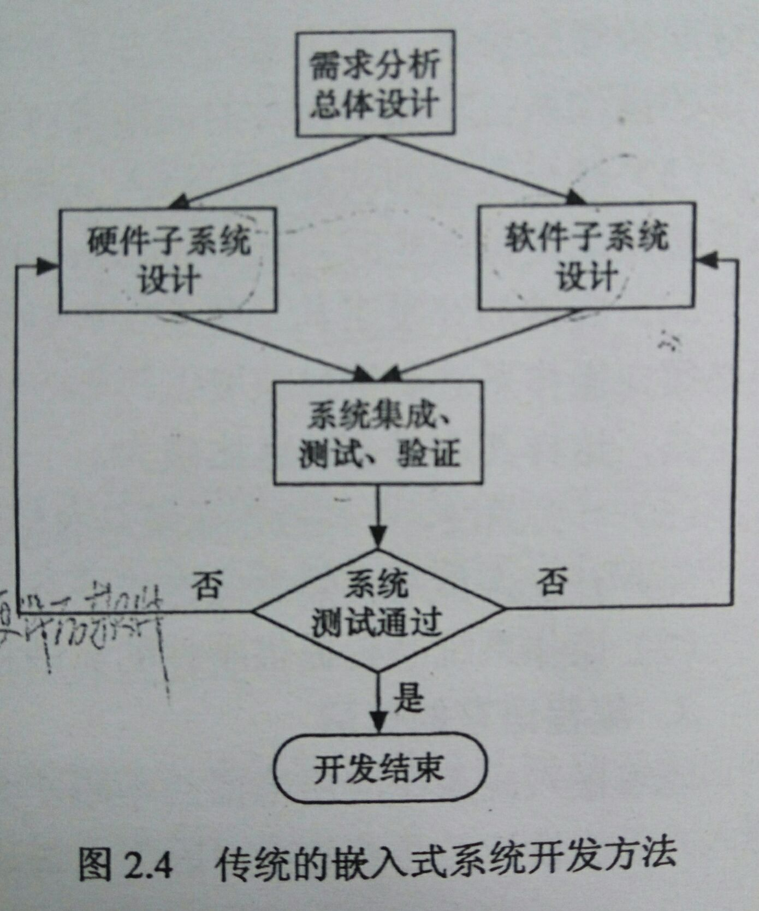
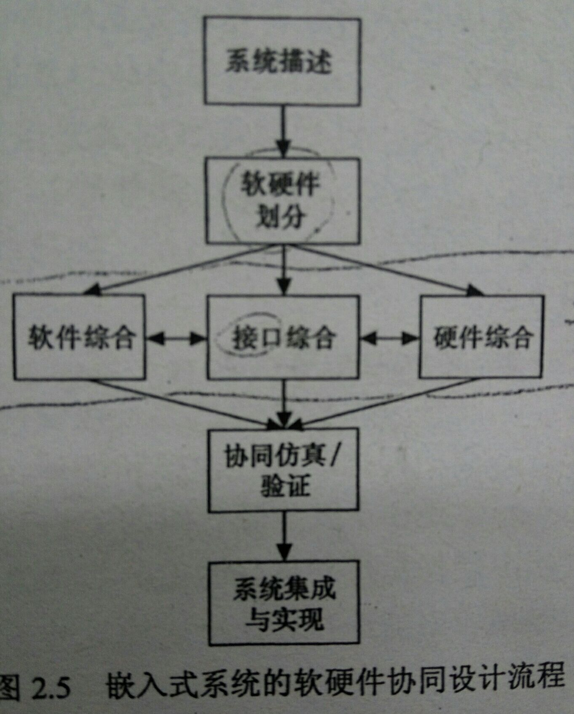
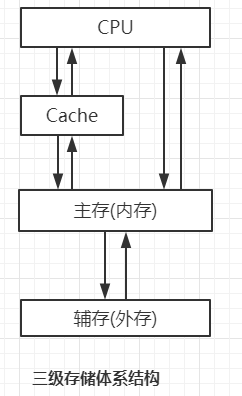
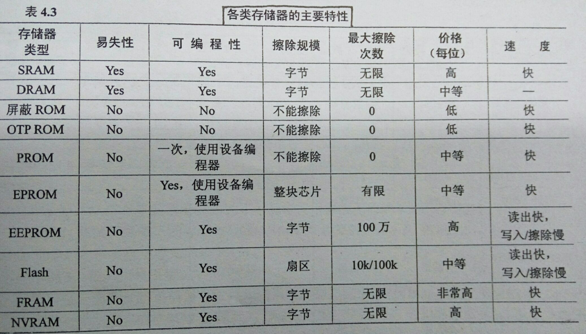

# 一、 简答题

##1. 第一章

- **嵌入式系统的定义**： 

  > 以应用为中心、以计算机技术为基础，软硬件可裁剪，对功能、可靠性、成本、体积、功耗和应用环境有特殊要求的专用计算机系统，由嵌入式处理器、外围硬件设备、嵌入式操作系统、用户应用程序组成

- **嵌入式系统特点**： 

  > - 低成本： 硬件成本、软件成本
  > - 低功耗
  > - 系统内核小
  > - 专用性强
  > - 不可垄断性
  > - 产品相对稳定性
  > - 实时性
  > - 实时系统： 硬实时系统、软实时系统
  > - 软件固化
  > - 专用开发工具
  > - 多种类型处理器和处理器体系结构
  > - ROM 中存放所有程序的目标代码

- **嵌入式系统特征**： 

  > - 实时性
  > - 技术密集
  > - 专用紧凑
  > - 安全可靠

- **嵌入式系统组成特点**： 

  > - 硬件以微处理器为核心（集成存储器和外围I/O设备）
  > - 软件包括：初始化代码及驱动、嵌入式操作系统RTOS(核心)、应用程序
  >
  > **硬件抽象层**把操作系统软件和硬件分隔开，从而提高了系统的可移植性

- **从嵌入式设计角度，嵌入式软件的运行模式**： 

  > 循环轮询、前后台、单处理器多任务、多处理器多任务

- **嵌入式软件的体系结构**： 

  > 驱动层、操作系统层、中间件层、应用层

- **嵌入式系统分类**： 

  > - 单个微处理器
  > - 不带计时功能的微处理器装置
  > - 带计时功能的组件
  > - 在制造或过程控制中使用的计算机系统

- **嵌入式系统的基本构成**： 

  > - 嵌入式处理器
  > - 外围硬件设备
  > - 嵌入式操作系统
  > - 用户应用程序
  >
  > 

- **嵌入式系统的应用领域**： 

  > - 工业控制
  > - 交通管理
  > - 信息家电

- **嵌入式系统发展趋势**： 

  > - 高可靠、高稳定性
  > - 运算速度快、开发周期短
  > - 支持多核处理
  > - 支持网络传输

## 2. 第二章

- **单片机系统与嵌入式处理器系统开发流程的比较**： 

  > 
  >
  > 

- **传统嵌入式系统设计方法**： 

  > - 首先进行**需求分析和总体设计**，将系统划分为硬件子系统和软件子系统
  > - 然后硬件工程师和软件工程师分别进行设计、开发、调试、测试
  > - 最后进行**软硬件集成**，并对集成的系统进行**测试**
  > - 如果系统功能正确，满足所有性能指标，则整个系统开发结束；否则对软硬件子系统进行重新验证、修改、再集成测试
  >
  > 

- **传统嵌入式系统设计缺点**： 

  > - 缺乏统一的软硬件协同表示方法
  > - 软件测试必须在硬件完成后进行
  > - 由于缺乏对软件构架和实现机制的了解，导致硬件设计的盲目性
  > - 不能对系统进行综合优化

- **传统嵌入式系统设计问题的原因**： 

  > 在设计初期未对软硬件进行统一描述，从而无法实现软件与硬件的优化和平衡

- **软硬件协同设计的基本过程**： 

  > - 系统描述
  > - 软硬件划分
  > - 协同综合
  > - 协同仿真与验证
  > - 系统集成与实现
  >
  > 

- **软硬件协同设计与传统设计的区别**： 

  > 在设计过程中始终将待设计的系统硬件与软件同时考虑与权衡，以利于系统的整体性能优化

- **常规软件测试的七个阶段**： 

  > - 单元或模块测试
  > - 集成测试
  > - 外部功能测试
  > - 回归测试
  > - 系统测试
  > - 验收测试
  > - 安装测试

- **嵌入式软件测试的四个阶段**： 

  > - 模块测试
  > - 集成测试
  > - 系统测试
  > - 软硬件集成测试

- **嵌入式软件测试技术**： 

  > - 白盒测试与黑盒测试
  > - 目标环境测试和宿主环境测试

- **嵌入式软件测试工具**： 

  > - 内存分析工具
  > - 性能分析工具
  > - GUI 测试工具
  > - 覆盖分析工具

- **嵌入式交叉开发环境包括**： 

  > **宿主机、目标机、物理连接、逻辑连接**
  >
  > 物理连接是连接方式： **并口、串口、以太网、USB**

## 3. 第三章

- **完整的计算机系统包括： 硬件系统和软件系统**

- **嵌入式系统的存储器结构中，寄存器组的存取速度最快**

- **嵌入式微处理器分类**： 

  > - 嵌入式微处理器 `MPC`
  > - 嵌入式微控制器 `MCU`
  > - 数字信号处理器 `DSP`
  > - 嵌入式片上系统 `SoC`

- **嵌入式处理器的技术指标**： 

  > 功能、字长、处理速度、工作温度、功耗、寻址能力、平均故障间隔时间、性能价格比

- **体系内核结构分类**：

  > - **冯*诺依曼结构**： 将数据和指令存放在同一存储器中
  > - **哈佛结构**： 将程序存储器与数据存储器分开，程序计数器只指向程序存储器

- **PowerPC 处理器体系结构的理解**： 

  > - 指令集体系结构： 构成了软件程序的基本组成部分
  > - 虚环境体系结构： 描述了软件程序须遵守的存储器模型的语义及定义了一些附加指令
  > - 操作环境体系结构： 描述了存储器管理结构，监控级寄存器和异常模型

- **FPGA 的结构资源**： 

  > - 硬件资源： 输入输出引脚资源、内部资源
  > - 软件资源： 设计输入工具、编译和综合工具、仿真工具
  > - IP 核资源： IP 核为可通过授权而应用的通用模块

- **SoC 设计方法学**： 

  > - 软硬件协同设计
  > - IP 核生成及复用技术
  > - 超声亚微米技术

- **多处理器常用架构：** 

  > - **对称多处理器 `SMP`**： 指在一个计算机上汇集一组处理器，各 CPU 之间共享内存子系统和总线结构
  > - **非对称多处理器  `AMP`**： 由主从处理器组成，主处理器是系统的核心，能运行操作系统；从处理器用来完成用户定义的指定功能

- **多处理器结构需考虑的问题**： 

  > - **节点通信方式**：基于共享内存访问方式、基于消息传递访问方式
  >
  > - **任务调度策略**： 静态调度、动态调度
  >
  > - **Cache 一致性问题**： 
  >
  >   > - 出现原因： 共享可写数据、进程迁移、I/O 传输
  >   > - 解决方法(两种协议机制)：监听协议、基于目录的协议 
  >
  > - **系统异构型问题**： 
  >
  >   > - 出现原因： 不同处理器的数据表示方法不同
  >   > - 解决方式： 将数据转换成公共格式

## 4. 第四章

- **存储体系结构**： 

  > **高速缓冲存储器(Cache)——主存——辅存**
  >
  > 
  >
  > - 主存： 存放需要执行的程序和处理的数据，由 DRAM 构成
  > - 外存： 存放需联机保存但暂不使用的程序与数据
  > - Cache： 解决 CPU 和主存之间的速度匹配问题，由 SRAM 构成

- **存储体系分层原因**： 

  > 是存储系统能提供更大的存储容量和更快的存取速度

- **主存(由 DRAM 构成)状态： 读写保持状态、刷新状态** 

- **寻主存址系统由存储地址寄存器 `MAR`、地址译码器、地址驱动器组成** 

- **地址译码方式**： 

  > - **单译码**： 地址译码器只有 1 个，用于小容量存储器
  > - **双译码**： 地址译码器分为 X 向和 Y 向 2 个译码器，用于大容量存储器

- 与外存相比，**内存的特点**： 容量小、速度快、成本高

- **主存读写过程**： 

  > 分为读出和写入过程：  **存储缓冲寄存器 `MBR`**
  >
  > - **读出**： 根据访存的读命令，借助读出线路将寻址确定的存储单元读出送 MBR，以供 I/O 或 CPU 使用
  > - **写入**： 先将写入数据送 MBR，依写命令，借助写入电路，将 MBR 内容写入由寻址确定的存储单元

- **Cache 的速度与 CPU 相匹配，容量与字长有关**

- **Cache 特点：** 

  > - **容量小**
  > - **组相联 Cache**： 提高命中率
  > - **分离 Cache**： 将 Cache 的数据与指令分离，具有更高指令与数据处理能力

- **映像规则**： 指出主存的块调入 Cache 时应存放的位置

- **降低 Cache 能耗的方法**： 

  > - 基于**模块分割**的方法
  > - 基于**路预测**的方法
  > - **添加一级小 Cache** 的方法
  > - **优化标识比较**的方法
  > - **动态可重构 Cache**

- **降低 Cache 能耗的作用**： 

  > Cache 作为 CPU 与主存之间的桥梁，消耗了大量能量，因此降低 Cache 能耗进而能降低嵌入式系统能耗，从而提高嵌入式系统性能

- **存储器主要功能**： 

  > 用来存放程序和数据

- **存储器性能指标**： 

  > - **存储容量**： 存储器所能容纳的二进制信息总量
  > - **存取速度**： 平均访存时间(`AMAT`) 衡量
  > - **价格**： 指存储单元本身和外围电路的总价格
  > - **功耗**： 指每个存储单元所消耗的功率

- **存储器分类**： 

  > - **按作用分**： 高速缓冲存储器、主存储器、辅助存储器、其他功能存储器
  > - **按存取方式分**： 随机存取存储器 `RAM`、只读存储器 `ROM`、顺序存取存储器 `SAM`、直接存取存储器 `DAM`
  > - **按存储介质分**： 磁芯存储器、半导体存储器、磁表面存储器、光存储器、铁电存储器
  > - **按信息可保存性分**： 易失性存储器和非易失性存储器、破坏性读出存储器和非破坏性读出存储器

- **静态 RAM(`SRAM`)** 靠**双稳态触发器**来保存信息，**动态 RAM(`DRAM`)** 靠 **MOS 电容存储电荷**来保存信息

  > **动态 RAM 和静态 RAM 都是不易失性半导体存储器**

- **DRAM 的刷新方式： 集中刷新、分散刷新、异步刷新**

- **DRAM 刷新原因**： 由于漏电阻存在，需周期性充电，以补充泄露电荷

- **刷新**是 DRAM 与 SRAM 的明显区别标志

- **刷新周期**： 每次刷新一行所需时间

- **存取相关概念**： 

  > - **存取时间**： 指从启动一次存储器操作到完成该操作所经历的时间
  > - **存取周期**： 指存储器进行一次完整的读写操作所需的全部时间，即连续两次访问存储器操作之间所需的最短时间间隔
  > - **存取速度**： 存取周期的倒数，表示在单位时间内能读写存储器的最大次数

- **存储相关概念**： 

  > - **存储单元**： 指存放 1 个 机器字的所在存储元集合
  > - **存储单元地址**：存储单元所对应的地址
  > - **存储元件(存储基元、存储元)**： 存储一位二进制信息的物理元件，是存储器中最小的存储单位，不能单独存取
  > - **存储字**： 一个存储单元所存二进制代码的**逻辑单位**
  > - **存储字长**： 一个存储单元所存二进制代码的**位数**
  > - **存储容量**： 存储器中可存二进制代码的总量
  > - **机器字长**： CPU能同时处理的数据位数
  > - **指令字长**： 一条指令的二进制代码位数
  >
  > 存储体由存储单元组成
  >
  > 每个存储单元又包含若干个存储元件
  >
  > 每个存储元件能寄存一位二进制代码 “0”或“1”

- **存储器相关概念**： 

  > - 掩膜式 ROM： `MROM`
  > - 一次可编程 ROM： `PROM`
  > - 光擦除电可编程 ROM： `EPROM`
  > - 电擦除电可编程 ROM： $E^2PROM$
  > - 闪存 `flash`

##5. 第五章

- **CAN 总线的最大通信速率为 6 MB** 

- **对一个设备操作之前需完成的几步**： 

  > 安装驱动、初始化设备、打开一个设备并得到文件描述符

- **块设备以块为单位传输数据，字符设备以字符为单位传输数据**

## 6. 第六章

- **操作系统**： 

  > 是连接硬件与应用程序的系统程序
  >
  > **基本功能**： **进程管理、内存管理、中断管理、I/O 资源管理**

- **嵌入式操作系统定义**： 

  > 是一种支持嵌入式系统应用的操作系统软件，负责嵌入式系统的全部软硬件资源的分配和调度工作，控制协调并发活动

- **嵌入式操作系统的发展历程**： 

  > - 第一阶段： 无操作系统的嵌入式算法阶段
  > - 第二阶段： 简单监控式的实时操作系统阶段
  > - 第三阶段： 通用的嵌入式实时操作系统阶段

- **嵌入式操作系统的特征**： 

  > 小巧、实时性、可装卸、固化代码、弱交互性、强稳定性、统一的接口

- **嵌入式系统的组成部分**：

  > 硬件层、BSP、RTOS、文件系统、GUI、应用软件

- **实时操作系统定义**： 

  > 指具有实时性能支持实时控制系统工作的操作系统

- **实时操作系统的设计原则**： 

  > 尽量缩短系统的平均响应时间并提高系统的吞吐率，在单位时间内为尽可能多的用户请求提供服务

- **实时操作系统应具有的功能**： 

  > 多任务可抢占、任务具有优先级、支持可预测的任务同步机制、支持多任务间的通信、支持消除优先级转置的=机制、存储器优化管理、实时时钟服务、中断管理服务

- **实时操作系统的基本特征**： 

  > 任务、任务切换、消息和邮箱、信号量、存储区分配、中断和资源管理

- **实时操作系统评价指标**： 

  > 任务调度算法、内存管理和最小内存开销、确定性、最大中断禁止时间、任务切换时间

- **嵌入式实时操作系统**： 

  > 是将嵌入式和实时性相结合的产物

- **嵌入式实时操作系统的特点**： 

  > - 响应时间快，且有确定的硬实时性要求
  > - 具有异步处理并发事件能力
  > - 具有快速启动、出错处理、自动复位功能
  > - 应用软件与操作系统是一体化设计
  > - 使用交叉开发环境

- **嵌入式实时操作系统的基本模块**： 

  > 初始化管理、任务管理、时间管理、定时管理、中断管理、任务间的通信/同步/互斥管理、内存管理

- **嵌入式实时操作系统的性能指标**： 

  > 中断延迟时间、任务上下文切换时间、任务响应时间、任务创建/删除时间、交替信号量时间、取得/释放信号量时间、交替消息队列传输时间

- **嵌入式实时操作系统的功能**：

  > 提高了系统可靠性、提高了开发效率且缩短了开发周期、充分发挥了 32 位 CPU 的多任务潜力

- **嵌入式实时操作系统的发展趋势**： 

  > - 向实时超微内核开放发展
  > - 向开放的、集成化的方向发展

- **目前使用的嵌入式操作系统有**： 

  > VxWorks、QNX、Nucleus PLUS、uC/OS、WinCE、uCLinux、Palm OS

- **QNX 实时操作系统的微内核结构的优点**： 

  > 各模块独立、驱动等在应用程序空间、OS 功能模块可动态加载/卸载

- **Dos 属于顺序执行操作系统，Unix 属于分时操作系统，VxWorks 属于嵌入式实时操作系统**

# 二、英文缩写

| 缩写   | 全称                                                | 含义                     |
| ------ | --------------------------------------------------- | ------------------------ |
| MCU    | Microcontroller Unit                                | 微控制器                 |
| MPU    | Micro Processing Unit                               | 微处理器                 |
| EOS    | Embedded Operation System                           | 嵌入式操作系统           |
| RTOS   | Real Time Operation System                          | 实时操作系统             |
| WDT    | Watch Dog Timer                                     | 看门狗定时器             |
| DSP    | Digital Signal Processor                            | 数字信号处理器           |
| SoC    | System On Chip                                      | 片上系统                 |
| SoPC   | System on a Programmable Chip                       | 片上可编程系统           |
| IDE    | Integrated Development Environment                  | 集成开发环境             |
| ICE    | In-Circuit Emulator                                 | 在线仿真器               |
| ICD    | In-Circuit Debugger                                 | 在线调试器               |
| OCD    | On-Chip Debugger                                    | 片上调试器               |
| CSC    | Contactless Smartcard                               | 无接触智能卡             |
| BSP    | Board Surport Package                               | 板级支持包               |
| API    | Application Programming Interface                   | 应用程序编程接口         |
| SCM    | Single Chip Microcomputer                           | 单片微型计算机           |
| UML    | Unified Modeling Language                           | 可视化建模语言           |
| IP     | Intellectual Property                               | 知识产权                 |
| RISC   | Reduced Instruction Set Computer                    | 精简指令集系统           |
| CISC   | Complex Instruction Set Computer                    | 复杂指令集系统           |
| ISA    | Instruction System Architecture                     | 指令系统结构             |
| CPI    | Cyclers Per Instruction                             | 每条指令周期数           |
| IC     | Integrated Circuit                                  | 集成电路                 |
| ASIC   | Application Specific Integrated Circuit             | 专用集成电路             |
| FPGA   | Field Programmable Gate Array                       | 现场可编程门阵列         |
| CPLD   | Complex Programmable Logic Device                   | 复杂可编程逻辑器件       |
| SMP    | Symmetric Multiprocessing                           | 对称多处理器             |
| AMP    | Asymmetric Multiprocessing                          | 非对称多处理器           |
| ARB    | Architecture Review Board                           | 结构审议委员会           |
| AMAT   | Average Memory-Access Time                          | 平均访存时间             |
| MTBF   | Mean Time Between Failures                          | 平均故障间隔时间         |
| ROM    | Read-Only Memory                                    | 只读存储器               |
| RAM    | Random Access Memory                                | 随机存取存储器           |
| SAM    | Seguential Access Memory                            | 顺序存取存储器           |
| DAM    | Direct Access Memory                                | 直接存取存储器           |
| SRAM   | Static Random Access Memory                         | 静态随机存取存储器       |
| DRAM   | Dynamic Random Access Memory                        | 动态随机存取存储器       |
| PROM   | One Time Programmable ROM                           | 一次可编程只读存储器     |
| EPROM  | Erasable Programmable Read Only Memory              | 可擦除可编程只读存储器   |
| EEPROM | Electrically Erasable Programmable Read Only Memory | 带电可擦可编程只读存储器 |
| SIMM   | Single Inline Memory Modules                        | 单列直插存储模块         |
| DIMM   | Dual Inline Memory Modules                          | 双列直插存储模块         |
| JTAG   | Join Test Active Group                              | 联合测试活动组           |
| FIQ    | Fast Interrupt Request                              | 快速中断模式             |
| CMP    | Chi Multi-Processor                                 | 多核处理器               |
| LCD    | Liquied Crystal Display                             | 液晶屏幕显示器           |
| LED    | Light-Emitting-Diode                                | 发光二极管               |
| $I^2C$ | Inter-Integrated Circuit                            | 集成电路总线             |
| $I^2S$ | Inter-IC Sound                                      | 集成电路内置音频总线     |
| CAN    | Controller Area Network                             | 控制器局域网络           |
| SDL    | Serial Data Line                                    | 串行数据线               |
| EIA    | Electronic Indurstries Association                  | 电子工业协会             |
| USB    | Universal Serial  Bus                               | 通用串行总线             |
| GPRS   | General Packet Radio System                         | 通用分组无线业务         |
| CDMA   | Code Division Multiple Access                       | 码分多址                 |
| DMA    | Direct Memory Access                                | 直接内存访问             |