#一、绪论

- ==数字图像==： 当坐标 x,y 和灰度值 f 是有限离散值时的图像

  > **灰度(强度)**： 在空间 (x,y) 任何一点的幅度值 f
  >
  > - **低级处理**： 以输入、输出都是图像为特征，如： 降噪、对比度增强、图像尖锐化
  > - **中级处理**： 以输入为图像，输出是从图像中提取的特征为特点、如： 图像分割、减少目标物
  > - **高级处理**： 涉及“理解”已识别目标的总体，以及在连续统一体的远端执行与视觉相关的认知功能

- ==数字图像处理==： 指借助于数字计算机来实现图像之间的变换以改善图像的视觉效果

- **图像分析**： 对图像中感兴趣的目标进行分割，纹理、形状等特征进行提取、检测和测量，以获得其客观信息，从而建立对图像的描述

- **图像理解**： 在图像分析基础上，进一步研究图像中各目标的性质及其联系，并得出对图像内容含义的理解以及对原来客观场景的解释，从而指导决策

- **图像工程**： 将光学、数学、心理学、计算机等学科的原理应用于图像相关工业领域，是图像处理技术与图像处理经验结合发展起来的

- **图像信息**： 符号信息、景物信息、情绪信息

- ==数字图像处理的主要内容==： 图像变换、图像增强、图像恢复、图像分割、形态学图像处理、图像编码与压缩

- ==图像处理的基本过程==： 

  - **图像获取**：对图像预处理

  - **图像增强**：以对问题的主观判断，对图像进行操作，使得图片比原始图像更适合处理

  - **图像复原**：改进图像外观，与图像增强相比，图像复原指的是客观处理图像

  - **小波变换和多分辨率处理**：以不同的分辨率来描述图像

  - **图像分割**：将一幅图像划分为其他组成部分或目标

- ==图像处理的相关硬件设备==： 

  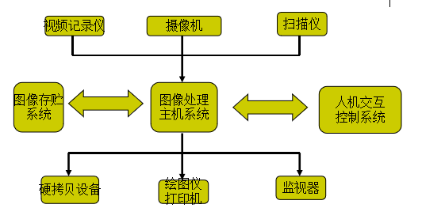

#二、数字图像基础

##1. 基本概念

- ==亮度函数==： 一种确定的表征图像特征的方法

  > - 一般表达式： $I = f(x, y, z, \lambda, t)$ 
  >
  > - 平面二维单色图像亮度函数： $I = f(x,y) = i(x, y) * r(x,y)$ 
  >
  >   > - $i(x, y)$： 为==入射分量==，即**入射到被观察场景的光源照射总量**，其性质取决于照射源
  >   > - $r(x, y)$： 为==反射分量==，即**场景中物体所反射的光照总量**，其性质取决于成像物体的特征

- **分辨率**： 
  - ==图像(空间)分辨率==： 图像中可分辨的最小细节，指对原始图像的采样分辨率，单位“象素点/单位长度”
  - ==采样分辨率==： 单位长度上所包含的采样数
  - ==灰度分辨率==： 灰度级中可分辨的最小变化

- ==图像深度==： 在位图图像中，表示各象素点亮度或色彩信息的二进制位数

- **图像数据量**： 象素点数目与象素点所需字节数的乘积

- **空间频率**： 指视像空间变化的快慢

- 数字化坐标轴称为取样，数字化幅度值称为量化

- ==灰度级==：典型取值是 2 的整数次幂，通常假设离散灰度级等间隔且是区间 [0,L-1] 内的整数

- ==k bit 图像==： 一副有 $2^k$ 灰度级的图像

- ==动态范围==：灰度级取值范围

  > - **高动态范围图像**： 占有灰度级全部有效段的图像
  >
  >   > 当多个象素呈现该特征时，图像就有较高的对比度
  >
  > - **对比度**： 图像中最高和最低灰度级间的灰度差

- **图像的运算**： 

  - ==点运算==： 指像素的逐点运算，如： 对比度增强、对比度拉伸、灰度变换 

    

  - ==代数运算==： 是图像之间点对点的运算

    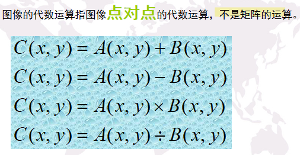

  - ==几何运算==： 涉及到空间位置变化，和灰度插值

    > - ==最邻近插值(零阶插值)==：  令输出像素的灰度值等于离它所映射到的位置最近的输入像素的灰度值
    >
    >   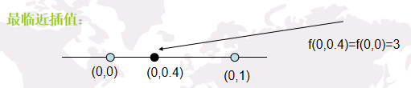
    >
    > - ==线性插值==： 通过在同一直线上的 2 个点去估计给定点的灰度值
    >
    >   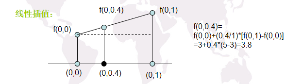
    >
    > - ==双线性插值==： 通过 4 个邻近点去估计给定位置的灰度值
    >
    >   > 赋值公式： $f(x, y) = ax + by + cxy + d,\,\,\,\, f(x,y)$ 表示灰度值，4 个系数由 4 个临近点组成的未知方程确定
    >   >
    >   > 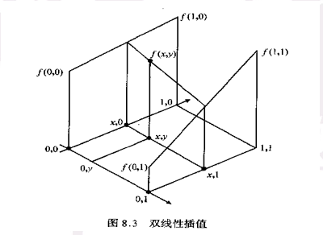
    >
    > - **双三次插值**： 包括 16 个最近邻点，商业图像编辑程序的标准内插法

- ==马赫带效应==： 视觉的主观感受在亮度有变化的地方出现虚幻明亮或黑暗的条纹

  > 人类的视觉系统有增强边缘对比度的机制

- ==同时对比度==： 当物体对背景的亮度、对比度保持一致时，即使物体和背景的亮度在很大的范围里变化，人眼对亮度的感觉仍保持不变

- ==空间频率特征==： 指视像空间变化的快慢，清晰图像表明有大量的高频成分，模糊图像只有低频空间成分

## 2. 数学工具

- **阵列与矩阵操作**： ==P41==
- **线性操作和非线性操作**
- **算术操作**： ==P43 2.6-3==
- **集合和逻辑操作**
- **空间操作**： 单像素操作、邻域操作、几何空间变换、图像配准
- **向量与矩阵操作**： 多光谱图像处理
- **图像变换**
- **概率方法**

#三、灰度映射变换

- **灰度变换**： 将一个灰度区间映射到另一个灰度区间的变换

  > - **目的**： 可使图像动态范围加大、图像对比度扩展、图像清晰、特征明显，是图像增强的重要手段
  >
  > - **方式**： s 与 r 分别代表处理前后的像素值
  >   - 图像反转： $s = L - r -1$
  >   - 对数变换： $s = c * log(1 + r)$  
  >   - 幂律(伽马)变换： $s = c * (r + \varepsilon)^{\gamma}, \,\, \varepsilon$ 为偏移量 
  >   - 分段线性变换： 对比度拉伸、灰度级分层、比特平面分层

- ==灰度直方图==： 关于灰度级分布的函数，是对图像中灰度级分布的统计

  表示图像中具有某种灰度级的像素的个数，反映了图像中某种灰度出现的频率

  > **三条性质**： 
  >
  > - 灰度直方图只能反映图像的灰度分布情况，不能反映图像像素的位置
  > - 一幅图像对应唯一的灰度直方图，但不同图像可对应相同直方图
  > - 若一幅直方图分成若干区域，则这些区域的直方图之和即为原图像直方图

- ==累计直方图==： 图像组成成分在灰度级的累计概率分布情况，每一个概率值代表小于等于此灰度值的概率 

- ==幅度的密度函数==： 

- ==幅度分布函数==： 

- ==图像幅值信息量(熵)==： 表征一幅图像含有的信息量有多少

  > - **信息量公式**： $H = - \sum_{i = 1}^k p_i log_2(p_i)$，其中 k 为图像灰度级别个数，p(i) 为各灰度级别出现概率
  >
  > - 特点： 当图像中的各个灰度级别出现的概率相等时，图像的熵值最大

- **图像直方图的特点**：  

  - **暗图像**的直方图： 分量集中在**灰度级的低端**
  - **亮图像**的直方图： 分量集中在**灰度级的高端**
  - **低对比度**图像的直方图： 分量**较窄**且集中在**灰度级的中部**
  - **高对比度**图像的直方图： 分量覆盖的灰度级**范围很宽**且**分布均匀**

- ==直方图均衡化==： 对图像中像素个数多的灰度级进行展宽，而对像素个数少的灰度级进行缩减，从而达到清晰图像的目的 

  > **基本原理**： 把原始图像的灰度分布直方图变换为均匀分布的形式，扩大像素灰度值的动态范围，从而增强图像对比度
  >
  > **映射函数需要满足的条件**： 
  >
  > - 映射函数单调递增
  >
  > - 映射函数值域不超过原始图像灰度的动态范围
  >
  >
  >
  > **例题**： 设有 k bit 图像 f 做直方图均衡化后得到图像 g，以 k=8 为例：
  >
  > 1. 求出原图 f 的灰度直方图，设为 h，h 为一个 $2^k$ 维的向量
  >
  >    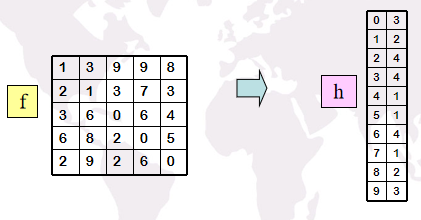
  >
  > 2. 求出图像f的总体像素个数 $N_f=m*n$ （m,n分别为图像的长和宽）
  >    计算各灰度级像素所占百分比： $hs(i)=h(i)/N_f    (i=0,1,…,255)$ 
  >
  >    
  >
  > 1. 计算图像各灰度级的累计分布 hp： $hp(i) = \sum_{k = 0}^i hs(k), i = 1,2,..,2^{k - 1}$  
  >
  >    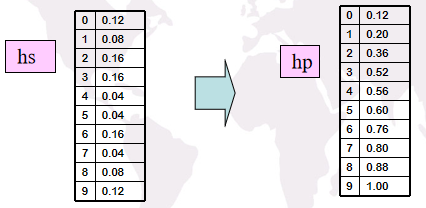 
  >
  > 1. 求出新图像 g 的灰度值： $g = (2^k - 1) * hp(i), i = 0,1,...,255$ 
  >
  >    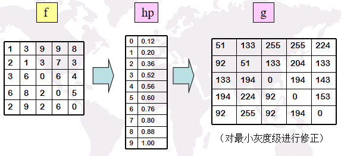

- ==直方图匹配(规定化)==：  用于产生处理后有特殊直方图的方法 

# 四、线性运算与空间图像增强

##1. 线性系统

- ==线性系统==性质： 

  - **叠加原理**： 如果输入信号是两个序列之和，则输出信号也为两个对应的输出信号之和

    > 即：若 $y_1 = T[x_1]，y_2 = T[x_2]$，则有 $y_1+y_2=T[x_1]+T[x_2] = T[x_1 + x_2]$ 

  - **齐次原理**：如果 y = T[x]，则有 $ay = T[ax] = aT[x]$ 

  > 综上，线性系统对于所有输入信号 x1，x2 以及所有复常数 a、b，皆有 $ay_1 + by_2 = T[ax_1 + bx_2]$ 
  >
  > 即，线性系统对于输入信号的加权和的响应等于单个输入信号响应的加权和

- ==移不变系统==： 指如果输入序列进行移位，则输出序列进行相应的移位

- ==线性移不变系统==： 具有移不变系统的线性系统

##2. 卷积

==卷积== 

- **定义**： $\int_{- \infty}^{+\infty} h(t - \iota) f(\iota) {\rm d} \iota$ 

  > - h(t) 是表征线性移不变系统特性的一个函数，叫做冲击响应
  >
  > - 冲击响应： 指系统的输入是单位冲击时得到的输出
  > - 线性移不变系统的输出可以通过输入信号与该系统的冲击响应的卷积得到

- **卷积步骤**： 

  - **折迭**：把 $h(\iota)$ 相对纵轴作出其镜像
  - **位移**：把 $h(- \iota)$ 移动一个 t 值
  - **相乘**：将位移后的函数 $h(t- \iota)$ 乘以  $f(\iota)$  
  - **积分**：$h(t-  \iota )$ 和 $f( \iota )$ 乘积曲线下的面积即为 t 时刻的卷积值

  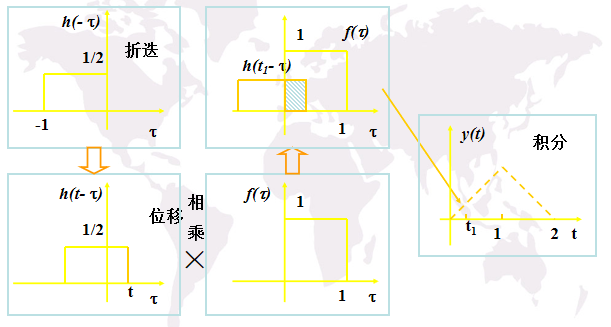 

## 3. 图像平滑

- ==图像平滑==： 在空域图像平滑处理中，采取**邻域累积**的方式平滑图像

- **距离： **

  - **欧氏距离**： 在m维空间中两个点之间的真实距离
  - **街区距离**： p 和 q 间的距离 $D_4 = | x - s | + | y - t |$ 
  - **棋盘距离**： p 和 q 间的距离 $D_8（p,q) = max(|x-s|,|y-t|)$ 

- **掩模**：是一个对图像局部进行操作的小矩阵，其数值是系数，不同的掩模往往决定图像处理的效果

  > 掩模，又称为模板，窗口，核，滤波器等 

- **图像平滑处理前后的图像变化**： 在消除孤立噪声的同时，模糊了图像的边缘

###1. 均值滤波

- **均值滤波**： 指在图像上给定一个包括其周围邻近像素的模板，将模板中的全体像素的均值来替代原来的像素值的方法

  > - **优点**： 抑制噪声有抑制作用
  > - **缺点**： 会使图像变得模糊

  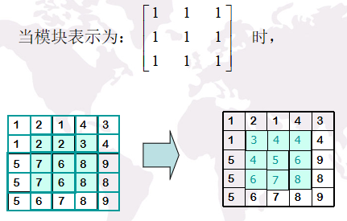

### 2. 中值滤波

- **中值滤波**： 对模板中的像素值由小到大排列，并取这个模板中灰度的中值

  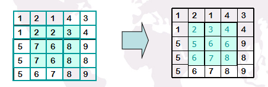

- **中点滤波**： 最高值与最低值的平均

##4. 图像锐化

- ==图像锐化==： 加强图像中景物的边缘和轮廓，即突出灰度的过渡部分，可使用灰度差分提取

### 1. 梯度算法

- **Roberts 梯度算法(交叉微分算法)**：  $G(i，j) = | f(i + 1,j + 1) - f(i,j) | + | f(i + 1,j) - f(i,j + 1) |$ 

### 2. 锐化算法

- 公式： $g(i,j) = [ d_x^2 (i,j) + d_y^2(i,j) ]^{1/2}$  

- **Sobel 锐化算法**： 

  $d_x = \begin{bmatrix} -1 & 0 & 1 \\ -2 & 0 & 2 \\  -1 & 0 & 1 \end{bmatrix} $ $d_y = \begin{bmatrix} -1 & -2 & -1 \\ 0 & 0 & 0 \\  1 & 2 & 1 \end{bmatrix} $ 

  实例： 

  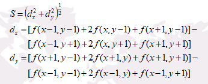

- **Priwitt 锐化算法**： 

  $d_x = \begin{bmatrix} -1 & 0 & 1 \\ -1 & 0 & 1 \\  -1 & 0 & 1 \end{bmatrix} $ $d_y = \begin{bmatrix} -1 & -1 & -1 \\ 0 & 0 & 0 \\  1 & 1 & 1 \end{bmatrix} $ 

### 3. 拉普拉斯算子

- 拉普拉斯算子定义： 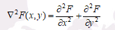 
- 数字图像的简化： $G(x,y) = 4F(x,y) - F(x + 1,y) - F(x - 1,y) - F(x,y + 1) - F(x,y - 1)$ 

**图像锐化与图像平滑的区别与联系**： 

- **区别**： 

  图像锐化用于增强图像边缘，导致高频分量增强，会使图像清晰

  图像平滑用于消除图像噪声，但也容易引起边缘模糊

- **联系**： 都属于空间图像增强，改善图像效果

# 五、傅里叶变换

##1. 概念
- ==积分变换==： $F(s) = T[f(t)] = \int_a^b k(s,t) f(t) dt$ 称 F(s) 为 f(t) 的有限积分变换， k(s,t) 是积分变换的核

- **傅里叶级数三角形式**： $f_T(t) = \frac{a_0}{2} + \sum_{n=1}^{+ \infty} (a_n \cos nw_0t + b_n\sin nw_0t)$ 

  其中： $w_0 = \frac{2 \pi}{T}$，$a_n = \frac 2 T \int_{- \frac T 2}^{\frac T 2} f_T(t) \cos nw_0t \,{\rm d}x$，$b_n = \frac 2 T \int_{- \frac T 2}^{\frac T 2} f_T(t) \sin nw_0t \,{\rm d}x$

  ​	     $\cos nw_0t = \frac 1 2 (e^{j n w_0 t + e^{-j n w_0 t}})$ ，$\sin nw_0t = \frac j 2 (e^{-j n w_0 t - e^{j n w_0 t}})$  

- **傅里叶级数复指数形式**： $f_T(t) = \sum_{n = - \infty}^{+\infty} c_n e^{j n w_0 t}$，其中： $c_n = \frac1 T \int_{- \frac T 2}^{\frac T 2} f_T(t) e^{-j n w_0 t} dt$ 

- ==傅里叶积分公式==： $f(t) = \frac 1 {2 \pi} \int_{- \infty}^{+ \infty} [ \int_{- \infty}^{+ \infty} f(\iota) e^{-j w \iota} d \iota ] e^{jwt} dw$ 

- ==傅里叶变换对==： $F(w) = \int_{- \infty}^{+ \infty} f(t) e^{-j w t} dt$ 与 $f(t) = \frac1 {2 \pi} \int_{- \infty}^{+ \infty} F(w) e^{jwt} dw$ 

- ==傅立叶振幅谱==： $|F(w)| = \sqrt{R^2(w) + I^2(w)}$ 

- ==傅立叶相位谱==： $\phi(w) = arctg \frac{I(w)}{R(w)}$  

- ==傅立叶能量谱==： $E(w) = | F(w) |^2 = | R^2(w) + I^2(w) |$  

##2. 性质

- 傅里叶性质： 
  1. 可分性： $F(u,v) = F_u \{ F_v [ f(x,y) ] \}$ 
  2. 线性性： $F[ a_1 f_1(x,y) + a_2 f_2(x,y) ] = a_1 F[f_1(x,y)] + a_2 F[f_2(x,y)]$ 
  3. 共轭对称性： $F^*(-u,-v)$ 是 $f(-x,-y)$ 的傅里叶变换的共轭函数，则有 $F^*(-u,-v) = F(u,v)$ 
  4. 旋转不变性： 在空间域函数旋转角度为 $\theta _0$ 内， $f(r,\theta + \theta _0) \iff F(k,\phi + \theta_0)$ 
  5. 位移性：  $f(t - t_0) \iff F(w) e^{-j w t_0}$ 与 $F(w - w_0) \iff f(t) e^{j w_0 t}$ 
  6. Parseval 等式： $\int_{- \infty}^{+ \infty} f^2(t) dt = \frac 1 {2 \pi} \int_{- \infty}^{+ \infty} | F(w) |^2 dw$ 

- ==卷积定义==： $f_1(t) * f_2(t) = \int_{- \infty}^{+ \infty}f_1(\iota)f_2(t - \iota) d \iota $ 
- ==卷积定理==： $\zeta[ f_1(t) * f_2(t) ] = F_1(w) F_2(w)$ 与 $\zeta[ f_1(t) f_2(t) ] = \frac 1 {2 \pi} F_1(w) * F_2(w)$ 

# 六、频域图像增强

- ==图像增强==： 除去图象中的噪声，使边缘清晰，突出图象中的某些性质等
- **图像增强目的**： 改进图象的质量，达到赏心悦目的效果

**频域图像增强的步骤**：

- 计算需增强图像的**傅立叶变换**
- 将其结果**与转移函数H(u,v)相乘**
- 再将结果**傅立叶逆变换**以得到图像增强

通用的频域图像增强方法：①低通滤波；②高通滤波；③带通或带阻滤波；④同态滤波

**频域滤波的原理**： 

- 先对原图像 f(x,y) 进行傅里叶变换，将图像从空域变换到频域，获得频域图像 F(u,v)
- 然后用滤波器 H(u,v) 和 F(u,v) 相乘，改变原图像的频谱成分
- 对改变后的频谱图像进行傅里叶逆变换，将图像从频域变换为空域，获得滤波后的图像

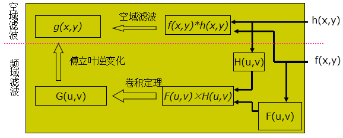

**按增强的作用域分类**： 

- **空间图像增强**： 直接对图像像素灰度进行操作
- **频率图像增强**： 对图像经傅里叶变换后的频谱成分进行操作，然后经傅里叶逆变换获得所需结果

##1. 低通滤波

- **理想低通滤波 ILPF**： $H(u,v) = \begin{cases} 1,  & \text D(u,v) <= D_0 \\ 0, & \text D(u,v) > D_0  \end{cases}$，其中 $D(u,v) = \sqrt{u^2 + v^2}$，$D_0$ 为截止频率

- **巴特沃思低通滤波 BLPF**： $H(u,v) = \frac 1 {1 + [ \frac {D(u,v)} {D_0} ] ^{2n}}$

  >  和理想圆形低通滤波器相比： 
  >
  > - 没有明显的跳跃
  > - 模糊程度减少

- **指数低通滤波器 ELPF**： $H(u,v) = e^{ln \frac 1 {\sqrt2} [ \frac {D(u,v)} {D_0} ] ^{2n} }$ 

  > - 有更加平滑的过渡带，平滑后的图象没有跳跃现象
  > - 与 BLPF 相比，衰减更快，经过 ELPF 滤波的图象比 BLPF 处理的图象更模糊一些

- **梯形低通滤波器 TLPF**： $H(u,v) = \begin{cases} 1 &\text D(u,v) < D_0 \\ \frac{D(u,v) - D_1}{D_0 - D_1} &\text D_0 <= D(u,v) <= D_1 \\ 0 &\text D(u,v) >D_1 \end{cases}$  

**四种低通滤波器的比较**： 

| 类别 | 振动程度 | 图像模糊程度 | 噪声平滑效果 |
| :--: | :------: | :----------: | :----------: |
| ILPF |   严重   |     严重     |     最好     |
| TLPF |   较轻   |      轻      |      好      |
| ELPF |    无    |     较轻     |     一般     |
| BLPF |    无    |     很轻     |     一般     |

##2. 高通滤波

- **理想高通滤波**： $H(u,v) = \begin{cases} 0,  & \text D(u,v) <= D_0 \\ 1, & \text D(u,v) > D_0  \end{cases}$，其中 $D(u,v) = \sqrt{u^2 + v^2}$，$D_0$ 为截止频率

- **巴特沃思高通滤波**： $H(u,v) = \frac 1 {1 + [ \frac {D_0} {D(u,v)} ] ^{2n}}$ 或 $H(u,v) = \frac 1 {1 + (\sqrt2 - 1) [ \frac {D_0} {D(u,v)} ] ^{2n}}$ 

- **指数高通滤波器**： $H(u,v) = e^{- [ \frac {D_0} {D(u,v)} ] ^{n} }$ 

  > - 有更加平滑的过渡带，平滑后的图象没有跳跃现象
  > - 与 BLPF 相比，衰减更快，经过 ELPF 滤波的图象比 BLPF 处理的图象更模糊一些

- **梯形高通滤波器**： $H(u,v) = \begin{cases} 1 &\text D(u,v) > D_0 \\ \frac{D(u,v) - D_1}{D_0 - D_1} &\text D_1 <= D(u,v) <= D_0 \\ 0 &\text D(u,v)  < D_1 \end{cases}$  

## 3. 带通滤波

##4. 同态滤波

- **作用**： 能减少低频且增加高频，减少光照变化并锐化边缘细节，从而对图像灰度范围进行调整，消除图像上照明不均的问题
- **步骤**： 
  - 首先对原图像 f(x,y) 取对数，使得图像模型中的乘法运算转化为简单的加法运算
  - 再进行傅立叶变换，将图像转换到频域
  - 接着用滤波器 H(u,v) 处理傅里叶变换来的新函数
  - 再进行傅里叶逆变换，将图像转到空域
  - 最后取指数得到最终结果

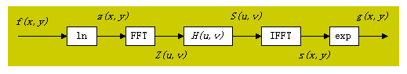

- 灰度函数： $f(x,y) = i(x,y) r(x,y)$

  > - $i(x,y)$： 入射光，占据低频段
  >
  > - $r(x,y)$： 反射光，占据高频段比较宽的范围
  >
  >   取决于物体的特性，物体的亮度特征主要取决于反射光

  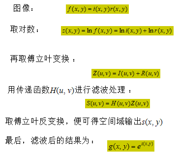 

# 七、图像复原

##1. 图像退化/复原过程模型

- ==图像复原==： 利用退化过程的先验知识，去恢复已被退化图像的本来面目

- **图像退化**： 图像的质量变坏，退化的形式有图像模糊、图像有干扰等 

- **图像退化原因**： 由传感器噪声、摄像机未聚焦、物体与摄像设备之间的相对移动、随机大气湍流、光学系统的相差、成像光源或射线的散射等原因造成

- ==信息熵==： **表示图像在被接收之前，信号传输过程中损失的信息量** 

- ==安全色==： 表示安全信息的颜色，常被用作为加强安全和预防事故而设置的标志

- ==图像退化模型==： 

  - ==线性位移不变的图像退化模型==： 

    退化图像表示： $g(x,y) = h(x,y) * f(x,y) + \eta(x,y)$ 

    频率域表示(傅里叶变换)： $G(u,v) = H(u,v)F(u,v) + N(u,v)$  

    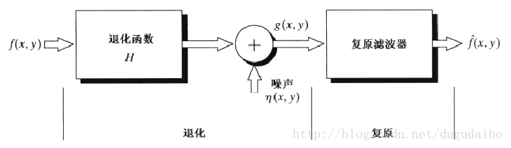

  - ==离散图像退化模型==： $y(i,j) = \sum_{k = 1}^M \sum_{l = 1}^N h(i,j;k,l) f(k,l) + n(i,j) = h(i,j) * f(i,j) + n(i,j)$  

    其中： $f(i,j)$ 为原始图像，$y(i,j)$ 为降质图像，$h(i,j;k,l)$ 为点扩散函数，图像为 $M \times N$ 维 

- **去卷积复原图像**： 

  由 $g(x,y) = f(x,y) * h(x,y) + n(x,y)$ 根据卷积定理得 $G(x,y) = F(u,v) \times H(u,v) + N(u,v)$  

  > ==去卷积的主要问题==： 
  >
  > - 确定引起退化的点扩散函数困难
  >
  > - 由于受到噪声影响，图像复原需要考虑病态的干扰
  >
  >   因此常用的基本方法都建立基本假设或忽略次要问题

##2. 噪声模型
### 1. 噪声模型

**噪声的概率密度函数(PDF)：** 

- **高斯噪声**： $p(z) = \frac 1 {\sqrt{2 \pi} \sigma} e^{- \frac {(z - \mu)^2} {2 {\sigma}^2}}$，其中： $\sigma ^2 = \frac {b(4 - \pi)} 4,\,\, \mu = a + \sqrt { \frac {b \pi} 4 }$  
- **瑞利噪声**： $p(z) = \begin{cases} \frac 2 b (z - a) e^{- \frac {(z - a)^2} b } &\text z >= a \\ 0 &\text z < a \end{cases}$  

- **伽马噪声**： $p(z) = \begin{cases} \frac {a^b z^{b-1}}{(b - 1)!} e^{-az} &\text z >= 0 \\ 0 &\text z < 0  \end{cases}$，其中： $\mu = \frac b a,\,\, \sigma^2 = \frac b {a^2}$ 
- **指数噪声**： $p(z) = \begin{cases} a e^{-az} &\text z >= 0 \\ 0 &\text z < 0  \end{cases}$，其中： $\sigma^2 = \frac 1 {a^2}, \,\, \mu = \frac 1 a$ 
- **均匀噪声**： $p(z) = \begin{cases} \frac 1 {b - a} &\text a <= z <= b  \\ 0 &\text 其他 \end{cases}$，其中： $\mu = \frac {a + b} 2,\,\, \sigma^2 = \frac {(b -a)^2} {12}$ 
- **脉冲(椒盐)噪声**： $p(z) = \begin{cases} P_a &\text z = a \\ P_b &\text z = b   \\  0  &\text 其他   \end{cases}$ 

### 2. 空间滤波复原

**均值滤波器**： 

- **算术均值滤波器**： $\hat{f}(x,y) = \frac 1 {mn} \sum _{(s,t) \in S_{xy}} g(s,t)$ 
- **几何均值滤波器**： $\hat{f}(x,y) = [ \prod_{(s,t) \in S_{xy}} g(s,t) ]^{\frac 1 {mn}}$ 
- **谐波均值滤波器**： $\hat{f}(x,y) = \frac {mn} {\sum_{(s,t) \in S_{xy}} \frac 1 {g(s,t)} }$ 
- **逆谐波均值滤波器**： $\hat{f}(x,y) = \frac {\sum_{(s,t) \in S_{xy}} g(s,t)^{Q + 1}}{\sum_{(s,t) \in S_{xy}} g(s,t)^Q}$  

---

**顺序统计滤波器**： 

- **中值滤波器**： $\hat{f}(x,y) = median_{(s,t) \in S_{xy}} \{ g(s,t) \}$
- **最大值滤波器**： $\hat{f}(x,y) = max_{(s,t) \in S_{xy}} \{ g(s,t) \}$  
- **最小值滤波器**： $\hat{f}(x,y) = min_{(s,t) \in S_{xy}} \{ g(s,t) \}$ 
- **中点滤波器**： $\hat{f}(x,y) = \frac 1 2 [ max_{(s,t) \in S_{xy}} \{ g(s,t) \} + min_{(s,t) \in S_{xy}} \{ g(s,t) \} ]$ 

---

**自适应中值滤波**： 

- `Level A`：若 `Zmin < Zmed < Zmax`，则转向 `Level B`，否则，增加窗口尺寸，若窗口尺寸 `<Smax`，重复 `Level A`，否则输出 `Zmed`
- `Level B`： 若 `Zmin < Zxy < Zmax`，输出 `Zxy`，否则输出 `Zmed` 

### 3. 频域滤波复原

- **周期噪声**： 在图像获取过程中由电力或机电干扰产生

  > - 唯一的一种空间依赖型噪声
  > - 可通过专用的带阻、带通和陷波滤波器来削减或消除周期性噪声干扰

**带阻陷波滤波器**： $u_0=v_0=0$ 时，下述三个滤波器都变为高通滤波器

- **理想陷波带阻滤波器**： $H(u,v) = \begin{cases} 0 &\text D_1(u,v),D_2(u,v) \leq D_0\\ 1 &\text 其它 \end{cases}$ 

  其中： $D_1(u,v),D_2(u,v) = [ (u - \frac M 2 - u_0)^2 + (v - \frac N 2 - v_0)^2 ]^{\frac 1 2}$ 

- **n 阶巴特沃思陷波带阻滤波器**： $H(u,v) = \frac 1 {1 + [ \frac {D_0 ^2} {D_1(u,v) D_2(u,v)} ] ^{n}}$  
- **高斯陷波带阻滤波器**： $H(u,v) = 1 - e^{- \frac 1 2 [ \frac{D_1(u,v)D_2(u,v)}{D_0^2} ]}$ 

**带通陷波滤波器**：  $u_0=v_0=0$ 时, 陷波带通滤波器变为低通滤波器

- $H_{np}(u,v) = 1 - H_{nr}(u,v)$  

## 3. 点扩散(估计退还)函数

### 1. 图像观察估计法

- 使用目标和背景样品的灰度级，构建一个不模糊的图像 S

  为减少噪声的影响，可以寻找强信号区域

### 2. 试验估计法

### 3. 模型估计法

==运动模糊图像复原== 

- **运动模糊假设**： 

  假设图像获取时图像被图像与传感器之间的均匀线性运动模糊了

  由于运动是相对的，我们假设图像 f(x,y) 进行平面运动，$x_0(t),y_0(t)$ 分别是在 x 和 y 轴上响应的随时间变化的运动参数

  则记录介质任意点的曝光总数通过对时间间隔瞬时曝光数积分得到

- **计算**： 

  - 如果曝光时间为 T，结果为： $g(x,y) = \int_0^T f[x - x_0(t),y - y_0(t)] dt$， g(x,y) 为模糊图像

    其傅里叶变换为： $G(u,v) = \int_{- \infty}^{+ \infty} \int_{- \infty}^{+ \infty} [ \int_0^T f(x - x_0(t),y - y_0(t))dt ]e ^{-j 2 \pi (ux + vy) dx dy}$ 

    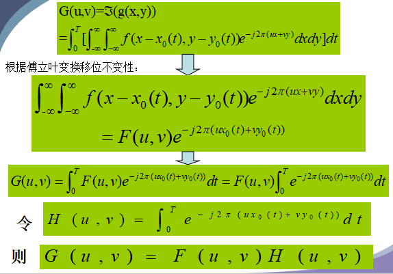

    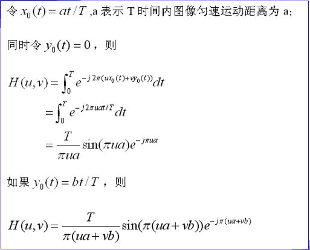

## 4. 逆滤波

- **定义**： 

  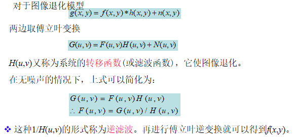

- **频域上图像退化与恢复过程**： 

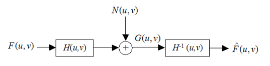

- **理想逆滤波恢复**： 

  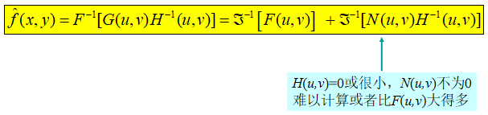

  > 问题：恢复出来的结果与预期结果相差很大，甚至面目全非

- **改进一**： $M(u,v) = \begin{cases} k &\text H(u,v) \leq d \\ \frac 1 {H(u,v)} &\text H(u,v) > d \end{cases}$ 

- **改进二**： $M(u,v) = \begin{cases} 0 & \text (u^2 + v^2)^{\frac 1 2} > D_0 \\ \frac 1 {H(u,v)} &\text (u^2 + v^2)^{\frac 1 2} \leq D_0 \end{cases}$ 

##5. 维纳滤波

- **维纳滤波器的传递函数**： $H_w(u,v) = \frac 1 {H(u,v)}  \frac {|H(u,v|^2}{|H(u,v)|^2 + \frac{P_n(u,v)}{P_f(u,v)} }$ 
- **特点**： 
  - 自动抑制噪声： $P_n(u,v) >> P_f(u,v) \implies  H_w(u,v) \to 0 $  
  - 逆滤波是维纳滤波的特例： $P_f(u,v) >> P_n(u,v)$ 

# 八、彩色图像处理

##1. 彩色基础

- **三基色原理**： 
  - 自然界中可见颜色都可以用三种原色按一定比例混合得到；反之，任意一种颜色都可以分解为三种原色
  - 作为原色的三种颜色应该互相独立，即其中任何一种都不能用其他两种混合得到
  - 三原色之间的比例直接决定混合色调的饱和度
  - 混合色的亮度等于各原色的亮度之和

## 2. 彩色模型

- ==RGB 模型==： 用R、G、B三参数描述颜色特性

  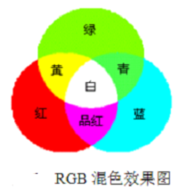 

- ==CMY 模型==： 减色混色模型，适合于彩色打印、印刷行业等

  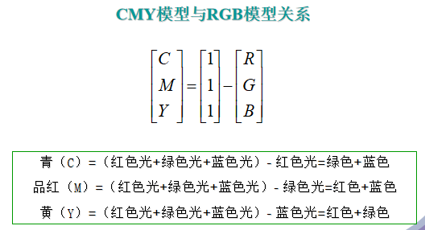 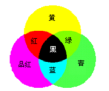

- ==CMYK 模型==： K 表示黑色，印刷业实际使用的彩色模型

  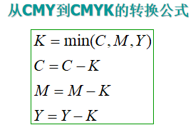 

- ==HSI 模型==： 反映了人的视觉对色彩的感觉

  - `H` 定义颜色的波长，称为色调

    > **色调 H**： 由角度表示，反映了颜色最接近什么样的光谱波长，即光的不同颜色
    >
    > 通常假定 0° 表示的颜色为红色， 120° 的为绿色， 240° 的为蓝色

  - `S` 表示颜色的深浅程度，称为饱和度

    > **饱和度 S**： 表征颜色的深浅程度，饱和度越高，颜色越深
    >
    > 饱和度参数是色环的原点到彩色点的半径的长度
    >
    > 在环的边界上的颜色饱和度最高，其饱和度值为 1；在中心的饱和度为 0

  - `I` 表示强度或亮度

    > **亮度 I**： 指光波作用于感受器所发生的效应，其大小由物体反射系数来决定，反射系数越大，物体的亮度愈大，反之愈小

**HSI模型与RGB模型关系**： 

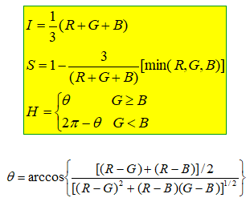 

##3. 伪彩色处理

- ==伪彩色处理==： 指将黑白图像转化为彩色图像，或者是将单色图像变换成给定彩色分布的图像

- **主要目的**： 为了提高人眼对图像的细节分辨能力，以达到图像增强的目的

  > 由于人眼对彩色的分辨能力远远高于对灰度的分辨能力，所以将灰度图像转化成彩色表示，就可以提高对图像细节的辨别力

- **基本原理**： 将黑白图像或单色图像的各个灰度级匹配到彩色空间中的一点，从而使单色图像映射成彩色图像

- **实现方法**： 

  - **密度分层法**： 

    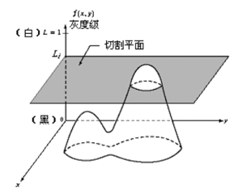 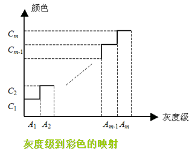

  - **灰度级---彩色变换法**：  

    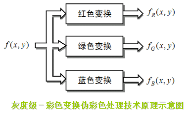 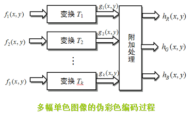

  - **频域滤波法**： 输出图像的伪彩色取决于灰度图像中不同的频率成分

    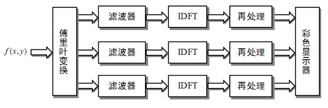

# 九、形态学图像处理

##1. 基本变换

- 集合 B 的**反射**： $\hat{B} = \{w | w = -b, b \in B \}$ 
- 集合 B 的**平移**： $(B)_z = \{ c | c = b +z, b \in B \}$  
- 集合 B 的**补集**： $B^c = \{ d | d = U - A \}$  

##2. 图像处理方法

### 1. 膨胀与腐蚀

- ==A 被 B 膨胀==： $A \bigoplus B = \{ z| (\hat{B})_z \bigcap A \neq \phi \} \iff  A \bigoplus B = \{ z| (\hat{B})_z \bigcap A \subseteq A \}$，其中 A 和 B 是 $Z^2$ 中的集合

  > - **定义**： B 对 A 的膨胀是以 B 的相对于其自身原点的映射且由 z 对映像进行位移为基础的集合
  > - **作用**： 膨胀可用来修复小的间断点
  >
  > 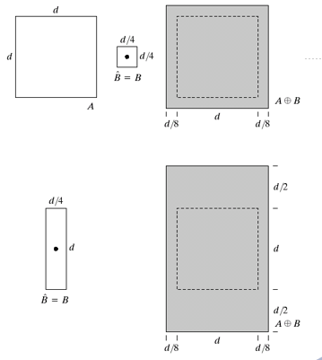

- ==A 被 B 腐蚀==： $A \Theta B = \{ z | (B)_z \subseteq A \} \iff A \Theta B = \{ (B)_z  \bigcap A^c = \phi \}$  

  > - **定义**：  B 对 A 的腐蚀是一个用 z 平移的 B 包含在 A 中的所有点 z 的集合
  >
  > 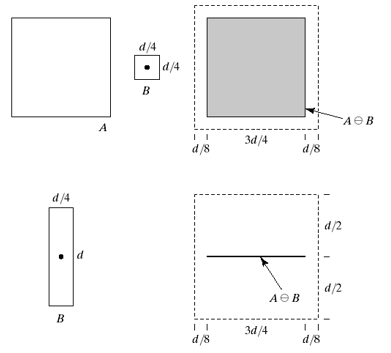

- **对偶性**： $(A \Theta B)^c = A^c \bigoplus \hat{B}$ 与 $(A \bigoplus B)^c = A^c \Theta \hat{B}$  

###2. 开操作与闭操作

- ==B 对 A 的开操作==： $A \circ B = (A \Theta B) \bigoplus B$  

  就是 B 对 A 的腐蚀，然后用 B 对结果进行膨胀

  > 一般会平滑物体的轮廓、断开较窄的狭颈并消除细的突出物

- ==B 对 A 的闭操作==： $A \cdot B = (A \bigoplus B) \Theta B$ 

  就是 B 对 A 膨胀，然后用 B 对结果进行腐蚀

  > 会平滑物体轮廓、弥合较窄的间断和细长的沟壑、消除小的孔洞、填补轮廓线中的断裂

###3. 击中或击不中变换

- ==击中或击不中变换==： 可用于形状检测

  $A \bigotimes B = (A \Theta X) \bigcap [ A^c \Theta (W - X) ] = (A \Theta B_1) \bigcap [ A^c \Theta B_2 ] = (A \Theta B_1) - [A^c \bigoplus \hat{B}_z]$  

## 3. 形态学的基本算法

### 1. 边界提取

- **边界提取**： 集合 A 的边界 $\beta(A)$，先用 B 对 A 腐蚀，而后执行 A 与腐蚀结果的差： $\beta(A) = A - (A \Theta B)$  

### 2. 区域(孔洞)填充

- **孔洞**： 由前景像素相连接的边界所包围的一个背景区域
- **目的**： 令 A 表示一个8 连通边界集合，每个边界包围一个背景区域，当给定各孔洞的一个点后，用 1 填充所有孔洞
- **步骤**： 先形成一个由 0 组成的阵列 $X_0$，然后用 1 填充： $X_k = (X_{k - 1}\bigoplus B) \bigcap A^c$，当 $X_k = X_{k - 1}$ 时结束

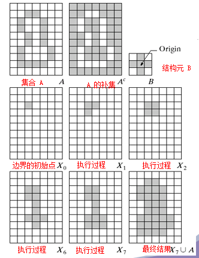

### 3. 连通分量提取

- 从二值图像中提取连通分量是许多自动图像分析应用中的核心

- **步骤**： 

  - 令 A 是包含一个或多个连通分量的集合，并形成一个阵列 $X_0$ 

  - 在对应于 A 中每个连通分量的已知位置点置为 1，其余置为 0

    迭代过程： $X_k = (X_{k - 1} \bigoplus B) \bigcap A$

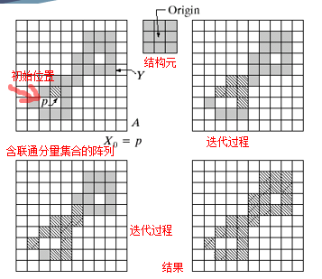

### 4. 骨架

- **集合 A 的骨架 S(A)**： $S(A) = \bigcup_{k = 1}^K S_k(A)$，其中 $S_k(A) = (A \Theta kB) - (A \Theta kB) \circ B$ 

  $(A \Theta kB) = ((...(A \Theta B) \Theta B)...)$，K 是 A 被腐蚀为空集前的最后一次迭代步骤： $K = max\{k | (A \Theta kB) \neq \phi\}$  

  - 若 z 是 S(A) 的一个点，且 $D_z$ 是 A 内以 z 为中心的最大圆盘
  - 圆盘 $D_z$ 在两个或多个不同位置与 A 的边界接触

## 4. 灰度图像形态学

- **膨胀**： $[f \bigoplus b_N](x,y) = max_{(s,t) \in b_N} \{ f(x - s,y - t) + b_N(s,t) \}$
- **腐蚀**：  $[f \Theta b_N](x,y) = min_{(s,t) \in b_N} \{ f(x - s,y - t) - b_N(s,t) \}$
- **开操作**： $f \circ b = (f \Theta b) \bigoplus b$ 
- **闭操作**： $f \cdot b = (f \bigoplus b) \Theta b$ 

# 十、图像分割

##1. 概述

- **图象分割**： 指把图象分成各具特性的区域并提取出感兴趣目标的技术和过程

  > - 图象分割是由图象处理进到图象分析的关键步骤，也是一种基本的计算机视觉技术
  > - 图象的分割、目标的分离、特征的提取和参数的测量将原始图象转化为更抽象更紧凑的形式，使得更高层的分析和理解成为可能

- **图像分割目的**： 为图像理解和分析作准备

- **图像特征**： 

  - **统计特征**： 直方图、矩、频谱
  - **视觉特征**： 区域的亮度、纹理、轮廓

- **分割方法**： 

  - 基于阈值的分割方法
  - 基于区域的分割方法
  - 基于边缘的分割方法
  - 基于特定理论的分割方法

##2. 点、线、边缘检测

- ==孤立点检测==： 如果一个孤立点与周围的点不同，则可以用指定模板检测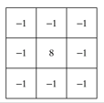 

- ==线检测==： 与点检查类似，但模板不同

  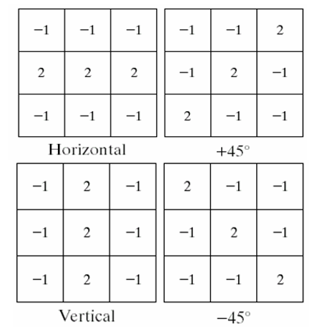 

- ==边缘检测==： 基于灰度突变来分割图像的常用方法

  > **边缘检测的步骤**： 
  >
  > - 为降噪对图像进行平滑处理
  > - 边缘点的检测
  > - 边缘定位

  - **LOG 算子**： 将 Laplace 算子与高斯低通滤波相结合

    > 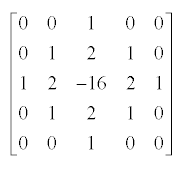
    >
    > 步骤： 
    >
    > - 对图像进行高斯滤波（G × f），再进行Laplace算子运算Δ（G × f）
    >
    > - 保留一阶导数峰值的位置，从中寻找 Laplace 零点
    >
    > - 对过零点的精确位置进行插值估计

  - **CANNY 算子**： 对信噪比与定位乘积进行测度，得到最优化逼近算子

    > 步骤： 
    >
    > - 去噪
    > - 用一阶偏导的有限差分来计算梯度的幅值和方向
    > - 对梯度幅值进行非极大值抑制
    > - 用双阈值算法检测和连接边缘

  - **Sobel 算子**：通过 3×3 模板作为核与图像中的每个像素点做卷积和运算，然后选取合适的阈值以提取边缘

    用来计算图像亮度函数的一阶梯度的近似值

  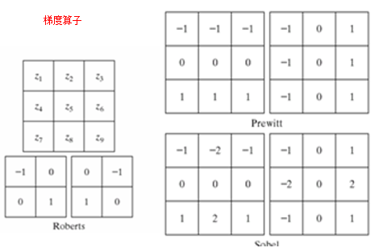

  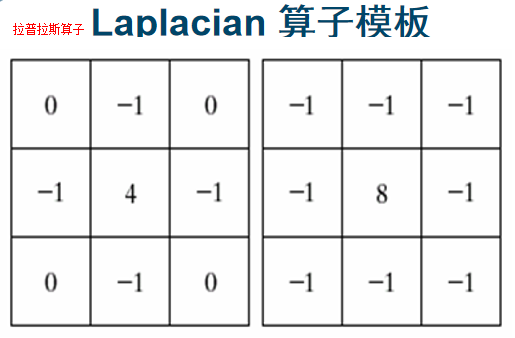 

  **梯度模板求边缘总结**： 

  - 首先，从连续函数表示的数字图像入手，分析导数、二阶导数的跟图像边缘的关系
  - 根据离散图像和工程应用的特点，依据数学原理，进行简化
  - 模板与图像的运算的过程，实际上是离散函数的卷积过程

- ==Hough 变换与直线检测==： 在直角坐标系和极坐标系中，点、线是对偶关系

  即直角坐标系中的点是极坐标系中的线，直角坐标系中的线是极坐标系中的点

  > 把原始图像中给定曲线的检测问题转化为寻找参数空间中的峰值问题
  >
  > 也即把检测整体特性转化为检测局部特性

## 3. 阈(域)值分割

> **阈值分割**： 以**像素特性分布**为基础的分割技术
>
> 因其处理直观、实现简单、计算速度快，因此阈值处理在图像分割中处于**核心地位**

- **门限 T 定义**： $T = T[x,y,p(x,y),f(x,y)]$ 

  其中： f(x,y) 是点 (x,y) 处的灰度值， p(x,y) 是点 (x,y) 为中心的局部性质

- **门限 T 数学表示**： $g(x,y) = \begin{cases} 1 &\text f(x,y) > T \\ 0 &\text f(x,y) \leq T \end{cases}$  

- **域值法分类**： 

  - ==全局门限==： T 仅取决于 f(x,y)

    > - 全局域值是一种最简单的域值处理技术，通过判断图像每个象素的灰度值，实现目标与背景区分
    >
    > - 这种方法能否成功完全取决于图像直方图能否能较好的分割
    >
    > - **全局域值自动分割算法**： 
    >
    >   - 选择一个初始化全局估计域值 T
    >
    >   - 用 T 分割图像，生成两组像素： G1,G2
    >
    >     G1 由灰度值大于 T 的所有像素组成
    >
    >     G2 由灰度值小于等于 T 的像素组成
    >
    >   - 求 G1,G2 的平均灰度值 u1,u2
    >
    >   - 计算新门限值(阈值)： T = (u1+u2)/2
    >
    >   - 重复 2到4，直到迭代所得到的 T 值之差小于预定参数 T0 为止

  - ==局域门限==： T 取决于 f(x,y) 和 p(x,y)

  - ==动态\自适应门限==： T 还取决于空间坐标 (x,y)

- ==自动确定门限值方法==： 

  - **均值法**： 使用图像所有灰度的均值作为阈值，分割图像

  - **方差法**： 按图像的灰度特性，将图像分成背景和目标两部分

    方差值越大，说明构成图像的两部分差别越大，当部分目标错分为背景或部分背景错分为目标都会导致两部分差别变小，因此类间方差最大分割的错分概率最小

## 4. 区域合并与分裂

> **基于区域的分割**： 以**直接寻找区域**为基础的分割技术

- ==区域生长==： 根据预先定义的准则将像素或子区域组合成更大区域的过程，即**从一组种子点来生长区域**
- **基本方法**： 以一组“种子”点开始将与种子类似的相邻图像附加到区域的每一个种子上
- **注意的问题**： 
  - 种子点的选择
  - 相似性准则
  - 联通和临近性限制
  - 生长的终止条件

- ==区域的分裂与聚合==： 先将一幅图像细分为一组任意的不相交区域，然后聚合和/或分裂这些区域

  - 对满足 $Q(R_i) = FALSE$ 的任何区域 $R_i$ 分裂为 4 个不相交的象限区域
  - 当不能进一步分裂时，对满足 $Q(R_j \bigcup R_k) = TRUE$ 的任意两个邻接区域 $R_j$ 与 $R_k$  进行聚合
  - 当无法进一步聚合时，停止操作

  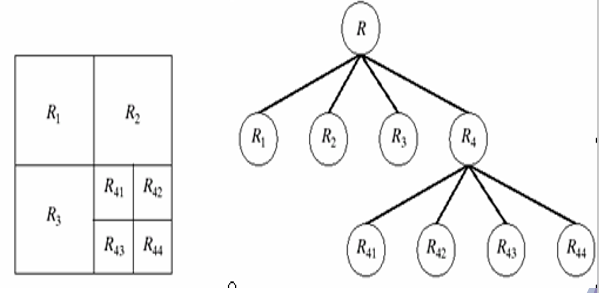

## 5. 分水岭分割

- ==灰度图像的分水岭算法==： 以灰度值模拟山的高度，从低到高，分别代表山岭从盆地到分水岭的高度，进而**找出分水线** 
- **基本思想**：处在不同汇水盆地的水要聚合在一起时，修建大坝将阻值聚合，大坝对应的边界，就是分水岭算法的分割线

# 十一、图像表示与描述

##1. 表示方法

- **图像表示分类**： 
  - **边界表示**： 关心图像中区域的形状特征
  - **区域表示**： 倾向于反映区域的灰度、颜色、纹理等特征的特点

- ==链码==： 用于表示由顺次连接的具有指定长度和方向的直线段组成的边界

  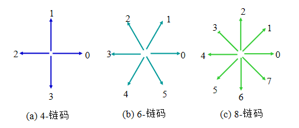

  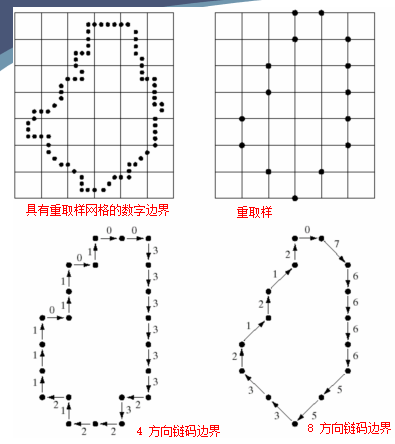

- ==边界分段==： 将边界分成若干段，然后分别对每一段进行表示，从而降低边界的复杂度，并简化表示过程

  > 基本步骤： 
  >
  > - 构造边界的凸包 
  > - 跟踪区域凸包的边界，记录凸包边界进出区域的转变点即可实现对边界的分割 
  >
  > 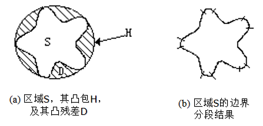

- ==多边形近似==： 因为多边形的边用线性关系表示，所以多边形的计算比较简单，有利于得到一个区域的近似值

  > - 多边形近似比链码、边界分段更具有抗噪声干扰的能力
  > - 对封闭曲线而言，当多边形的线段数与边界上点数相等时，多边形可以完全准确的表达边界
  > - 但在实际应用中，多边形近似的目的是用最少的线段来表示边界，并且能够表达原边界的本质形状 
  >
  > 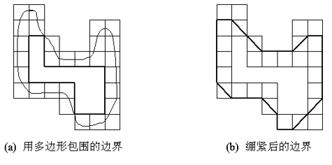

- ==标记图==： 将原始的二维边界用一个一维函数来表示，从而降低表达难度

  > - **最小周长多边形法**：以周长最小的多边形来近似表示边界，适用于无自交情况的多边形
  >
  >   > 将边界看成是介于多边形内外界限之间的有弹性的线，当它在内外迹象的限制之下收缩紧绷时，就可以得到最小周长边界
  >
  > - **算法详解**：
  >   - 在获取边界之后，先查找边界的拐角点，并且标记该拐角点是凸点还是凹点
  >   - 然后将所有的凸拐点连接起来作为初始的最小周长多边形 P0
  >   - 接着把所有在多边形 P0 之外的凹拐点移除
  >   - 再将剩余的凹拐点和所有凸拐点依次连接，形成新的多边形 P1
  >   - 然后移除所有原为凸点而在新多边形中变成凹点的拐点
  >   - 再用剩余的点连接形成新多边形，再次移除
  >   - 如此循环，直至新形成的多边形中没有凹点
  >
  > 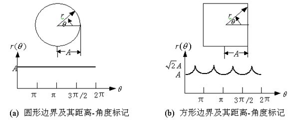

##2. 边界描绘方法

###1. 简单描绘子

- ==边界周长==： 边界所包围的区域的轮廓的周长

  > - 4-连通边界：其长度为边界上像素点个数
  > - 8-连通边界：其长度为对角码个数乘上水平和垂直像素点的个数的和

- ==边界直径==： 边界上任意两点距离的最大值

- ==形状数==： 四方向编码的边界的形状数定义为最小量级的一次差分，形状数的阶 n 为其表示的数字个数

  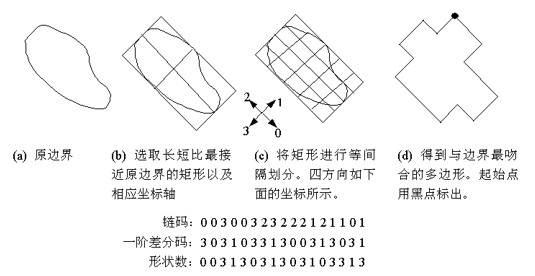

### 2. 傅里叶描绘子

==傅里叶描绘子==： 

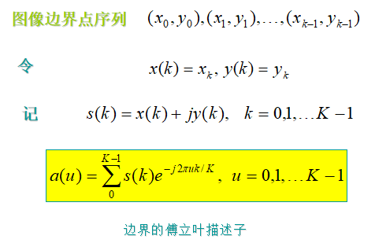 

- ==统计矩==： 用 1-D 函数描述边界曲线，易于实现并且具有对边界形状的物理意义

  $\mu _n = \sum_{i = 0}^{(K - 1)} (r_i - m)^n g(r_i)$，其中： $m = \sum_{i = 0}^{K - 1} r_i g(r_i)$  

## 3. 区域描绘子

- ==区域面积与重心==：  

  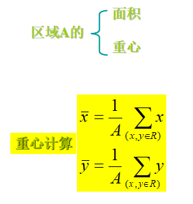 

- ==纹理==： 反映像素灰度的空间分布属性的图像特征通常变现为局部不规则但宏观有规律性

  > 纹理描述方法： 
  >
  > - **统计法**： 基于图像的灰度直方图的统计矩来描述纹理
  >
  >   即通过统计图像的空间频率、边界频率、空间灰度依赖关系等来分析纹理
  >
  >    
  >
  > - **结构描述法**： 把复杂纹理拆分为许多简单纹理单元，并将这些基本纹理单元按照某一规律重复排列组合成复杂纹理
  >
  >   > 使用形式语言对纹理的排列规则进行描述
  >   >
  >   > 但需要计算出纹理基元的偏心度、面积、方向、矩、延伸度等特征
  >   >
  >   > 并需要应用模式识别和编译原理中的句法理论
  >
  > - **频谱法**： 利用信号处理方法，主要借助傅里叶变换将空间域的纹理图像变换到频率域中，通过计算峰值处的面积、峰值与原点距离的平方、峰值处的相位、两个峰值间的相角差等来获得纹理特征
  >
  >   > **傅里叶频谱的三个特征**： 
  >   >
  >   > - 频谱中突出的尖峰给出纹理模式的主要方向
  >   > - 频率平面中尖峰位置给出模式的基本空间周期
  >   > - 采用滤波方法消除任何周期分量而留下非周期性元素，然后采用统计技术来描述 

- ==灰度共生矩阵==： 令 Q 是定义两个像素彼此相对位置的一个算子，并考虑一幅具有 L 个可能灰度级的图像 f；令 G 为一个矩阵，其元素 $g_{ij}$ 是灰度为 $z_i$ 和 $z_j$ 的像素对出现在 f 中由 Q 所指定的位置处的次数 

  > 不仅考虑强度分布，还考虑相同强度或近似强度值的像素位置
  >
  > 刻画共生矩阵特性的描绘子： 
  >
  >  
  >
  > ==P537 图11.29== 

- **不变矩**：

  二维 (p + q) 阶矩： $m_{pq} = \sum_{x = 0}^{M - 1} \sum_{y = 0}^{N - 1} x^p y^q f(x,y)$ 

  对应 (p + q) 阶中心距： $\mu _{pq} = \sum_{x = 0}^{M - 1} \sum_{y = 0}^{N - 1} (x - \hat{x})^p (y - \hat{y})^q f(x,y)$ ，其中： $\hat{x} = \frac{m_{10}}{m_{00}}$ 与 $\hat{y} = \frac{m_{01}}{m_{00}}$

  归一化中心距： $\eta_{pq} = \frac {\mu _{pq}}{\mu ^{\gamma}_{00}}$，其中： $\gamma = \frac {p + q} 2 + 1$ 

  由二阶矩和三阶矩推出的不变矩组： 

   

# 十二、实践

## 1. OpenCV-python的安装与使用

### 1. 安装

**Anaconda 的安装与虚拟环境的搭建**： 

- 安装 Anaconda
- 进入 Anaconda 的安装目录的 Scripts 文件夹运行 activate 命令激活虚拟环境
- 然后再在命令行键入 python 并执行，则可进入 python 环境；键入 `exit()` 推出 python 环境
- 通过 `pip install numpy` 安装 numpy

**安装 OpenCV-python**：

- 配置环境变量 Path，增加 `<安装目录>/Anaconda/Scripts` 
- 打开 cmd 进入工作目录，如： `D:\OpenCV`
- 键入 `conda create -n OpenCV` 创建自己的以 OpenCV 命名的 python 虚拟环境
- 键入 `activate opencv` 来激活 opencv 虚拟环境
- 键入 `pip install opencv-python` 来安装 python-OpenCV

### 2. 使用

- 打开 cmd 并进入对应工作目录，然后键入 `python` 并回车，进入 python 交互环境
- 然后 `import cv2`
- 接着 `print(cv2.__version__)` 打印 python-opencv 版本

## 2. 基于OpenCV视频合成的基本方法

- **视频合成**： 先将视频转换为每一帧图像，然后通过对图像的逐帧代数运算来合成

## 3. 基于OpenCV的目标跟踪基本方法

##4. 基于OpenCV的灰度直方图均衡化与规定化

## 5. 基于OpenCV的高通滤波、低通滤波、带通滤波

##6. 彩色图像操作

# 十三、综合案例

## 1. 车牌号识别系统

- **典型车牌识别系统的步骤**： 

  - **车牌定位**： 利用车牌主要特征从图像中提取出车牌

    > - 是车牌识别中的关键步骤
    > - 要求： 对车牌大小自适应强、速度快、准确率高
    > - **方法**： 基于直线边缘检测的方法、基于阈值迭代的方法、基于彩色信息的方法、基于灰度检测的方法、基于

