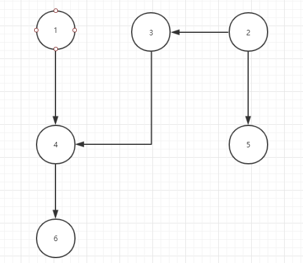
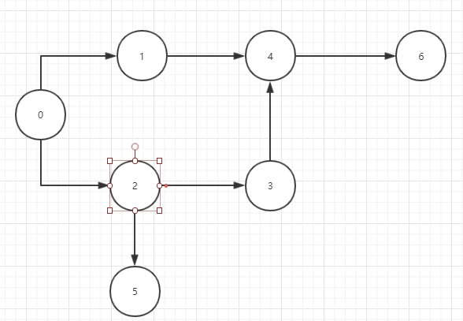

# 			 数学建模上机

​				

​													——**软工1603—刘俊傲—U201617047**


## 一、背景问题

组装某产品有六道工序，由一条装配线完成。装配线由一系列工作站组成，被装配的产品在装配线上流动，每个工作站都要完成一道或几道工序，这些工序按先后次序在各工作站上完成。

​	关于这些工序有如下的数据：

| 工序 | 所需时间（分） | 前驱工序 |
| :--: | :------------: | :------: |
|  1   |       3        |    无    |
|  2   |       5        |    无    |
|  3   |       2        |    2     |
|  4   |       6        |   1，3   |
|  5   |       8        |    2     |
|  6   |       3        |    4     |

另外工艺流程特别要求，在任一给定的工作站上，不管完成哪些工序，可用的总时间不能超过10分钟。

如何将这些工序分配给各工作站，以使所需的工作站数为最少？

## 二、数学模型

### 1. 问题分析

该题目让我联想到算法导论中的作业排程问题，因此先得出关系图：



由题可知，可以通过枚举法来得出最优解，因此可以先通过拓扑排序得到拓扑排序序列，然后使用贪心算法得到最优解，其中注意每组的总工序时间不超过 10 小时



此处增加节点 0 为指定开始节点


### 2. 模型求解

首先定义全局相关参数：

```java
final static int NUM = 7;
int[][] graph = new int[NUM][NUM];//邻接矩阵
int[] degree = new int[NUM];//入度
int[] top = new int[NUM]; //存储拓扑排序后的结果
int[] time = new int[NUM]; //存储每个节点花费时间
```

接着对数据进行初始化：

```java
//初始化各参数
public void init() {
    for (int i = 0; i < NUM; i++) {
        for (int j = 0; j < NUM; j++) {
            graph[i][j] = 0;
        }
    }
    for (int i = 0; i < NUM; i++) {
        degree[i] = 1;
    }
    degree[0] = 0;
    degree[4] = 2;

    graph[0][0] = 1;
    graph[0][1] = 1;
    graph[0][2] = 1;
    graph[1][4] = 1;
    graph[2][3] = 1;
    graph[2][5] = 1;
    graph[3][4] = 1;
    graph[4][6] = 1;

    time[0] = 0;
    time[1] = 3;
    time[2] = 5;
    time[3] = 2;
    time[4] = 6;
    time[5] = 8;
    time[6] = 3;
}
```

然后进行拓扑排序：

```java
//拓扑排序
private void topSort() {
    int num = 0;
    for (int i = 0; i < NUM; i++) { //遍历邻接矩阵
        for (int j = 0; j < NUM; j++) {
            if (graph[i][j] == 1) {//是否存在节点
                if (degree[j] > 1) {//该节点入度是否为 0
                    degree[j]--;
                } else {
                    top[num] = j;
                    num++;
                }
            }
        }
    }
}
```

再接着对拓扑排序求最优解：

```java
//得到最优解
private void getResult() {
    int tmp = 0;
    String str = "";
    for (int i = 0; i < NUM; i++) {//便利
        if (tmp + time[top[i]] > 10) {
            System.out.println(str);
            tmp = 0;
            str = "";
        }
        tmp += time[top[i]];
        str += "," + top[i];
    }
    System.out.println(str);//打印最后结果
}
```

最后测试结果：

```java
public class Process {
    public static void main(String[] args) {
        Process process = new Process();
        process.init();//初始化
        process.topSort();//拓扑排序
        process.getResult();//得到最优解
    }  
}
```

打印输出：其中的 0 未去掉

```java
,0,1,2,3
,5
,4,6
```

### 3. 结果分析

从打印结果可得，最少需要 3 个工作站参能满足需求

一种满足需求结果为： `[1,2,3]  [5]  [4,6]`
