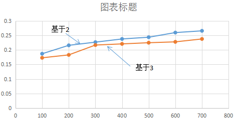

##                              数据结构实验报告二

###姓名：刘俊傲            学号：U201617047            班级：软工1603班

1. **求power(n,x)**

   > 1 . 问题描述：用基于2，3的方式来求power(n,x)，并分析相应的时间复杂度。
   >
   > 2. 问题分析与算法设计
   >
   >    > 1. 基于2的方式：将数分为能整除2和不能整除2两种
   >    > 2. 基于3的方式：将数分为除3余0，1，2这三种情况
   >
   > 3. 实验方案和步骤
   >
   >    > 1. 基于2的方式求整数的n次方
   >    >
   >    > > 1. 定义int型变量n和x并通过scanf()函数对变量n和x赋值，把n和x作为求幂函数的参数；
   >    > > 2. 定义clock_t类型的变量start并调用clock（）函数来记录函数开始执行时间；
   >    > > 3. 定义方法power(int n,int x) //利用递归方法求解；
   >    > > 4. 定义clock_t类型的变量end并调用clock（）函数来记录函数结束时间。
   >    > > 5. 将求值函数体循环100000次，在函数执行前，加上代码： start=clock(); 函数执行后，加上代码：end=clock()；
   >    > > 6. 打印（double）(end-start)/CLOCKS_PER_SEC；
   >    > > 7. 重复5 次实验，得到平均数据；
   >    > > 8. 记录相应实验结果并绘制相应Excel图表。
   >    >
   >    > 2. 基于3的方式球整数的n次方
   >    >
   >    > > 1. 定义int型变量n和x并通过scanf()函数对变量n和x赋值，把n和x作为求幂函数的参数；
   >    > > 2. 定义clock_t类型的变量start并调用clock（）函数来记录函数开始执行时间；
   >    > > 3. 定义方法power(int n,int x) //利用递归方法求解；
   >    > > 4. 定义clock_t类型的变量end并调用clock（）函数来记录函数结束时间。
   >    > > 5. 将求值函数体循环100000次，在函数执行前，加上代码： start=clock(); 函数执行后，加上代码：end=clock()；
   >    > > 6. 打印（double）(end-start)/CLOCKS_PER_SEC；
   >    > > 7. 重复5 次实验，得到平均数据；
   >    > > 8. 记录相应实验结果并绘制相应Excel图表。
   >
   >    4. 算法实现
   >
   >       > 1. 基于2的方式求整数的n次方
   >       >
   >       >    ```
   >       >    #include<stdio.h>
   >       >    #include<time.h>
   >       >
   >       >    static int power2(int n, int x);
   >       >
   >       >    static int count = 0;
   >       >
   >       >    static int power2(int n, int x) 
   >       >    {
   >       >    	if (n == 0)
   >       >    	{
   >       >    		return 1;
   >       >    	}
   >       >    	if (n & 1)
   >       >    	{
   >       >    		count += 2;
   >       >    		return power2(n>>1,x*x) * x;
   >       >    	}
   >       >    	count++;
   >       >    	return power2(n>>1,x*x);
   >       >    }
   >       >
   >       >    void main() 
   >       >    {
   >       >    	int n = 15;
   >       >    	printf("after %d multiplications  2^%d is computed as %d\n", count, n, power2(n,2));
   >       >    	clock_t start = clock();
   >       >    	for (int i = 0; i < 100000; i++)
   >       >    	{
   >       >    		power2(n, 2);
   >       >    	}
   >       >    	clock_t end = clock();
   >       >    	double time = (end - start) / CLOCKS_PER_SEC;
   >       >    	printf("time:%f", time);
   >       >    	getchar();
   >       >    }
   >       >    ```
   >       >
   >       > 2. 基于3的算法实现
   >       >
   >       >    ```
   >       >    #include<stdio.h>
   >       >    #include<time.h>
   >       >
   >       >    static int power3(int n, int x);
   >       >
   >       >    static int count = 0;
   >       >
   >       >    static int power3(int n, int x)
   >       >    {
   >       >    	switch (n)
   >       >    	{
   >       >    	case 0:
   >       >    		return 1;
   >       >    		break;
   >       >    	case 1:
   >       >    		return x;
   >       >    		break;
   >       >    	case 2:
   >       >    		count++;
   >       >    		return x*x;
   >       >    		break;
   >       >    	default:
   >       >    		break;
   >       >    	}
   >       >    	if (n % 3 == 0)
   >       >    	{
   >       >    		count += 2;
   >       >    		return power3(n/3, x*x*x);
   >       >    	}
   >       >    	if (n % 3 == 1)
   >       >    	{
   >       >    		count += 3;
   >       >    		return power3(n / 3, x*x*x)*x;
   >       >    	}
   >       >    	count += 4;
   >       >    	return power3(n / 3, x*x*x)*x*x;
   >       >    }
   >       >
   >       >    void main() 
   >       >    {
   >       >    	int n = 15;
   >       >    	printf("after %d multiplications  2^%d is computed as %d\n", count, n, power3(n, 2));
   >       >    	clock_t start = clock();
   >       >    	for (int i = 0; i < 100000; i++)
   >       >    	{
   >       >    		power3(n, 2);
   >       >    	}
   >       >    	clock_t end = clock();
   >       >    	double time = (end - start) / CLOCKS_PER_SEC;
   >       >    	printf("time:%f", time);
   >       >    	getchar();
   >       >    }
   >       >    ```
   >
   >    5. 测试结果与分析
   >
   >       > 
   >       >
   >       > 随着n的增大，基于3的算法的速度更快

2. 求主元

   > 1. 问题描述：
   >
   >    > 大小为N的数组A，其主要元素是一个出现次数超过N/2的元素（从而这样的元素最多有一个）
   >    >
   >    > 设计并实现使用分治求数组的主元的算法。如果不用分治，通过比较和计数，复杂程度是多少？
   >
   > 2. 问题分析与算法设计
   >
   >    > 利用递归查找数组的主元
   >
   > 3. 实验步骤和方案
   >
   >    > 1. 如果数组长度为0，则返回无主元，如果为1，则返回该元素
   >    > 2. 否则，比较相邻的两个元素，如果相等就从数组的开头开始放起，组成新的数组，然后递归调用。
   >
   > 4. 算法实现
   >
   >    >```
   >    >#include<stdio.h>
   >    >#include<time.h>
   >    >
   >    >#define MAX 100000
   >    >
   >    >static int  majEle_recursive(int a[], int n);
   >    >
   >    >static int majEle_recursive(int a[], int n)
   >    >{
   >    >	int i, j, k = n / 2;
   >    >	int tmp;
   >    >	if (n == 0) return (MAX);
   >    >	if (n == 1) return (a[0]);
   >    >	for (i = 0, j = 0; i < k; i++)
   >    >	{
   >    >		if (a[2 * i] == a[2 * i + 1])
   >    >		{
   >    >			tmp = a[j];
   >    >			a[j++] = a[2 * i];
   >    >			a[2 * i] = tmp;
   >    >		}
   >    >	}
   >    >	tmp = majEle_recursive(a, j);
   >    >	if (n % 2 == 1)
   >    >	{
   >    >		if (tmp == MAX)
   >    >			return (a[n - 1]);
   >    >	}
   >    >	return (tmp);
   >    >}
   >    >```
   >
   > 5. 测试结果与分析
   >
   >    > 对于分治求数组主元来说，它的时间复杂度是 O(N), 递推公式为T(N)=T(N/2)+O(N)，因此T(N)=NlogN。