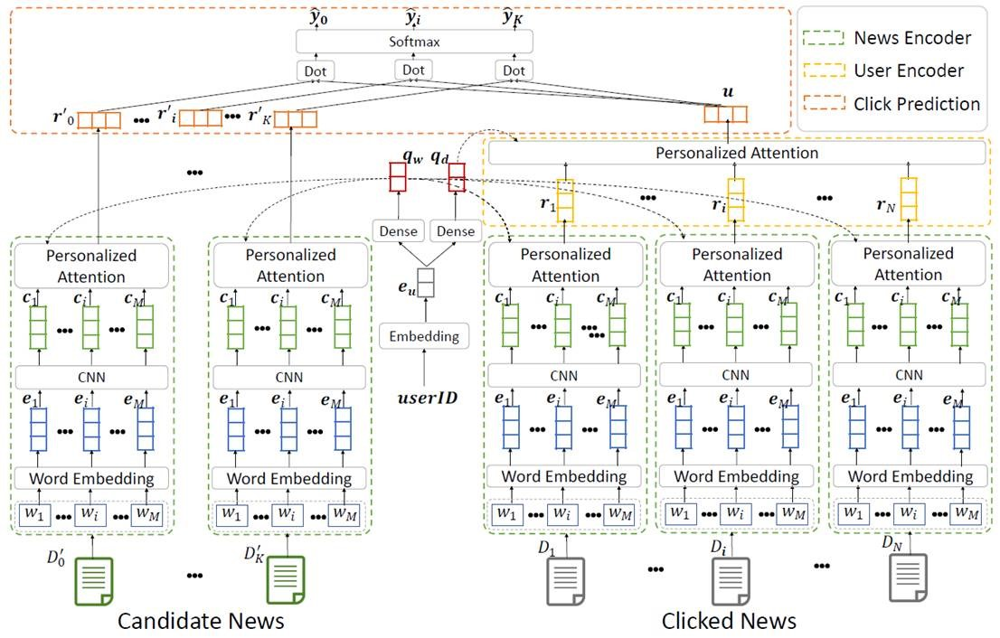
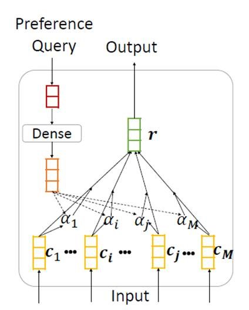

## 一、 基本信息

- 论文名称： Neural News Recommendation with Personalized Attention
- 论文链接：[https://arxiv.org/pdf/1907.05559.pdf](https://arxiv.org/pdf/1907.05559.pdf) 

## 二、概述

1. **背景**： 每天都有大量用户在微软新闻等在线新闻平台阅读电子新闻，然而，面对互联网上每天都在产生的海量新闻，用户从中逐个寻找感兴趣的内容是不现实的。因此，新闻推荐是在线新闻平台的一项重要任务。可以帮助用户找到他们感兴趣的新闻文章，并减轻信息过载。在浏览新闻时，不同的用户通常具有不同的兴趣，并且对于同一篇新闻，不同的用户往往会关注其不同方面。然而已有的新闻推荐方法往往无法建模不同用户对同一新闻的兴趣差异。

2. **提升**： 该论文提出了一种 neural news recommendation with personalized attention（NPA） 模型，可在新闻推荐任务中应用个性化注意力机制来建模用户对于不同上下文和新闻的不同兴趣。该模型的核心是新闻表示、用户表示和点击预估。

3. **实现**： 

   - 在新闻表示模块中，NPA 基于新闻标题学习新闻表示。新闻标题中的每个词语先被映射为词向量，之后使用 CNN 来学习词语的上下文表示，最后通过词语级的注意力网络选取重要的词语，构建新闻标题的表示

   - 在用户表示模块中，NPA 基于用户点击的新闻来学习用户的表示。由于不同新闻表示用户具有不同的信息量，应用新闻级的注意力网络选取重要的新闻文章，构建用户的表示。

## 三、实现

1. **构成**： 该模型主要由三部分组成：新闻编码器，用户编码器以及预测器。其构成如下图所示。

   

2. **向量**： 新闻编码器从候选的新闻中学习新闻的向量表征。将新闻列表表示为$D_0^{'}...D_K^{'}$，其中每一篇新闻都是由若干个词组成。NLP 领域常用的方法就是**词向量**，简单来说假设一个语义空间，每个词都表征一定的语义，在这个语义空间中占有一定的位置，用一个多维向量来表示。

3. **嵌入矩阵**： 使用一个预学习的词嵌入矩阵（通常在大规模语料上训练以获得全面的语义），分别对应词序号和词向量，将新闻中对应的词从词嵌入矩阵中取出词向量代替，一篇新闻就成了一个可数值运算的矩阵了，然后将这个矩阵输入到卷积神经网络中，用以提取局部语义。语言中很多词语要组合在一起才能表达原有的意思，比如“机器学习”，表示机器学习这门学科，而“机器”和“学习”显然又是不同的意思了。
4. **公式**： 使用卷积神经网络让模型学习到词的表示，包含了上下文语义。用公式表达即：

$$
c_i = RELU(F_w \times e_(i-k):e_(i+k) + b_w)
$$
​	其中RELU为激活函数，$F_w$和$b_w$为卷积神经网络的滤波器的参数。

5. **注意力机制**： 首先注意力机制是一种学习对输入信息采取不同接受程度的模型。根据注意力模型接受到的输入和给定的询问向量，模型对各输入学习到对应的权重，然后将输入以加权的方式输出。这里的个性化注意力机制，即将用户ID嵌入后使用一个全连接层得到用户的向量表示。这对于每个用户来说是独一无二的信息，将这个向量作为注意力机制的询问向量即有了用户的个性化。如上图所示，新闻编码器最终将候选的新闻列表编码成了向量组$r_0{'}...r_k{'}$。

   用户编码器和新闻编码器结构大致相同，将用户点击过的新闻作为数据集，学习用户的表征。只不过用单一的向量表示用户，因此在点击新闻向量之后还要进行一次个性化注意力机制。

6. **候选分数**： 最终，利用候选新闻的表征向量$r_0{'}...r_k{'}$和对应用户的表征向量$u$，预测器预测出用户对于每一则候选新闻的分数$\hat{y_0}...\hat{y_k}$，这个分数就表示用户点击的可能性。值得注意的是因为用户在浏览新闻的时候往往是浏览很多新闻，才会点击一个，此前的很多工作都是使用的正负样本均衡的数据集，这样会导致丢失很多负样本的信息。这里使用负采样技术，同时预测$K+1$个样本，其中有一个正样本和$K$个负采样的负样本。这样将新闻的点击问题转变成了$K+1$次分类问题，使用最大似然法来最大化可能性：

$$
L = -\sum_{y_j}log(\hat{y_j})
$$
​	

---

**模型构建细节**：在MSN新闻数据集上训练，使用预训练的Glove词嵌入，在每一层使用dropout防止过拟合，使用Adam算法来进行梯度下降的优化，评价指标选择AUC，MRR，nDCG@5和nDCG@10

## 四、总结

总结为以下几点：

* 由于神经网络能够学习到更复杂的特征，所以使用了神经网络的模型优于传统的基于矩阵分解方法的模型
* 由于由于训练数据集与应用场景不符，所以使用了负采样技术的模型优于没有采用负采样的模型
* 由于选择重要的特征能够帮助模型判断，所以使用了注意力机制的模型优于没有使用注意力机制的模型

因为该论文能够根据用户的个性动态选择新闻，并能在新闻中判断出重要的词语帮助判断，因此该论文的模型在各方面取得了最优的效果