# 王者荣耀游戏世界分析

## 一、 简要介绍

### 游戏介绍

《王者荣耀》是腾讯第一5V5团队公平竞技手游，国民MOBA手游大作！5V5王者峡谷、公平对战、还原MOBA经典体验；契约之战、五军对决、边境突围等，带来花式作战乐趣！10秒实时跨区匹配，与好友开黑上分，向最强王者进击！多款英雄任凭选择，一血、五杀、超神，实力碾压，收割全场！敌军即将到达战场，王者召唤师快来集结好友，准备团战，就在《王者荣耀》！

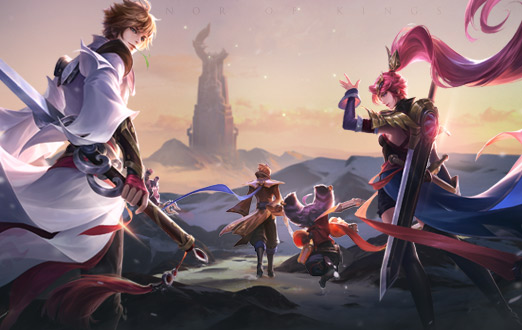

### 游戏特色

#### 1. 5V5团队公平竞技

5V5经典地图，三路推塔，呈现最原汁原味的对战体验。
英雄策略搭配，组建最强阵容，默契配合极限操作，凭实力carry全场，与团队共赴荣耀

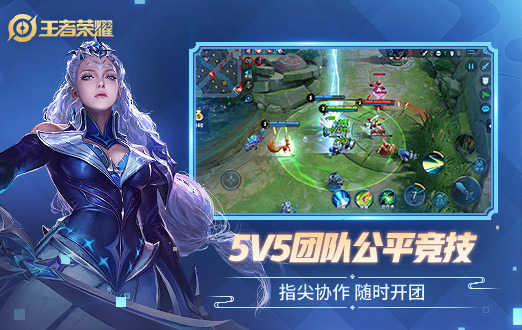

#### 2. 王者出征 2.0时代来临

超高清峡谷，东方美学界面，视觉全面升级！全景沉浸式大厅，国风配色、传统饰形、山水云纹，更具东方神韵。采用次世代技术，全面提升画质，呈现超高清峡谷地图；局内外模型、材质、光影特效、动画等同步升级，角色更精致、材质更细腻、光影效果更逼真

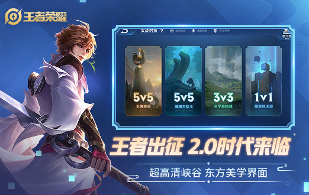

#### 3. 征战日之塔 5VN新玩法

在日之塔中，5名玩家组队协作、操作双人机甲、挑战BOSS，共同闯关。玩法中的关卡设定富有策略和趣味性，还有专属的装备天赋系统，玩家可逐步成长，挑战更高难度。

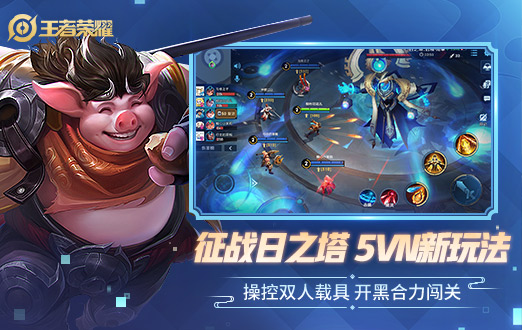

#### 4. S14新赛季 荣耀启程

荣耀战令上线，赛季福利大升级！新增荣耀战令任务系统，解锁荣耀战令，可获得更多福利，兑换专属奖励！

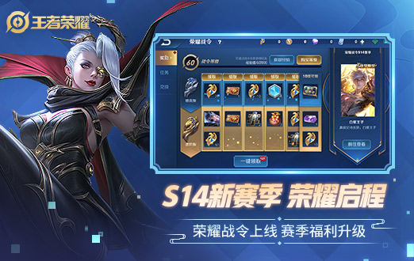

#### 5. 守护对局 狄大人上任

排位赛对局优化，排位征召模式禁用见习英雄，增加不合理阵容重开机制。加强对局实时审判，对局补偿升级。信誉积分系统展示界面优化，信誉积分权益、奖励升级，新增信誉积分上限回复进度条

### 游戏模式

#### 1. 墨家机关道

墨家机关道是游戏中最小的地图，是玩家1v1solo的地图，墨家机关道地图是一个长条状，两头是双方的复活点，而水晶则在复活点前面的位置，水晶前面就是防御塔，匹配规则：1V1组队通过系统匹配我方1个玩家与敌方1个玩家进行战斗。该模式包括实战对抗，人机练习。胜利条件：摧毁敌方基地水晶

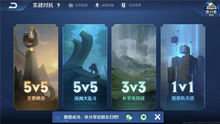

#### 2. 长平攻防战

长平攻防战是游戏中3v3的对战地图，地图上拥有着出生点、基地、防御塔、草丛和野怪的设定，和墨家机关道地图类似，地图只有一条兵线，相比下多了很多野怪区域，地图中间位置为兵线，双方各有2座防御塔和1座基地塔。在兵线上方有一个小野区，小野区中只有小野怪。兵线下方有一个稍大一点的野区，这个野区中除了小野怪之外，还有暴君BOSS，击杀暴君可让英雄获得强力BUFF效果，每次击杀暴君后都能获得一层BUFF增益，最多叠加三层

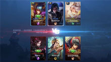

#### 3. 王者峡谷

王者峡谷是一张较大的竞技地图，有三路兵线，每条兵线上每方各有三座防御塔，而每方的基地塔只有一个，5V5的最终胜利条件就是摧毁敌方基地塔。在王者峡谷地图中，还有诸多的小径和草丛，小径可以让英雄快速切换路线，对敌人进行切断退路、绕后包夹等。草丛会影响视野，进入草丛后，会在敌人视野中消失，无论是用于逃跑还是用于突袭，都是常见的战略战术

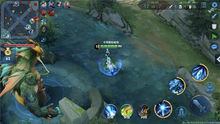

#### 4. 深渊大乱斗

深渊大乱斗这张地图与王者峡谷一样都是5V5地图，但是不一样的是王者峡谷有野区和三条对抗路线，而深渊大乱斗只是单线对抗也没有野区的存在，深渊大乱斗作为一个直线型地图，2个阵营的玩家自然占据了地图的2端，地图中间就是大家的主要战斗区域，几座草丛也是满足了大家的战术需求。和所有的MOBA游戏一样，地图上每个阵营也都有2座防御塔和一个基地，基地被推倒也就代表着对战的结束

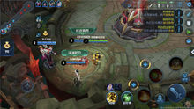

#### 5. 火焰山大战

火焰山大战是一张5V5地图，该地图为活动地图，限时开放，战斗开始前，双方会在出在各自的出生点，但在死亡后，将随机在地图中的复活点中复活；在地图中，道路是非常安全的，但道路的两侧会有岩浆，如果玩家接触到岩浆，将会被迅速的扣血，所以将敌方推入岩浆，是一个非常有效的致胜策略；进入该地图后，玩家将获得一个“火球”技能，该技能可以将敌方击退，击杀地图中的野怪可以增强“火球”技能的效果，如：一次可以发射出3枚火球等；整个比赛倒计时10分钟

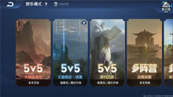

## 二、物理维度

### 空间维度

王者荣耀采用 2.5D 的设计方式，采用二维图像重叠、图层水平精确移动、纵向方向跳跃等方式，使其达到三维立体的效果

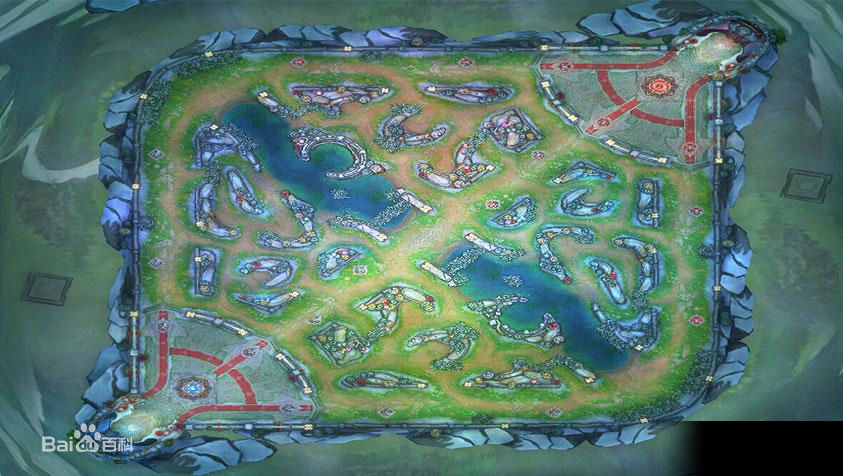

如上图可见，这是一张游戏地图的俯瞰图，虽然是一个 2.5 D 游戏，但通过对地图的细致处理，能给玩家提供真切的 3D 感受。

### 大小规模

威力更加真实的显现游戏界面并给玩家带来更真切的游戏感受，王者荣耀对每个元素的大小设计都有细致的规划。例如： 英雄与小兵的大小比例，以及周围的墙壁、草丛的大小设计。

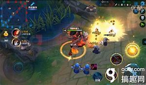

同时每个英雄也会因特点的不同，而展现出不同的大小，可以更加突出每个英雄的特点，展现每个英雄的外观，因此能更真切的增加玩家的游戏体验。

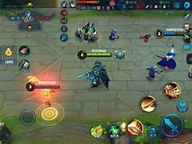

### 界限

由下面的地图俯瞰图可知，该游戏有着明显的分界，但游戏中的玩家的视野确实非常大的，从整个游戏地图得知，玩家视野所及之处，都有着不同的地图展现，但却不能超出游戏的边界范围。

## 三、时间维度

王者荣耀对于时间的概念有着明显的界限，每场游戏都会有着一个时间计数器，因为处于不同时间段的英雄都会有不同的强势期，而且不同时间段的游戏进展与节奏也不同。

时间会影响玩家的操作与意识，比如游戏的前期基本是玩家和平发育阶段，但到游戏的中后期基本就是不断的团战以及埋伏抓人。

因此随着游戏时间的加长，游戏的节奏就会不断加快，从而使每把游戏的时间总长控制在一个合理的范围，进而达到随手可以开一把的游戏优势，增加用户的喜悦度与用户粘性。

## 四、环境维度

### 文化背景

该游戏由一个整体的宏大背景，从游戏的进入界面就可以感受出游戏所想展现出的文化背景的依赖度。比如： 整个游戏有一个整体的文化背景，并且赋予了每一个英雄角色特有的文化背景呈现形式。

因此，每个英雄都有一个特定的所属阵营：

大唐：新兴的大陆第一强国，由女帝武则天所统治。它的子民富足，井然有序，铁骑所向披靡。长安城更是大宗师墨子亲手修筑的一代雄城。大唐乃是东方大陆最具开放和包容的国度，促使了它的日益兴盛。目前唯一能与它抗衡的，只有西方同样新兴的国度。

秦：因为血祸一度陷入混乱，但年轻的帝王嬴政使它开始复兴。它所野心勃勃想要吞并的目标包括邻近的数个小国，以及庇佑它们的稷下学院。

楚汉之地：神秘的大河流域，这里是自然和森林的领地。神秘莫测的阴阳家们牢牢把控着此地的统治和信仰，巫术大行其道。

魏、蜀、吴：东岸的三个小国。魏擅于作战，蜀擅于机关术，吴擅于船运。起初三国势均力敌，自从枭雄曹操把持了魏的大权，又收留自扶桑归来的徐福作为左膀右臂，力量的均衡，陡然便被打破。

西域：围绕绿洲和水源，先后出现了十余小国。它们的统治者热衷于魔道，以暗杀，毒药，邪术互相攻讦，领土的变动比任何国家都要频繁。然而这种危险的行径终于招致了灭顶之灾。如今整片西域都归于死寂。

北夷：北方的部族，由数个部落组成。他们是大迁徙途中留下的子民后裔。他们一直与严寒和贫困抗争，却自磨难中变得强大。杰出领袖的率领下，他们正在崛起。

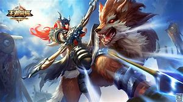

### 物理环境

大体看起来，游戏的物理背景就是多个英雄玩家处于同一对战环境下。但处于游戏中的各个单位的展现却完全不同，不同的草丛设计，不同的线路划分，不同的野区展现。

红蓝双方的高地被设计为不同的展现形式，使玩家更容易区分，也使玩家更有团队感。

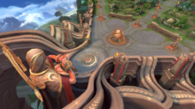 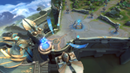

不同野区的物理环境展现，使打野玩家可以获得不同的视觉效果感受，以及玩家自身的理解思路。

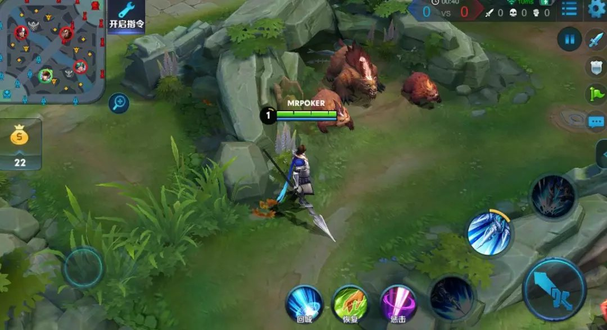

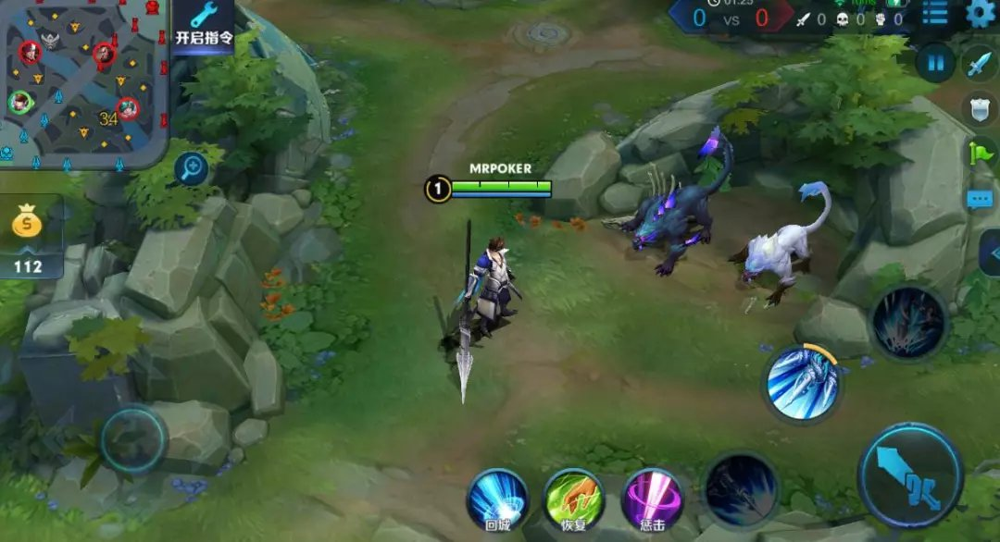

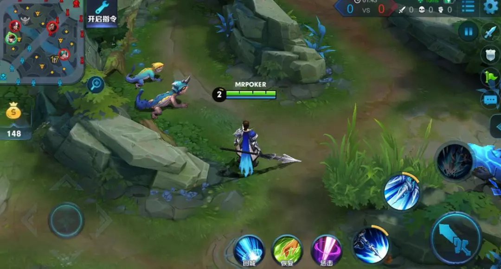

不仅有上述的视觉感受，而且也有刺激的游戏音效。当你击杀玩家，被玩家击杀时的不同提示音，以及各种美妙的背景音乐，英雄配音都会使玩家处于一种美妙的感觉之中。同时也会让玩家不停的体验紧张刺激的感觉。

### 细节

游戏的整体细节都非常细致，这展现出了游戏设计师对于提高玩家的游戏感受所做的努力。

比如游戏地图中多处草丛设计的更改，使玩家能够获得更好的游戏体验。

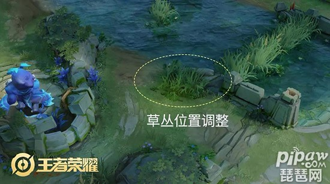

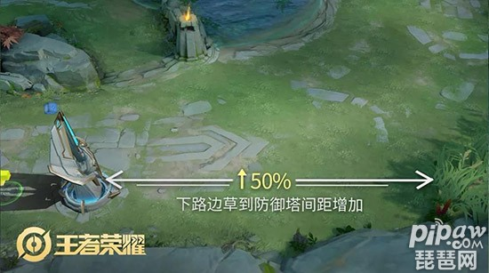

### 风格

王者荣耀不同的模式有着不同的展现风格，比如： 常规的排位对战与五军对决模式的地图就存在很大的不同

常规的 5V5 对战的地图只有交战的游戏双方，地图也呈现出旋转对称的感觉

五军对决的地图，由于交战的玩家分为 5 个派别，因此游戏地图的设计就呈现出类似五角星的设计样例，在达到较为公平的前提下，增加游戏的厚重感与可玩性。

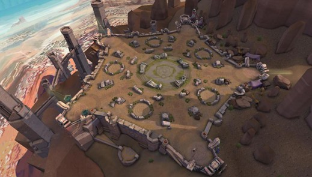

### 灵感来源

王者荣耀的灵感，大众普遍的看法是来源于英雄联盟，但却不同于英雄联盟，因为王者荣耀有自己的背景故事，有自己的英雄定位。

整体的背景故事为： 王者大陆诞生之前，曾存在于时空中的久远星球上。智慧的人类创造出无比璀璨的文明。庄周从他的梦中回到这里：高耸入云的建筑，不用马拉的车子，以及长翼的铁鸟，令人无比惊叹。然而当这种文明到达巅峰后，无可避免的走向湮灭。真正的原因不为后世的人们所知晓，学者们公认的说法是，与空间的异变有关。

## 五、感情维度

做为普通的即时战略类游戏来看的话，王者荣耀的感情维度可能就不是很丰富了，因为若仅从即时战略方向来考虑的话，无非就是运营发育，然后碾压对方，获得比赛的胜利。

但如果从多人对战的角度来考虑，那么王者荣耀的感情维度就丰富多彩了。因为是多人对战，所以就会有不同游戏能力的玩家组成队伍进行对抗，因此也会选出不同的对战阵容。因为很多玩家都有自己擅长以及不擅长的英雄，因此每局的表现可能会有很大的差别。同时由于一些模式对胜负的看待很重视，则会出现当部分玩家操作不足时，遭到其他玩家的指责。但当游戏成功翻盘时，又会获得极大的成就感等等丰富的玩家游戏体验感情。

## 六、道德维度

### 1. 对战补偿

如果在对战中，出现其他玩家掉线或者其他玩家一直在送人头等影响游戏平衡的恶劣行为，游戏除了提供了玩家举报功能来举报影响游戏正常行为的措施外，也会自动检测该局游戏的公平性并适当给予该局中其他玩家适当的补偿

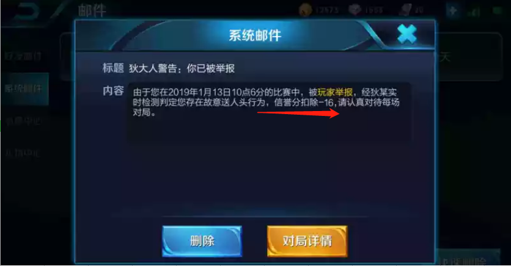

### 2. 重开补偿

在排位赛中，如果存在部分玩家恶意随便选择不适合阵容的英雄，则游戏提供了对局重开的功能，并会及时给每位玩家适当的勇者积分来补偿每位玩家，并会立刻进行重新匹配，不影响玩家的心情与正常的游戏。

### 3. 不断的活动

为了弥补充钱玩家与平民玩家的差距，王者荣耀会常常出各种活动，每当玩家达到活动要求时，都会进行免费的英雄、皮肤等各种游戏道具的赠送，从而拉近充钱玩家与平民玩家对于游戏的差距，使游戏达到一个更加合理的区间。

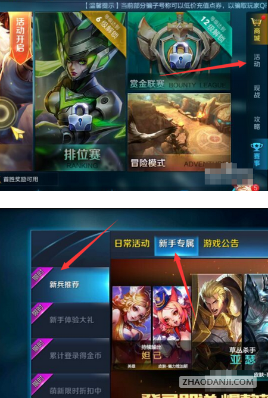

## 七、现实维度

王者荣耀对于现实维度的处理也是很细致的，在早期版本中，英雄命名基本全是基于历史人物，但部分英雄与历史中的记载存在较大差距，因此也进行了即使的改进，比如： 早期的版本的“荆轲”，由于游戏中的形象的女性，所以官网及时更改为了“阿珂”。

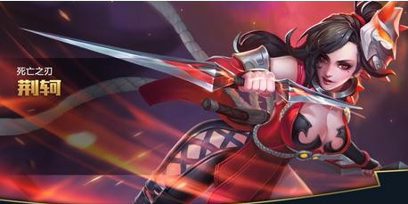

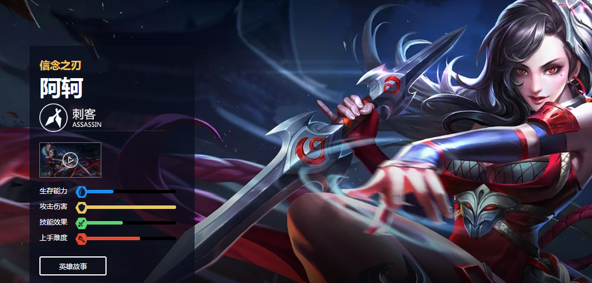

