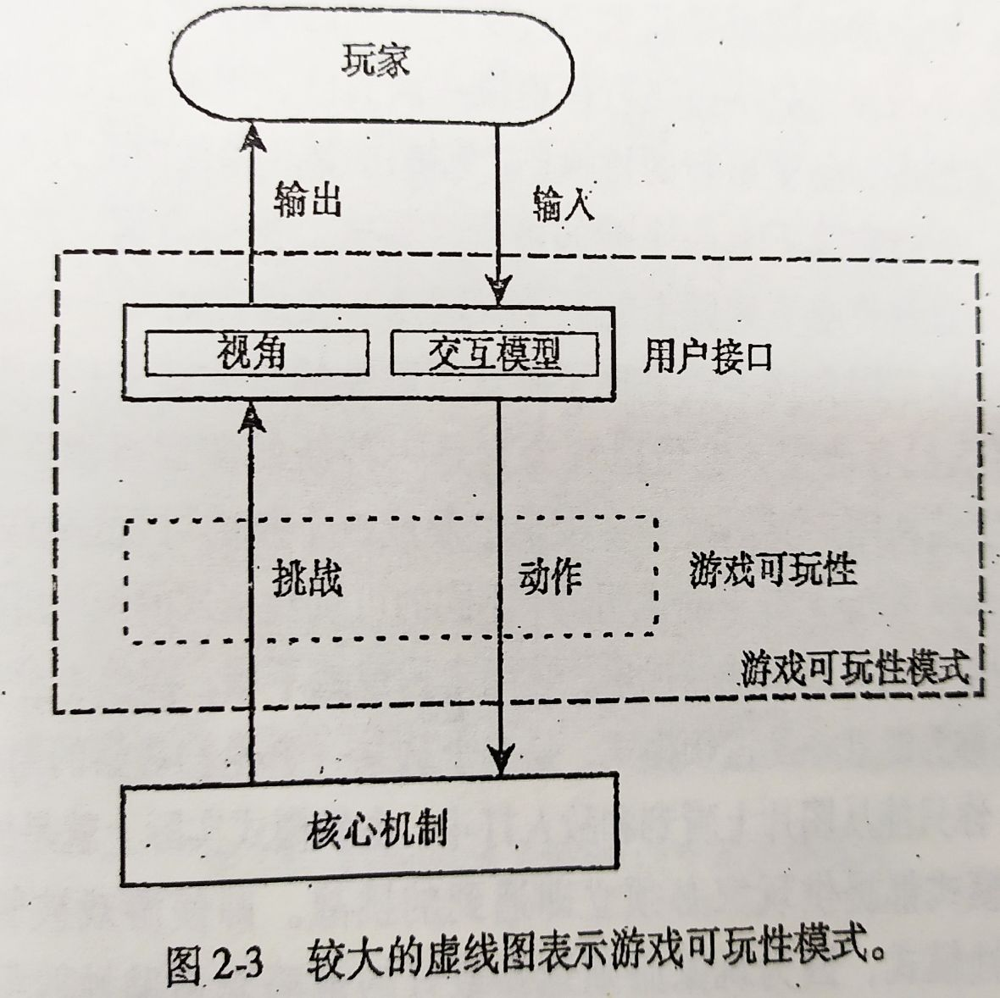

# 一、游戏和计算机游戏

## 1. 游戏简介

### 1. 游戏四要素

> **玩和假想**是体验游戏所必须具备的两个基本元素

- **玩**：和游戏交互（相互作用），**参与式/交互式娱乐**

  > **表征式/表象性娱乐**：看书、电影、戏剧，听音乐
  >
  > 游戏需要参与活动更改事件进程的主动玩家
  >
  > **游戏具有交互性和挑战性**

- **假想**：在游戏中建立虚拟世界(**魔法圈**)

  > - **魔法圈是现实世界与假象世界的分界线**
  >
  >   > 假象世界 === 魔法圈
  >
  > - 魔法圈的建立(进入)、生效(依据游戏规则)和消失(退出或结束)
  >
  >   - 当**玩家加入游戏**时，魔法圈就存在了
  >   - 当**玩家遵循游戏规则来扮演自己的角色**时，魔法圈就生效了
  >   - 当**玩家放弃游戏或游戏结束**时，魔法圈就消失了

- **任务目标**：目的和追求，目标的表示，魔法圈中存在的意义，目标的实现构成对玩家的挑战

  > - **目标的表示**： 游戏的目标不需要用获胜或击败来表示
  >
  >   > 胜利与失败不是游戏基本要素，但可使游戏更加刺激
  >
  > - **目标的限制**： 游戏的目标受到游戏规则的限定，并且有随意性
  >
  > - **目标的重要性**： 游戏的目标很重要，因为游戏必须有一定的挑战性
  >
  >   > **目标的实现构成对玩家的挑战**： 达到游戏目标的过程必须有一定的挑战性，不同玩家对挑战性的难度有不同的认识
  >
  > - **魔法圈存在的意义**： 游戏的规则与目标完全包含在魔法圈中
  >
  > > - 游戏的规则通常把游戏目标描述为**成功条件**
  > > - 决定游戏何时结束的规则称为**终止条件**

- **游戏规则**：是在游戏过程中玩家同意接受的定义和指令

  > - **规则的功能**：
  >
  >   - 建立起游戏的目标，规定在魔法圈内发生的不同活动和事件所具有的不同意义
  >   - 创建上下联系的结构，可使玩家知道哪些活动被允许，并可估计出哪些活动最有利于完成任务
  >
  > - **规则的详细定义**：
  >
  >   - **游戏符号语言**： 游戏所使用的不同符号的意义和它们之间的联系
  >
  >   - **游戏可玩性**：起到娱乐作用的挑战和对挑战做出的动作
  >
  >     > - 挑战能产生紧张和戏剧性效果
  >     >
  >     >   > 例子： 书P16
  >     >
  >     > - 视频游戏中，可玩性是娱乐的主要来源
  >
  >   - **操作序列**： 组成游戏的一系列动作
  >
  >   - **游戏的任务目标**：游戏的规则通常把游戏目标描述为成功条件
  >
  >   - **游戏的终止条件**： 决定游戏何时结束的规则
  >
  >   - **超规则**： 关于规则的规则，指出在什么情况下规则可以被改变，或在什么时候允许例外发生

### 2. 游戏认识(定义)

- **定义**： 在一种假设的虚拟环境下，参与者按照规则行动，实现至少一个既定的重要目标任务的娱乐性活动

- 游戏的竞争与冲突： 正规的游戏理论要求玩家间存在利益的冲突

  > 创造性游戏与合作游戏除外

- 游戏要求有规则，但游戏必须通过操作才能存在

  > 设计玩家活动比定义游戏更重要，因为玩家通过操作感知规则

- 游戏是一系列有趣的选择（可玩性）

- 游戏的共同特性： 

  - **娱乐性**
  - **挑战** 
  - **规则和结构**
  - **抽象**

### 3. 游戏可玩性

- 概要定义： 一系列有趣的选择或有趣的交互

- 详细定义：游戏可玩性由**玩家为达到游戏目标所必须面对的挑战**和**允许玩家采用以应对挑战的动作**组成

  > 该定义在游戏设计中处于中心地位

  - **挑战**： 事先为玩家设定的不易完成的任务

    > - 精神上和身体上的挑战
    > - 大的复杂挑战由许多小的简单挑战构成
    > - 挑战由游戏规则建立
    > - 挑战难度和种类

  - **动作**：游戏规则确定的用来克服挑战的动作

### 4. 对称和非对称游戏

- **公平定义**： 游戏开始时，所有玩家都要有相同的机会赢得胜利

  > - 游戏过程中，规则能否改变由不成文的社会习惯决定
  >
  >   > 某些情况下，规则的改变过程则由规则自身来描述
  >
  > - 规则分类： 可变规则与不可变规则
  >
  >   > 非可变规则包括了对可变规则在什么时候改变以及如何改变的说明

- **对称游戏**： 相同规则、初始条件、允许动作和取得胜利的条件等都相同，如：棋类游戏

  > 没有绝对对称的游戏

- **非对称游戏**： 可以采用不同规则以获得不同的获胜条件，如： 战争模拟游戏

### 5. 竞争合作模式

- **竞争**： 出现于玩家间发生利益冲突时，**冲突是玩家们都试图各自完成游戏给定的相互冲突的任务**
- **合作**： 玩家间通过一块工作来完成相同或相关的任务

- **竞争合作模式**： 在游戏中建立合作和竞争机制的方式
  - 单玩家： 扫雷
  - 两玩家竞争(最好的竞争模式)： 围棋
  - 多玩家竞争： 麻将
  - 多玩家合作： CS
  - 组队(分为： 组间竞争、组内合作)：足球游戏
  - 混合型竞争模式： 单玩家模式、组队模式、多玩家竞争模式(死亡竞赛)

## 2. 传统游戏与视频游戏

>  **视频游戏都要以计算机为媒介**

与传统游戏的区别： 

- **隐藏规则**： 使玩家从规则中释放出来，玩家可以像对待其他娱乐方式一样，完全沉浸在游戏中

  > - 缺点： 玩家只有通过玩游戏才能了解规则
  > - **解决方法**： 提供足够的线索使玩家推导出解决问题的正确方法，避免产生只有通过不断的试验和错误才能克服的挑战

- 设置步调： 视频游戏中，**计算机控制游戏的步调，并决定游戏的发展**

  > - 视频游戏根据游戏设计者设定的步调，是游戏保持向前发展，除非玩家要输入数据时才会等待
  > - 传统游戏中，不需要时间标记，由**玩家或独立的裁判来设置游戏的步调，即决定游戏的进展**

- **呈现游戏世界**： 虚拟现实和逼真

  - 传统游戏： 尽管通过印制的棋盘、扑克等来辅助想象，但还是**主要发生在玩家头脑**中

  - 视频游戏： 利用显示屏和扬声器，使玩家直接接触到虚拟世界

    > 视频游戏能够将设计者的虚拟游戏世界以比棋类游戏世界更直观的方式呈现给玩家

- **人工智能**： 

  - **策略**： 通过对各种不同的有效行动可能产生的结果进行分析，来确定采取最优的行动方案
  - **路径查找**： 寻找最有力的道路来穿过充满障碍的模拟地形
  - **自然语言分析**： 玩家可以通过使用自然语言对游戏发出命令
  - **自然语言产生**： 通过对事先记录下的短语或句子进行组合，以产生语言
  - **模式识别**： 包括语音识别、面部识别、加工过程中的变化检测、对玩家行为的检测
  - **模拟人和生物**： 利用 AI 模拟人或生物的行为模型

- **网络交互**

## 3. 视频游戏如何产生娱乐效果

- **游戏可玩性**： 起到娱乐作用的挑战和对挑战做出的动作

  > **可玩性是娱乐的主要来源**
  >
  > - 视频游戏中，可玩性是娱乐的主要来源，必须首要考虑
  >
  > - 挑战能产生紧张和戏剧性效果
  >

- **艺术享受(美学)**： 

  - 艺术和可玩性结合产生好的游戏

  - 艺术的协调产生整体美

    > 协调性就是玩家感觉游戏的所有部分都属于一个唯一的、连贯的整体

- **讲故事**： 

  - 传统游戏： 玩家很难沉浸在游戏故事中，因为玩游戏时还要实现游戏规则

  - 视频游戏： 能使玩家感到自己就在故事中，并影响故事的发展

    > 叙述故事催生了混合性娱乐方式： 交互式故事

- **风险与回报**： 

  - 风险与回报依旧是所有竞争游戏的关键部分
  - 风险与回报机制使游戏更加令人兴奋
  - 风险总会有回报

- **满足好奇感(新奇)**： 未知世界和未知事物的好奇

  > 视频游戏不仅给玩家全新的世界，还可以在游戏过程中改变玩游戏的方式

- **代价较小和效率较高的学习**： 

  - 游戏应能提供愉快的学习环境
  - 游戏应能提供实用的技能，即玩家学习后，有助于更成功的玩游戏

- **创造型和表现型玩法**： 如果个人选择能影响到游戏，则玩家会不计后果选择自己喜欢的选项，这就是自我表现所体现的强大吸引力

- **沉浸**：

  - **战术沉浸**： 在快速活动游戏中对“最佳状态”感觉
  - **策略沉浸**： 思考策略和制定计划
  - **叙述性沉浸**： 沉浸在故事中

- **社会化**： 

  - 本地多玩家游戏
  - 网络游戏
  - 局域网游戏
  - 集体游戏

> 游戏本地化： 改编一个不是为某个国家制作的游戏，让它可以在这个国家出售的过程

# 二、游戏设计内容和过程

## 1. 设计方法

- **艺术+工程+手工艺**： 设计师兼具艺术家的想象力、工程师的严整性、手工艺者的优雅判断力

  > - 一款游戏包含了艺术和功能的元素： 必须要有美学的愉悦、很好的运行、玩起来令人愉悦
  > - **优雅**是工艺技术的最高标志

- **以玩家为中心**： 娱乐和迎合代表性玩家

  > - 错误观点： 我就是游戏的典型玩家、玩家是游戏的对手
  > - 正确观点： 对每一项元素、每一个特征的测试都要有标准可依

  - **娱乐职责**： 给玩家娱乐是最主要的
  - **移情职责**： 把自己放到玩家代表的位置

- 其他影响因素： 

  - 市场驱动： 为特定的市场专门制作游戏，并在专门的设计中，为提高市场销售而包含某些元素

  - 设计者驱动： 与市场驱动相反，该方式忽略可玩性与其他人的智慧，结果总是得到拙劣的游戏

  - 许可证： 不能完全按照自己的想法来设计游戏

  - 技术驱动： 为展示特殊的技术成就，如：图形、硬件

    > 风险： 得花更多时间关注技术

  - 艺术驱动： 为展示某些人的艺术作品和审美情趣

  > **游戏设计的常见方法： 市场驱动型、技术驱动型、艺术驱动型**

## 2. 游戏关键组成

> **三大组成： 核心机制(决定游戏的可玩性)、用户界面(视角和交互模型)、故事叙述引擎** 
>
> - 关系： 

### 1. 核心机制

- **定义**： 把游戏中的一般规则转化为能被算法实现的数学模型

  > - 核心机制是所有游戏的中心
  >
  > - 核心机制决定游戏可玩性
  > - 核心机制是隐藏的

- **作用**： 

  - 定义了游戏所给出的挑战，以及对应于这些挑战玩家能采取的动作
  - 确定了玩家行为对游戏世界所产生的影响
  - 阐述了达到游戏胜利的条件，以及胜利或失败后所发生的结果

- 核心机制的**抽象程度(现实主义程度)**： 和游戏可玩性无关的尽可能抽象处理或不处理

  > 所有游戏在抽象与表象间转换

### 2. 用户界面

- 作用： 

  - **玩家与游戏的交互界面**： 让游戏操作更方便、娱乐玩家

  - **玩家与核心机制间的媒介**(**表示层**)

    > - 把核心机制产生的挑战转化为在屏幕上显示的图像和从扬声器中发出的声音
    > - 把玩家在键盘上的按键和操纵杆的移动转化为游戏环境中的行动

- 基本特征： 

  - **视角**： **用户界面显示游戏世界的角度**(摄像机角度)

    > - 3D： 第一人称和第三人称
    > - 2D： 自上而下、横向滚轴和平视角
    >
    > 概念观察(基于所给信息的观察或抽象展示，如：图标)、视觉观察

  - **交互模型**： **规定玩家的按键或操作和作为结果的行动之间的关系**

    - 定义了在给定时刻玩家会采取什么样的行动
    - 标准交互模型： 
      - **多处存在模式**：无论何时，玩家可以在游戏世界的不同地方采取行动，从“外面”进入“里面”
      - **基于化身的模型**：玩家以一个在游戏中已存在的人物身份出现，玩家采取的行动通过该人物进行
      - **基于团队的交互模式**： 一组角色在一起，采取点选导航和空中视角

## 3. 游戏结构

> **游戏结构： 可玩性模式和 shell 菜单**
>
> **故事和关卡进度与游戏结构的区别**：
>
> - **一个故事只发生在一个可玩性模式中**
> - **一个游戏可能有多种可玩性模式，但无故事**
> - **可玩性模式与故事之间无必然联系**

### 1. 可玩性模式

- **定义**： **由游戏的可玩性子集及表示该子集的用户界面组成**
- **组合**： 在游戏给定点的可用游戏可玩性（挑战和动作）和支持的用户界面（视角和交互模型）

- **要点**： 如果一个玩家采取影响核心机制的动作，游戏就处于一个可玩性模式中

  > 如果不影响，游戏就处于 shell 菜单或 shell 屏幕

### 2. shell 菜单

- **定义**： **不影响核心机制的动作发生在 shell 中，shell 菜单位于游戏世界外，用于基本的游戏设置**

  - shell 屏幕： 非交互式的屏幕序列，如：截屏和标题屏幕

- **注意**： 游戏可玩性模式和 shell 菜单及它们之间的联系共同组成了游戏结构

  > 即游戏要么处于游戏可玩性模式，要么处于 shell 菜单或 shell 屏幕中

## 4. 游戏开发阶段

- **概念设计阶段**： 最先执行，不能改变，概念是相对固定的

  > **游戏可玩性是概念设计阶段的第一要务，概念阶段只确定是否需要故事**

  - **获得游戏概念**
  - **定义目标人群**
  - **确定玩家角色**
  - **明确玩家实现梦想的途径**

- **详细设计阶段**： 加大部分细节并通过原型化方法和游戏测试来重新定义你的设计决定
  - **定义主要的游戏可玩性模式：视角、交互模型、挑战、动作**
  - **设计主人公**
  - **定义游戏世界**
  - **设计核心机制**
  - **创建附加模式**
  - **关卡设计**
  - **编写故事**
  - **组建、测试、迭代**

- **调整阶段**： 不再加入新特征，只为游戏优化做微调

## 5. 游戏设计团队

- 首席设计师： 一个游戏只有一位
  - 整体控制、保证一致性
  - 远见保持者
- 游戏设计师： 多位，由首席设计师管理
  - 定义和记录游戏的实际工作方式：可玩性和内部机制
- 关卡设计师： 多位，由首席设计师管理
  - 利用游戏设计师提供的游戏基本组件（可玩性、用户界面和核心机制）设计和构建关卡
  - 掌握3D建模和脚本语言
- 用户界面设计师： 设计用户界面层
- 作家： 兼职工作
  - 创建游戏的说明性或虚构的内容：介绍性材料、背景故事、对话、情景插叙
- 艺术导演(首席艺术师)
  - 管理所有可视资产：复杂模型、纹理、动画、形象和用户界面元素
  - 视觉风格
  - 和首席设计师合作
- 声频导演
  - 管理所有音频资产：音乐、背景声音、声效、对话、对白
  - 和首席设计师合作，兼职

## 6. 游戏设计文档

- 高级概念文档： 为能获得某些人、产品商、发行执行人的认可

- 游戏处理文档： 向某些对游戏感兴趣，想知道更多的人呈现游戏的大体轮廓

- 角色设计文档： 记录一个会出现在你的游戏中角色的设计文档

  > - 角色外表、移动集合
  > - 背景：历史、喜好、优缺点等
  > - 多视角、多姿势概念艺术

- 世界设计文档： 构建描绘游戏世界的所有艺术和音频的基础

- **流程板**： 流程图和故事板的交叉，**记录游戏的结构**

  > **流程板 = 流程图 + 故事板**

  - **流程图**： 程序员用来记录算法的
  - **故事板**： 电影制作人用来记录一系列尝试的线性记录

- 故事和关卡进度文档： 记录游戏中的大型故事和关卡从一个关卡到另一个关卡的方式

  > - 无故事和单关卡可以没有该文档
  > - 记录玩家从开始到结束的体验的大体轮廓
  > - 故事分支
  > - 玩家体验故事的方式：情景插叙、任务简报、对话
  > - 和游戏结构的区别

- 游戏脚本文档： 记录其他文档没有覆盖的关键部分： 游戏规则和核心机制

  > 游戏规则使得纸上玩游戏和测试游戏成为可能
  > 游戏脚本不包括技术设计：如何实现和构建
  > 首席程序员根据脚本书写技术文档

## 7. 游戏设计者

- 想象力：视觉和听觉想象力、戏剧想象力、概念想象力（想法及其关系）、横向思考（可替换）
- 技术知识：设计和实现经验
- 分析能力
- 数学能力：内部经济设计、概率
- 美学能力：艺术基础知识、艺术流派、具体艺术经验
- 常识和调查能力：历史、地理、人文、科学、政治、艺术、文学
- 写作能力：技术写作、故事写作、对话写作
- 绘画：概念艺术、素描
- 协调能力

# 三、游戏概念

- **确定想法**

- **从想法到游戏概念**： **打算怎样通过游戏可玩性娱乐某些人的一般想法** 

  > - 高级概念概述：两三句话
  > - 角色或化身：一段话
  > - 一个基本的游戏模式：视角、交互模式、主要挑战
  > - 游戏种类
  > - 目标人群
  > - 平台和目标机器，特殊设备
  > - 相关许可
  > - 竞争模式
  > - 故事；游戏流程
  > - 游戏世界
  > - 市场：对手分析、主要卖点、营销

- **定义玩家角色**

  > 越容易解释的玩家角色，越容易被理解
  >
  > - 首先考虑玩家动作，然后才是故事、化身、世界、美工等
  > - 清楚解释角色的意义：确定动作挑战（可玩性）
  > - 角色的真实程度

- **选择游戏类别**： **类别由挑战决定，与背景或游戏世界无关**

  > - **动作游戏**： 呈现的大多数挑战都是测试玩家的物理技能
  > - **策略游戏**： 大多数挑战是策略性冲突挑战
  > - **RPG**： 玩家控制一个或多个角色
  > - 体育游戏
  > - 交通工具模拟游戏
  > - **建设和管理模拟游戏**： 挑战主要与经济发展有关
  > - **冒险游戏**： 关于玩家控制的主角的互动故事，故事叙述和探索是两大关键元素
  > - 混合类别游戏：动作冒险

- **定义目标人群**

- **确定游戏进度**

- **考虑游戏平台**

  > PC、视频控制台、手机、街机、电视机、平板电脑

> 概念设计检查点：
>
> 1. 写下一个高级概念表述：给出游戏的一般特点的几句话。如果你的游戏包含了相似的内容，你可以引用其他游戏、电影、书籍或者任何其他媒体
> 2. 玩家的角色是什么？玩家要装作是某个人或者某个东西吗？如果是，是什么？这种东西多于一个吗？玩家的角色怎样帮助定义可玩性。
> 3. 游戏有一个化身或者其他主要角色吗？描述它
> 4. 用一般术语说明游戏可玩性的本质是什么？玩家会面对什么类型的挑战？玩家将使用什么样的东西来克服这些挑战？
> 5. 玩家的交互模型是什么？是无所不在？通过一个化身？还是其他东西？或者是其他组合？
> 6. 游戏的主视角是什么？玩家将怎样观察屏幕上的游戏世界？会有多个视角吗？
> 7. 游戏属于已知的游戏类别吗？如果是，属于哪一种？
> 8. 游戏是竞争型的、合作型的、基于团队的还是单人的？如果允许多个玩家，他们是使用同一台机器上的不同控制器还是通过网络使用不同的机器？
> 9. 为什么会有人希望玩这款游戏？谁是游戏的目标人群？是什么样的特征把他们同其他大多数一般玩家区别开？
> 10. 在哪种机器上运行游戏？它是否可以利用，或者它是否要求使用像跳舞毯或者摄像头等特殊的设备？
> 11. 游戏的背景是什么？它在哪里发生？
> 12. 游戏会被分为不同的关卡吗？对一个典型的关卡来说，胜利的条件是什么？
> 13. 游戏进行的过程中有一个叙事或者故事吗？用一两句话概括一下故事情节
> 14. 有其他类似游戏吗？你的游戏有何卖点？
> 15. 游戏有无需要许可的地方？
> 16. 游戏如何销售和盈利？

# 四、游戏世界

- 游戏世界： **是一个模拟的世界、一个想象的地方、游戏事件发生的地方**

  > 视频游戏的游戏世界是通过图片和声音展示

- 游戏世界的目的： 

  - 目的一： 在自己的范围内娱乐，即给玩家**提供一个探索的地方和互动的环境**

    > **游戏世界对于核心机制了解不深的玩家很重要**

  - 目的二： 把卖游戏放在第一位

- 游戏提供娱乐的方式： 游戏可玩性、新奇事物、社会互动

- 普遍规则： 玩家对于游戏的核心机制了解得越多，游戏世界就越不重要

  > 掌握核心机制要求抽象思维和可作为消遣的幻想能力

- 游戏世界的维度： **物理维度、时间维度、环境维度、感情维度、道德维度、现实维度**

  - **物理维度**： 

    - **空间维度**： 几维空间

      > 2D：横向卷轴，缺点： 没法相对玩家纵向移动，优点： 可直接与显示器兼容
      > 2.5D：看起来像三维，重叠二维图层、图层内水平精确移动、纵向方向跳跃
      > 3D：真实、3D硬件加速器和建模工具、基于化身角色
      > 4D：两个或多个3D世界，看起来相似，角色在其中移动

    - **大小规模**： 

      > 绝对大小和相对大小
      > 不影响怀疑暂停下的变形

    - **界限**：

      > 棋盘游戏界限
      > 试图掩盖世界有限的事实
      > 体育游戏世界界限：赛道、体育馆
      > 设计“有限”的世界：岛、地下洞穴
      > 飞行模拟游戏：没有有形障碍限制；到了边缘停止、循环的圆世界

  - **时间维度**： 定义了对待游戏世界时间的方式，及与现实世界不同的地方

    > 通过时间改变世界外观，不影响游戏可玩性

    - **可变时间**：时间流逝和比真实世界时间快：省略掉或缩短无趣事情的时间、睡觉
    - **反常时间**：不同部分表现不同时间速度：种田和砍树
    - **可调时间**
    - **和现实时间相同的流逝**

  - **环境维度**： 描述游戏世界的外观和氛围

    > 环境形成创造美术和音频的基础

    - 文化背景： 包括游戏的背景故事
    - 物理环境
    - 细节： 游戏世界的详细程度
    - 定义一种风格
    - 过度使用的背景： 尝试新的游戏世界，丢开既单调又过时的背景
    - 灵感来源

  - **感情维度**： 定义人物情感，且引发玩家情感

    - 影响玩家感情

      > - 刺激玩家努力得到某种东西有关的情感
      > - 玩家对角色的认同感

    - 扩展娱乐的局限性

    - 不要用数字来描述情感： 避免陈词滥调

  - **道德维度**： 定义游戏世界中，什么是对，什么是错

    - 道德决策： 避免很令人讨厌的事、给玩家适当犯错的机会
    - 游戏暴力： 避开暴力、色情、政治敏感问题

  - **现实维度**： 在高度写实与高度抽象之间

    - 现实程度和游戏类别有关
    - 不同的部分采取不同的现实程度
    - 现实在游戏中的表示服务于可玩性

# 五、创造型和表现型玩法

## 1. 自定义型玩法

- 定义： **从大量角色中选择一个化身，然后用各种方法对这个化身进行自定义**

- 意义： 提供给玩家一个在游戏世界表达自己个性的机会

  > - **化身选择**：开始时从预定义化身中选择、升级后有更多选择
  > - **化身定制**：修改化身的外貌或能力、RPG（技能、衣服、武器等）、赛车（颜色、发动机、变速器）、游戏开始或进行中（奖励）
  > - **化身构造**：从零构造角色，从一套可用的选择里挑选每个细节

**玩家可以更改的属性**：

- **功能属性**：玩家可以更改、并影响游戏过程的属性

  - **特征属性**：决定角色的基本方面，变化很慢或根本不变

  - **状态属性**：角色当前的状态，可以频繁变化

    > 变化情况： 经常，且幅度大

  > 推荐做法：
  >
  > - 给玩家一个固定或随机的点数在所有属性中分配
  > - 提供一系列默认或推荐设置
  > - 先限制，后允许设置属性

- **装饰性属性**：不影响游戏过程的属性

  > - 不是游戏核心机制的部分，只修改外观
  > - 对克服挑战和完成动作没有任何影响
  > - 装饰属性可以标示同组成员，从外观上分类

## 2. 创造型玩法

- **受限的创造型玩法**： **玩家只能在规则规定的人为限制里创造**

  - **受经济限制玩法**：创造需要经济资源限制，成功的经济管理
  - **按照物理标准创造**：创造的物体要符合物理要求
  - **按照美学标准创造**：
    - 设定规则（服装颜色、面料等搭配）
    - 供玩家研究的趋势系统（趋势信息）
    - 在线投票

- **自由创造型玩法**： **允许玩家使用所有提供的设施，没有时间或资源上的任何限制**

  > 沙盒模式： 让玩家随意操作，但通常不像受限模式那样提供奖励

## 3. 故事叙述型玩法

- **故事叙述型玩法**： **用游戏提供的东西创造自己的故事**

## 4. 游戏修改

- 发烧玩家修改游戏
- 关卡编辑器：自己给游戏设置关
- 机器人：玩家自己设置AI对手、作弊程序

> 设计问题：
>
> 1. 为了让玩家在游戏里定义自己，你想包括下面哪个：化身选择、定制、从零开始创造？如果她能修改属性，那么选择修改哪些属性？
> 2. 你怎样让玩家明白角色定制的后果，以让他作出明智的选择？你会把这些信息放在哪里？
> 3. 如果你提供创造型玩法，它的领域是哪些？机器会带来哪些限制？
> 4. 你打算提供受限的创造型玩法吗？如果这样做，限制哪些方面，经济、物理还是美学？游戏会不会提供一个解除限制的途径？在美学属性里，你怎样实现一个美学判断机制，判断结果怎样让玩家清楚地知道？有美学吸引力的创造会不会得到更多的资金、奖品、分数，或者别的奖励？
> 5. 你会不会提供自由创造型玩法？如果会，它会是普通游戏的一部分，还是单独的沙盒模式的一部分？如果你提供自由创造型玩法，玩家的创造能否影响游戏过程？
> 6. 你的游戏包含故事叙述型玩法的材料吗？它们会是什么？你怎样天衣无缝地把这些和游戏的其余部分结合在一起？
> 7. 你打算允许修改吗？你会让玩家修改什么？他们能不能设置新关卡、机器人、叙事材料？你想要使用什么样的工具来支持这样的活动？
> 8. 你怎样在玩家中间创造一种社区观念，允许他们分享创造成果？

# 六、角色开发

## 1. 角色设计目标

- **设计目标**： **创作出能够吸引人的、令人信服的、玩家能够了解的人物角色**
- 意义： 动作游戏、冒险游戏、动作冒险混合游戏、角色扮演游戏**充分利用人物角色达到娱乐目的**

> 注意： 一个好的角色是任何视频游戏的知识产权中最具有经济价值的部分

## 2. 玩家和人物模型间的关系

- **化身**： **表示游戏中由玩家控制作为主角的人物形象**

  > - 动作和冒险游戏只控制一个角色，**角色扮演(RPG)**管理一群角色
  > - 如果采用第三人称，则玩家看到化身的时间比其他角色的时间都要长

- 玩家和化身的关系： 
  - 是否自己定义他的化身
  - 化身是否具有视觉和听觉实体
  - 玩家怎样控制化身的移动

**玩家与人物模型关系**： **指定化身与非指定化身、控制效果、设计化身** 

- **指定化身和非指定化身**
  - **非指定化身**：游戏设计者没有指定化身的任何东西
  - **指定化身**：设计者需要设计人们看到的化身，更多地指定化身的属性，开发出具有个性的化身

- **设计化身**： 内容越详细，化身越独立

  - **完全非指定化身**：仅为玩家提供一个控制机制
  - **部分指定化身**：玩家能够看到和了解化身的一部分，化身没有内部生命
  - **完全指定化身**：化身和玩家分离开来，拥有自己个性的独立实体

  > **控制方式： 直接-木偶、间接、独立**

- **不同控制机制的效果**： 
  - 间接控制：不控制化身四处移动，但指出希望化身去的地方，然后化身根据安排走到那里
  - 直接控制：控制化身的操作，玩家变成化身且着迷于玩家自己没有但化身拥有的能力

- **玩家性别和角色**： 

  > 选择合适性别的角色
  > 女性希望更了解化身
  > 男性希望操作化身木偶，而不是了解化身
  > 女性喜欢定制化身，男性喜欢选择默认化身
  > 让玩家游戏选择的机会：角色和内容

## 3. 视觉外表

- **艺术驱动角色设计**： 首先考虑角色的视觉外表

  > 前提条件： 角色不复杂且改变不大

- **故事驱动角色设计**： 创建角色时，视觉和行为设计技术都会用到，但每个设计者都擅长使用某一种设计模式来作为主要的设计方法

**外表分类**：

- **角色身体类型**

  > - 具有人类特点、不具有人类特点、二者混合
  > - 卡通式特点
  > - 超性感角色

- **衣着、武器、标志性物品、名字**

- **调色板**： 保持视觉上的与众不同，反映角色的姿态和情感气质

- **同伴**： 提供变化和戏剧性穿插

## 4. 创作角色的深度

- **展示角色个性： 外表、语言、行为**

- **角色属性**： 核心机制的一部分，**状态属性和特征属性、健康属性和等级属性、角色社会关系和感情状态属性**

  > - 状态属性： 频繁改动且改动数值很大
  > - 特征属性： 改变不频繁且改变数值很小或根本不改变的属性

- **人物维度**： 角色的情感复杂度和行为对情绪的改变所做出的反应决定维度

  > - 零维：离散的情绪状态，不是连续统一的
  > - 一维：一种简单感情变化，如： 憎恨-中立-喜爱；厌恶-中立-同情
  > - 二维：多变量来描述感情，感情间正交，如： 诚实维和勇敢维
  > - 三维：多种情感，且可能会冲突，内心矛盾，如： 相互交织，道德上的难题

- **角色成长**

  > - 动作游戏：身体技巧提升，精神状态不变
  > - 冒险游戏：变化显著，身体和情感成长

- **人物原型**

## 5. 音频设计

- **音效**
- **声音和语言**

# 七、故事讲述和叙事

## 1. 为什么把故事放到游戏中

**游戏包含故事的原因**： 

- 故事可以**增加游戏的娱乐性**：上下文环境、戏剧性有意义
- 故事可以**吸引更多观众**：提供挑战的动机
- **让玩家保持较长的兴趣**：故事可以提供变化
- **有助于销售**游戏的故事

**故事设计影响因素**： 

- **长度**：游戏越长，从故事获益越多
- **角色**：关注单独一个角色
- **真实度**：抽象游戏故事较少
- **情感丰富程度**：故事有助于激发更多的情感

## 2. 关键概念

### 1. 故事

- **故事：一系列事件的记叙**

- **好故事**： **可信、连贯和戏剧上有意义**

  > - 可信：提供观众可以同情、认可或者让人信服的角色；科幻和历史
  > - 连贯：和谐的创造一个满意的整体
  > - 戏剧上有意义：必须涉及听众关心的某些东西或人

- **交互式故事**： **玩家通过执行动作与之交互的故事**（发生在现在，记述在过去）

  > 三种事件：玩家事件、游戏内事件、叙事性事件
  >
  > - **玩家事件**：玩家直接执行的动作，可玩性动作和戏剧性动作
  >
  >   > **游戏动作分为： 可玩性动作和非可玩性动作**
  >
  > - **游戏内事件**：游戏核心机制中的事件，对玩家动作的反应或独立于玩家动作
  >
  > - **叙事性事件**：玩家不能改变，玩家可以决定它们是否发生
  >
  > **交互式故事：玩家通过执行动作与之交互的故事**
  >
  > > 如果玩家的动作不能改变情节的方向，一个故事也可以是交互式的

### 2. 叙事

- **叙事的组成： 由叙述动作产生的文本或对话组成**
- **叙事定义： 叙述出来的故事事件，由游戏告诉或展示给玩家，叙事由游戏非交互式的、表现型的部分组成**
- **作用：把玩家不能控制的事件呈现给玩家**

要点： 

- 使用叙事块讲述故事的某个部分
- **叙事形式**：预制电影、图像引擎显示的场景插叙、介绍任务的滚动文本、解释游戏背景故事的画外音、角色独白、NPC间的非交互式对话
- **叙事和可玩性**：观看叙事是被动过程；提供足够多的叙事来丰富游戏世界并给玩家提供动动机；不能抑制玩家选择的自由；交互是游戏存在的理由

### 3. 戏剧性紧张和游戏可玩性紧张

> **阅读故事时的戏剧性紧张；玩游戏时的可玩性紧张**

- 戏剧紧张是故事讲述的本质

- 可玩性紧张来至玩家克服挑战的欲望以及对他是否会成功或失败的不确定性

  > - 戏剧性紧张依赖读者对角色的认同和对角色接下来会发生什么的好奇心；可玩性紧张不要求任何角色
  > - **随机性和可重复性会损害戏剧性紧张**

## 3. 故事讲述引擎

- 故事讲述引擎的作用： **把可玩性与故事的叙事事件交织在一起**
- **故事叙述引擎与核心机制的比较**： 
  - **核心机制管理玩家通过游戏挑战的进度；故事讲述引擎管理玩家通过游戏故事的进度**
  - **核心机制管理玩家事件和游戏内事件；故事讲述引擎管理叙事事件**

- 交互式故事的分类： **玩家事件、故事内事件、叙事事件**

## 4. 线性故事

- **线性故事**：**玩家不能改变的故事**

**线性故事的利弊**： 

- **线性故事比非线性故事要求的内容少**：只需创作给玩家体验的故事材料
- **故事讲述引擎更简单**：不需要记录玩家作出的重要决定，只跟踪一个情节事件序列
- **线性故事更不容易出现bug和矛盾**：不管玩家动作，事件序列不变
- **线性故事不允许玩家拥有戏剧性自由**：动作只让故事前进
- **线性故事能驾驭更加巨大的情感力量**

## 5. 非线性故事

- **非线性故事**：**允许玩家影响未来的事件，改变故事的方向**

**非线性故事结构**：

- **分支故事**： 允许玩家在每次玩游戏的时候都有不同的体验

  > - 立即、延期和累积的影响
  >   - 立即：影响事件在分支前
  >   - 延期：决定影响后面的分支
  >   - 累积：一系列决定累积一起影响一个分支点
  > - 分支游戏结构

- **反送故事**： 分支故事和线性故事的折中

  > 故事戏剧性较少，不能避免某些事件的发生，结局可以有多个

- **自发叙事**： 完全由玩家动作和游戏内事件产生的故事讲述，不包含任何作家创作的叙事块

## 6. 间隔尺度(故事粒度)

- **间隔尺度(故事粒度)**： 游戏向玩家呈现叙事元素的频率
- 无穷小粒度：游戏可玩性和故事讲述以一种细微的方式进行交织以至于玩家意识不到叙事事件和游戏中其他部分独立

## 7. 推进情节的技术

- **表现型媒体中，故事按照读者阅读或显示的速度推进**

- **视频游戏中，故事讲述引擎推动情节发展**

  > **故事引擎推动： 挑战成功、旅行、时间流逝**

**故事推动的三种情况**： 

- **克服挑战推动**

  > 随着玩家克服挑战或者做出决定向前发展：完成任务或关卡
  > 适合没有行进或行进本身不影响情节
  > 情节推进感觉有点机械

- **旅行推动**

  > - 化身的移动触发故事讲述引擎推动故事前进，旅途中设置障碍
  > - 旅程故事由挑战、选择和旅行元素构成
  >
  > - 好处：自动提供新奇性（减少戏剧材料）、允许玩家控制进度

- **时间流逝推动**： 

  > - 游戏按照自己的步调前进，使用时间的流逝推动情节
  > - 核心机制不向故事讲述引擎发送触发推动情节，故事引擎自己推动情节并向核心机制发送触发信号来说明什么时候应该提供哪些可玩性

## 8. 交互式故事的情感限制

- **非线性故事的情感限制**： 不能保证感情上最强大体验

  > 某些玩家会将故事带入到一个无趣的结局
  > 不能保证玩家可以体验你认为你的故事提供的情感上最强大的解决方案
  > 将非线性故事限制在一个单一结局

- **基于化身游戏的情感限制**： 叙述角色不能过早死亡

  > 和第一人称写的故事类似
  > 叙述角色不能过早死亡
  > 不能获得像第三人称那样对故事叙述者生命的关注
  > 化身死后，重新装入
  > 同伴死亡引发情感
  > 基于团队可以容易杀死一个团员

## 9. 有底稿的交谈和对话树

- 自然语言： 指人类写作或说话使用的普通语言

- 有底稿的交谈： 玩家参与到与非玩家角色(NPC) 的交谈中

- 实现： 通过对话树

  > 类似分支故事树，但其分支代表玩家可以选择的对话语句

- 好处： 产生了一个看似真实的谈论和回答序列

> 设计问题： 
>
> 1. 怎样让玩家可以使用的动作和游戏中的故事配合来确保游戏保持可信、连贯和戏剧上有意义？
> 2. 你怎样设计你的游戏可玩性来保证玩家没有体验过多的随机性或者重复，以至于它破坏了你的故事的戏剧性紧张？
> 3. 你的游戏中的故事会是线性的还是非线性的？
> 4. 如果你的故事是非线性的，那么故事是采用分支还是反送？什么类型的东西会导致它分支：挑战、选择或者二者同时？你会允许延期或者累积的影响吗，或者所有的影响都是立即的？
> 5. 如果故事反送，它将有多少不可避免的事件？它们会是什么？
> 6. 你的故事会有多少个结局？每一个结局是怎样反应玩家在整个游戏中的玩法和/或者选择？
> 7. 你的游戏的间隔尺度会是多少？叙事事件在什么时间以及怎样和游戏事件和玩家动作交织起来？
> 8. 你会使用什么样的技术来推进情节？旅行、事件、时间或者某些组合？
> 9. 故事可以在游戏的开始处开始吗，或者游戏也会从一个序言中获益吗？
> 10. 游戏会包含叙事（ 即不交互的）材料吗？它发挥什么样的作用—介绍、任务简介、过渡材料、结局、角色定义？叙事对玩家理解和玩游戏是基本要求吗？
> 11. 叙事材料会使用什么样的形式？手工记录？程序中的滚动文本？电影？场景插叙？语音叙事？角色独白？
> 12. 玩家可以采用什么的动作，这些动作只是故事动作，对克服挑战没有影响？交谈？建造？探索？
> 13. 游戏会包含有底稿的交谈吗？在玩家和哪个角色之间？为了什么目的？

# 八、创造用户体验(用户界面设计)

## 1. 什么是用户体验

- **用户体验**： 游戏通过用户界面向玩家呈现娱乐体验
- **游戏内部**： 指核心机制和故事讲述引擎，包含关于游戏故事、游戏规则和当前状态的所有信息
- **隔离外部**： 指用户界面，决定玩家怎样和游戏世界进行交互(交互模型)，决定玩家怎样观察游戏世界(视角)

## 2. 以玩家为中心的界面设计

- **界面设计一般原理**

  > - 一致：界面外观和功能都一致
  > - 提供良好反馈：视觉和听觉
  > - 记住玩家是发号施令的人：不要剥夺玩家操作自由；不要让化身做玩家不让做的事情
  > - 限制采取一个动作所要求的步骤的数目：个数和层数
  > - 允许简单的动作撤销（不是所有多可撤销）：撤销有限
  > - 最小化身体压力：常用和频繁使用的操作最容易操作
  > - 不要考玩家的记忆力
  > - 元素分组
  > - 为有经验玩家提供快捷键

- **玩家需要知道什么**

  > 我在哪?：主视野、地图、背景听觉反馈
  > 我现在实际上在干什么？：展示玩家在游戏世界中控制的任何东西、视觉和听觉提示
  > 我正在面对什么样的挑战？
  > 我的动作是成功还是失败？
  > 我拥有成功玩游戏所需要的东西了吗？：指示器
  > 我处于快要失败的危险之中吗？：生命值、能量条、时钟
  > 我正在前进吗？：得分、百分比
  > 我接下来要做什么？
  > 我做的怎样？

- **玩家希望做什么**

  > 移动
  > 四处观察
  > 和NPC进行物理交互（打斗、交谈、交易、疗伤。。。）
  > 捡起物体或者放下它们
  > 操作固定的物体：灯、机关、门、窗户
  > 建造和毁坏物体
  > 向单位或者角色下达命令：选定、命令、目标
  > 和NPC交谈：对话树
  > 定制角色或者交通工具
  > 在网络游戏中玩家交谈：聊天系统、论坛
  > 暂停游戏
  > 设置游戏选项
  > 保存游戏
  > 结束游戏

## 3. 设计过程

- **首先定义游戏可玩性模式**： **由摄像机视角、交互模型、可用的游戏可玩性组成**
- **选择屏幕布局**
- 视觉元素： **告诉玩家需要知道的东西**
- 控制机制： **让玩家做想做的事情**

- **shell 菜单**

## 4. 管理复杂度

- **简化游戏**

  > - 抽象：用不那么精确和详细的版本代替，游戏真实性下降，玩起来简单（赛车不考虑油不够）
  > - 自动化：把玩家从控制中解放出来（自动挡和手动挡、建造）
  >
  > 二者区别：核心机制是否影响

- **深度与宽度**

  > - **宽阔的界面：同时提供很多选项的界面**
  > - **深长的界面：一次只提供几个选项，要求做出多次选择才能完成动作**

- **上下文敏感界面**： 只展示或激活当前可用的选项

  > 灰色菜单选项

- **避免模糊**： 避免玩家不能辨别按钮或菜单的作用

  > - 美工过于积极
  > - 减少 UI 屏幕使用的压力
  > - 开发者对材料的属性

## 5. 交互模型

- **交互模型**： 玩家通过输入设备的输入和游戏世界中的作为结果而发生的动作之间的关系

**交互模型的类型**：

- **基于化身的模型**：玩家的动作大部分由控制游戏世界中的一个角色组成。玩家通过化身与游戏世界交互，玩家只能影响化身当前存在的游戏世界区域
- **多处存在模型**：玩家可以同时作用于游戏世界的不同部分
- **基于团队的交互模型**：一小组角色通常保持在一起作为一组
- **竞赛模型**：玩家回答问题并作出决定，将不同的决定分配到不同的按键上
- **桌面模型**：模仿计算机桌面或实际桌面

## 6. 视角

> 2D和3D：2D不能使用第一人称和第三人称视角
>
> **视角的相关操作名称： 横向移动，吊起，转动，倾斜，滚动**
>
> 摄像机：
>
> - **移动（离开或靠近场景）**
> - **吊起（垂直移动）**
> - **转动（绕垂直轴转动但不移动）**
> - **倾斜（转动时向上或下看）**
> - **滚动（绕镜头纵向轴旋转）**

- **第一人称视角**： **只在基于化身模型中使用**

  > 优点： 
  >
  > - 不用显示化身
  > - 不需要设计 AI 来控制摄像机
  > - 交互容易： 玩家视角与化身视角相同；化身的身体没有挡住玩家视线
  >
  > 缺点： 
  >
  > - 不能获得化身的视觉快感
  > - 不能看到化身的肢体语言和面部表情
  > - 剥夺了设计师使用电影摄像机角度制作戏剧效果的机会
  > - 使某些移动更加困难，如： 跳远

- **第三人称视角**： **基于化身模型**

  > - 化身转动时的摄像机行为： 
  >
  >   > - 摄像机不停的保持自己处于化身后面的方向
  >   > - 摄像机调整自己的方向到玩家的后面会稍微有点慢，在化身转动后有几秒的时间，可以看到周围的环境
  >   > - 摄像机只在化身停止运动之后，才把自己的方向调整到化身的后方
  >
  > - 插入的场景物体： 避免场景挡在化身与玩家之间
  >
  >   > - 把摄像机放置在正常的位置，而把中间物体设为半透明
  >   > - 直接把摄像机放在化身之后，然后吊起向下倾斜
  >   > - 立即把摄像机的方向调整为化身头部的后面，并把头部设为半透明
  >
  > - 玩家对摄像机的调整： 玩家手动移动摄像机

- **空中视角**： **基于团队和多处存在**

  > - 上下视角：2D 实现容易、用摄像机从游戏世界正上方显示游戏世界、头部和顶部、失真处理、感觉距动作很远
  > - 等距视角：适合无 3D 图形的系统、等距投影从一个角度显示游戏世界、摄像机可以横向和纵向移动、远处物体无差别、投影方向可以改变、接近动作
  > - 自由徘徊摄像机：从等距视角演变来的3D视角、摄像机角度可变、使用真实的视角显示世界（远处物体小）、必须实现所有移动摄像机的控制并让玩家掌握
  > - 上下文敏感视角：要求 3D 图形、基于化身或基于团队中使用、摄像机智能跟随动作移动，在任何时刻都以最适合显示动作的角度显示、详细定义摄像机行为、接近电影摄像师效果、成本高、不适合快速游戏

- **其他2D显示**

  > - 单屏幕：一个屏幕显示整个世界、摄像机从不移动、失真的上下视角
  > - 横向滚轴：长的2D条，摄像机从侧面跟随化身
  > - 上下滚轴：飞行游戏，上下视角变种，场景在化身下移动
  > - 绘制后的背景：早期图形冒险游戏，从多个角度绘制背景

## 7. 视觉元素

- **主视野**

  > 窗口视野：主视野占据屏幕一部分，其他部分显示反馈和控制机制。
  > 不透明覆盖：主视野充满屏幕，上面覆盖其他元素。覆盖临时、无边界覆盖
  > 半透明覆盖：主视野充满屏幕，覆盖元素半透明。容易混淆

- **反馈元素**： 向玩家转达游戏内部状态（核心机制）细节

  > - **指示器**
  >
  >   > 数字：一般数字；明确和空间利用高；表示精确的东西里程表
  >   > 针规：一般数字；交通工具模拟；机械环境；速度表
  >   > 能量条：一般数字；生命值或时间；方向、颜色、主题
  >   > 小倍数：手机信号强度；小整数数字；生命数、携带东西数、合适图片
  >   > 有色的灯：符号；合适颜色；开关或关-低-高
  >   > 图标：符号；汽车空调设置
  >
  > - **微型地图**
  >
  >   > 世界为主导：不管当前主视野的方向，地图方向；摄像机跳转
  >   > 角色为主导：显示化身周围的游戏世界，地图随着化身改变；
  >
  > - **颜色**
  >
  > - **化身肖像**： 在一个小窗口显示

- **屏幕按钮和菜单**： 反馈元素、叙事、对话

## 8. 音频元素

- **音效**：对应游戏中动作或游戏世界世界中是事件
- **环境声音**：丛林中小鸟的叫声等
- **背景音乐**：帮助设置游戏基调和步调；突出背景文化；可重复；自适应音乐
- **对白和画外音**：重复和版本；配音演员

## 9. 输入设备

- **一维输入设备**： 

  > - 控制器按钮和按键
  > - 压敏按钮
  > - 滑动开关

- **二维输入设备**： 

  > - 方向控制器
  > - 操纵杆
  > - 鼠标
  > - 触摸感应设备

## 10. 导航设备

> **自由度**： 指一个输入设备可移动的可能方向的数目
>
> > 原则上，自由度相同的设备可以互换

- 以屏幕为主导的引导
- 基于化身的引导
- 飞行
- 即点即到型导航

> 检查点： 
>
> 1. 游戏可玩性模式要求点击或者驾驶设备吗？这些应该是模拟的，一个D-pad足够吗？它们在游戏的上下文环境中实际在干什么？
> 2. 控制器上一个或者多个按钮的功能可以在一种可玩性模式里面改变吗？如果可以的话，什么视觉提示会让玩家知道这种改变的发生？
> 3. 如果玩家有一个化身（不管是一个人类、生物或者车辆），化身的移动和其他行为怎样和机器的输入设备对应？定义引导机制。
> 4. 你的屏幕的主要元素将怎样分布？游戏将使用窗口视野、不透明的覆盖、半透明的覆盖或者还是它们的组合？
> 5. 主视野将使用什么视角？游戏可玩性模式将使用什么交互模型？它是某一个常见的模型还是一种新型的？视角怎样支持交互模型？
> 6. 游戏的类别（如果有的话）对确定用户界面有帮助吗？玩家可能会希望游戏遵循已存的什么标准？你打算打破这些用户的期望吗，如果是，你将怎样通知用户那些东西？
> 7. 游戏包含菜单吗？菜单结构是什么？它是宽阔浮浅型的（ 使用很快，掌握很困难）或者狭窄深长型的（容易掌握，但是使用起来很慢）？
> 8. 游戏在屏幕上包含文本吗？如果是的话，它需要提供本地化服务吗？
> 9. 游戏使用什么图标？它们之间视觉上容易区分并被很快地识别吗？它们是各种文化通用的吗？
> 10. 玩家需要知道数字值（得分、速度、生命值）吗？这些值可以通过非数字方式（能量条、针规、小倍数）呈现吗，或者它们应该作为数字显示？如果作为数字显示，它们通过怎样的方式显示才能不破坏怀疑暂停？你会标出那些值吗，如果是，怎样标出？
> 11. 玩家需要知道什么符号值（安全/危险，锁定的/没有锁定/打开）？你将通过什么方式传递这些值和它的标记？

# 九、游戏可玩性

## 1. 让游戏变得有趣

**游戏开发过程中兴趣的来源方面**：

- **50% 避免错误**
- **30% 调整和完善**
- **10% 富有想象力的变化**：关卡设计师9%，游戏设计师1%
- **4% 游戏创新**
- **1% 不可预知**

**有趣原则**：

- **可玩性第一**：美工和故事第二
- **要正确完成一项功能，否则就去除它**
- **玩家为中心**
- **忽略无趣的东西，或使之自动化**
- **忠于设计，专注**：避免简单搅拌
- **尽量和谐、优雅和美丽**

## 2. 挑战的层次

- **原子挑战组成子任务，子任务组成任务，任务组成游戏目标**

- **显式挑战**：直接告诉玩家关于挑战的信息

  > 最高级别挑战和最低级别挑战是显式的

- **隐式挑战**：玩家自己发现

  > 中间级别挑战是隐式的

- **中间级挑战**：隐式是为了探索；依次完成原子挑战来克服中间挑战；中间挑战多种方式；多种方式获得胜；所有方式平等和都应受到奖励
- **并发原子挑战**： 让游戏压力更大，同时对付多个不同敌人

## 3. 技能、压力、绝对难度

- **固有技能**：没有时间压力克服挑战需要的技能水平

- **压力**： 衡量时间压力对玩家能力的影响

  > 此处能力： 指克服一个要求一定固有技能的挑战的能力

- **绝对难度**： 由没有时间压力情况下克服挑战要求的固有技能以及时间压力组成

## 4. 经常使用的挑战

- **身体协调性挑战**：测试玩家的身体压力，手眼协调性，时间压力有关，技能较少

  > 速度和反应时间：测试玩家快速输入控制的能力和玩家对事件的快速反应能力
  > 精确度和准确度：引导和射击类游戏
  > 对物理的直观理解：汽车驾驶；飞镖；物理引擎可靠一致；物理模型
  > 时机和节奏：横向滚轴；跳舞
  > 组合移动：复杂的操纵杆移动序列和控制按钮按下的序列

- **逻辑和数学挑战**

  > 形式逻辑谜题：不要求任何外部知识；魔方；号码锁；空当接龙；试验中推理
  > 数学挑战：隐式；概率推理；斗地主

- **竞速和时间压力**

  > 竞速：在其他玩家之前完成目标；有竞争无冲突
  > 时间压力：不鼓励深思熟虑；采用直接方法

- **事实性知识挑战**： 休闲和问答游戏要求的事实性知识要说明

- **记忆挑战**：测试玩家回忆在游戏中看到或听到东西的能力

- **模式识别挑战**：测试玩家指出视觉或听觉的模式或模式改变和行为的能力

- **探索挑战**

  > 空间感知挑战：在一个不熟悉和复杂的空间中寻找道路；文本游戏中难；地图作用
  > 上锁的门：阻止玩家在游戏中前进的障碍
  > 陷阱：触发后损害玩家的装置；多种形式陷阱；让玩家解除陷阱
  > 迷宫和不合逻辑的空间：结合逻辑和模式识别；避免反复尝试
  > 传送点：替代不合逻辑空间；突然把玩家从一个地方传送另外一个地方的技术；单向传送点；不作为挑战

- **冲突**：直接力量对抗；通过直接或间接阻碍打败对方；规模、速度和取胜条件

  > 策略：利用形势和资源做出计划
  >
  > 战术：执行一个计划完成策略要求的目标；小规模战争游戏
  > 后勤：部队后勤；无趣的后勤；武器生产；物品携带
  > 生存和消减敌方力量：生存是冲突游戏的基本挑战
  > 保护脆弱项目或单位：将；基地
  > 潜行：不被发现的移动；AI对手能力

- **经济挑战**：任何可以创建、移动、存储、赚取、交换或者毁坏的量化物质都可以形成经济的基础

  > 积累资源：财富、分数。。。
  > 达到经济上的平衡
  > 照顾生物：满足个体需要

- **概念性推理和横向思考谜题**：外部知识；逻辑谜题区别

  > 概念推理：使用推理能力和跟谜题有关的知识解决问题
  > 横向思考：高处取物；现实性和外部知识

## 5. 动作

- **动作**：直接由用户界面解释的玩家输入造成的游戏世界中的事件

  > 可玩性模式 --> 定义和重新定义动作克服原子挑战的方式 --> 中高级挑战动作 --> 角色动作

## 6. 保存游戏

- **保存游戏**： 获得一个给定的时间点的游戏世界的快照和其所有细节，并把它们存储起来，这样玩家以后就可以载入相同的数据，返回那个时间点

- **保存理由**： 

  > - 允许玩家离开游戏并在以后返回
  > - 让玩家从灾难性的错误中恢复
  > - 鼓励玩家探索可以替换的策略

- **保存的影响**： 损害用户的沉浸和故事体验

- **保存的方式**： 

  > - **密码**
  > - **保存到文件**
  > - **快速保存**
  > - **自动保存**

> 检查点： 
>
> 1. 你希望在游戏中包含什么类型的挑战？你希望挑战玩家的身体能力，还是他的智力能力，还是两者都有？
> 2. 游戏类别的定义一部分是由它们提供的挑战的性质所决定的。你选择的游戏类别暗示了什么样的游戏可玩性？你打算包含任何类别的跨类别的元素，以及在你选择的类别中通常不会出现的挑战吗？
> 3. 你的游戏的挑战的层次结构是怎样的？你希望它拥有多少关卡？每一个关卡的典型的挑战是什么？
> 4. 你的游戏的原子挑战是什么？你计划让玩家一次面对多于一个原子挑战吗？它们是全部独立的，就像一次一个的战场敌人那样，还是彼此相互关联的，就像平衡经济一样？如果它们是相互关联的，它们是怎样相互关联的？
> 5. 玩家可以选择到达胜利的方法吗？他可以决定使用一种策略而不是另一种吗？他可以忽略某些挑战，面对其他的挑战并且仍然能够到达一个更高级别的目标吗？或者他必须一次面对所有的挑战？
> 6. 游戏既包含隐式挑战吗，又包含显式挑战吗？
> 7. 你打算为你的游戏提供可以设置的难度级别吗？每一个挑战要求什么水平的固有技能和压力？
> 8. 你将实现什么动作来满足你的挑战？玩家可以使用少量的动作克服大量的挑战吗？挑战和动作之间的映射关系是什么？
> 9. 你会为其他目的实现什么样的其他动作？那些目的是什么———无组织的玩法、创造性和自我表现、社交、故事参与或者控制游戏软件？
> 10. 你计划实现什么样的保存机制？

# 十、核心机制

## 1. 简介

- **核心机制**： 由精确定义了游戏规则的数据和算法组成

  > 规则 --> 核心机制 --> 程序
  >
  > - 程序使用核心机制文档编写代码
  > - 核心机制通过游戏引擎发挥作用

- 程序使用核心机制文档编写代码

- 核心机制以文档形式表达

- 玩家不直接体验核心机制，但可以从游戏的行为方式推断核心机制

- 核心机制通过游戏引擎发挥作用：游戏引擎执行核心机制核心机制指定了引擎将会做什么，引擎可以选择确切的做的方式

- **核心机制功能**

  > 控制游戏内部经济
  > 通过用户界面向玩家呈现主动的挑战：被动挑战vs主动挑战
  > 接收玩家动作并实现它们的效果
  > NPC控制
  > 改变游戏模式
  > 向故事讲述引擎发送触发信号

- 实时游戏中核心机制持续运转；回合制种等待玩家动作并计算动作对游戏世界的效果

## 2. 关键概念

- **资源**： 玩家可以移动或交换的物体或材料的类型，游戏可以把它们作为数字值处理，对这些值执行算术操作

  > 核心机制定义游戏使用或者交易资源的过程，还有资源实例如何进出游戏

- **实体**： 资源的一个特殊的实例或者游戏世界的某些元素的状态

  > 简单实体：由一个数据说明
  > 复合实体：需要多个数据描述
  > 属性：属于另一个实体的实体；属性也可以是复合实体
  > 唯一实体：游戏中只有一个

- **机制**： 记录了游戏世界和游戏世界中的所有东西的行为方式，规定了实体、事件和发生在游戏的资源和实体之间的过程之间的关系，记录了触发事件和过程的条件

  > 全局机制：在整个游戏过程中运行的机制；特定可玩性模式的机制
  > 实体之间的关系：公式或表格表达；角色级别=经验值/1000
  > 事件：条件触发一次它就发生一次的变化；当玩家捡起一个金蛋（条件），他得到2分（事件）
  > 过程：动作序列
  > 条件：导致一个事件发生和过程的开始或停止；程序语言的控制结构描述

- **数字和符号关系**：
  - 数字关系： 通过数字和算术操作定义的实体之间的关系
  - 符号关系： 符号实体可能表现出的所有状态以及它们之间的关系
  - 数字符号关系： 数字定义符号，符号控制数字

## 3. 内部经济

- **经济**：资源和实体量化产生、消费和交互的系统

**经济机制**： 

- **来源**： 资源或实体到达游戏世界的机制
- **消耗**： 资源怎样永久性离开游戏世界的规则
- **转换**：把一种或多种资源变为另外类型资源的机制
- **交易**： 管理玩家与玩家之间的商品交易
- **生产机制**： 方便玩家可以使用资源，或者直接把资源带给玩家的来源

**有形和无形资源**： 

- **反馈循环、相互依赖和死锁**： 

  > - **反馈循环**：一个生产机制要求这个机制本身生产的资源
  >
  >   > 需要启动资源
  >   >
  >   > 会导致死锁
  >
  > - **相互依赖**：两个生产机制彼此需要另一个的输出作为输入来正常运转
  >
  >   > 会导致死锁

## 4. 核心机制和游戏可玩性

- 核心机制向玩家呈现挑战，并从玩家那里接收动作，媒介为用户界面

- **挑战和核心机制**： 

  > **被动挑战**：纯静态的障碍作为的挑战
  > **主动挑战**：允许玩家与其交互

- **动作和核心机制**： 

  > **玩家动作触发机制**： 详细说明每个动作的机制
  >
  > **数据伴随的动作**： 对来自于用户界面的数据的操作和存储

## 5. 设计核心机制

- **设计核心机制**：

  > - 识别关键实体和机制
  > - 编写记录实体的属性和机制的功能的详细说明

- **机制组成**： **关系、事件、过程、条件**

- **核心机制设计目标**： 

  > 尽量简单和优雅
  > 寻找模式，然后一般化
  > 不要试着让理论的一切都完美：反复改进
  > 关于细节程度的说明：折中和平衡

- **重新检查早期的设计工作**： 

  > 玩家将要做什么
  >
  > 游戏结构的流程板：机制状态实体
  > 情节转换条件
  > 故事中的角色
  > 关卡计划：什么类型东西
  > 关卡推进方式
  > 所有胜利和失败条件
  > 非可玩性动作
  > 去掉装饰性的东西

- **列出实体和资源** 

# 十一、游戏平衡

- **游戏平衡**： 对玩家公平、难道适中、玩家技能是决定因素的游戏

- **避免统治性策略**

  > 统治性策略：可以可靠地获得玩家可以到达的最好结果的策略，而不用管对手做的怎么样

- **避免偶然性**

- **玩家对玩家公平**： 感觉公平，可以超越，很少平局

- **玩家对环境公平**： 感觉公平，主观难度一致

管理困难度：

> - 难度使玩家尽量保持最大生产状态：能力正好符合他所面对的问题
>
> - **难度4要素：技能、压力、游戏提供的能力、游戏内经验**
>
> - 其他要素：事前经验和天赋
> - 提供的能力：跟当前情况相适应的玩家力量
> - **相对难度**：和玩家克服挑战的能力相关联的挑战的难度
> - **感知难度=绝对难度-（提供的能力+游戏内经验）**

# 十二、关卡设计的一般原理

## 1. 简介

- **关卡设计**： 使用游戏设计师提供的组件，构建直接提供给玩家体验的过程

关卡设计师创造了玩家体验的以下基本部分：

- **游戏发生的空间**：将设计师的大体计划变得明确和具体
- **关卡的初始条件**：可变特性的状态
- **关卡内挑战的集合**：构建合适空间，并将挑战放置在里面
- **关卡的终止条件**
- **可玩性和故事的之间的相互作用**：可玩性和叙事事件
- **关卡的美学和意境**

## 2. 设计原理

- **一般关卡设计原理**

  > 把一个游戏的早期关卡制作为新手关卡
  > 使关卡的步调多样化
  > 当玩家克服一个消耗了他的资源的关卡时，提供更多资源
  > 避免概念上的不合逻辑
  > 明确地通知玩家他的短期目标
  > 冒险、奖励和决定的后果很清晰
  > 奖励玩家的技能、想象力、智力和共享
  > 大奖励、小惩罚
  >
  > 一个人工对手的作用就是呈现出游戏的打斗然后失败
  > 实现对多种难度的设置

- **特定类别的关卡设计原理**

  > 动作游戏：步调多样化
  > 策略游戏：奖励计划（策略性思考）-预测对手的移动并为防守做准备
  > 角色扮演游戏：提供角色自我成长和玩家自我表现的机会
  > 体育游戏：逼真最重要（场地、队员）
  > 交通工具模拟游戏：奖励熟练的操作
  > 建设和管理模拟游戏：为初始条件和目标提供一个有趣的变化
  > 冒险游戏：构建和玩家位置和故事和谐的挑战（多章节）
  > 人工生命游戏：为生物创造交互机会
  > 益智游戏：给玩家思考时间

## 3. 布局

- 开放式布局：几乎无限制的移动
- 线性布局：要求玩家按照固定的顺序体验游戏的空间
- 平行布局：线性布局变种
- 环形布局：路径最后返回出发点
- 网络布局：一个空间和其他多个空间相连
- 星型布局：玩家开始处于布局的中间位置，从中心出发探索其他空间，玩家选择想去的地方
- 组合布局：线性布局中组合网络布局，一个故事总线，多个子情节

- 气氛
- 步调
- 新手关卡

## 4. 设计过程

**关卡设计过程**： 

- 明确设计基础
- 计划
- 原型化
- 关卡评审
- 关卡改进和锁定
- 移交给艺术家的关卡设计
- 第一次艺术调整
- 艺术品移交给关卡设计和评审
- 内容整合
- 调试
- 用户测试和调整

**关卡设计缺陷**： 

- 范围不正确
- 概念上不合逻辑
- 非典型关卡不可选
- 一次展示所有东西
- 忽略观众