# 一、 认识软件架构

- **本书的主旨：** **阐明企业目标、产品需求、设计师的经验、构架和最终系统之间的关系**——它们构成带有回路的、可由开发组织实施管理的周期
- **架构商业周期(ABC)**： 软件架构是技术、商业和社会等诸多因素作用的结果，而软件架构的存在反过来又会影响技术、商业和社会环境，从而影响到未来的架构（**从环境到架构又返回到环境**）
- **架构也是若干商业和技术决策的结果**

## 1. 软件架构的概念 

#### 1. **定义：** 

> **是系统的一个或多个结构，他们由软件元素、这些元素的外部可见属性以及组件之间的关系组成，组件的外部可见性属性是指其他元素对该元素所做的假设**

从下面六个方面来理解：

- 软件架构**定义了软件元素**
- 系统可能**由多个结构组成**
- **每个软件系统都有自己的架构**
- 架构应**建立在一定的设计原则之上**
- 只要某个组件的行为可以从其它组件的角度观察到或区别开，这样的行为就是软件架构的内容
- **软件架构是抽象的**，集中研究“黑盒”组件的行为和交互，是设计第一步

#### 2. 其它观点

- 软件架构是**高层次的设计**
- 软件架构是**软件系统的总体结构**
- 构架**是组件和连接器**
- **软件架构是一个程序或系统的组件结构、组件之间的相互联系及管理其设计和演变的原则和方针的结构**
- 软件架构是具有一定形式的结构化元素，包括处理元素、数据元素和连接元素。处理元素负责对数据进行加工，数据元素是被加工的信息，连接元素把架构的不同部分组合连接起来(Perry和Wo1f提出)
- 软件体系结构是**软件设计过程中的一个层次**，这一层次超越计算过程中的算法设计和数据结构设计(Mary Shaw和David Garlan)
- **软件体系结构有四个角度**(Kruchten)：
  - 概念角度描述系统的主要构件及它们之间的关系
  - 模块角度包含功能分解与层次结构
  - 运行角度描述了一个系统的动态结构
  - 代码角度描述了各种代码和库函数在开发环境中的组织

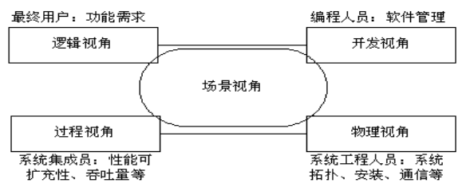

## 2. 软件架构的多个结构

**P31 页图片（和PPT不一样）：**

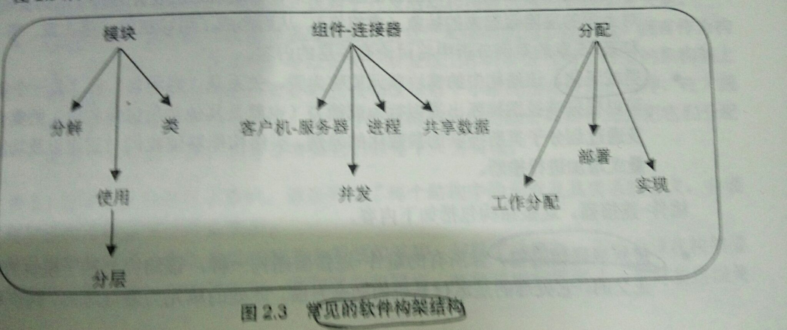

#### 1. 静态的角度：

- **模块结构** —— **体现了任务的划分**，每个模块有其接口描述、代码和测试计划等，各模块通过父子关系联系起来，在开发和维护阶段用于分配任务和资源
- **分析类结构** ——**子系统图、包图**
- **类结构** —— **对象之间的继承或实例关系**

#### 2. 动态的角度：

- **进程结构** —— **运行系统的动态特征**，包括进程间的同步关系、缺少不能运行、存在不能运行、先后等关系，与模块结构、概念结构成垂直正交关系
- **数据流** —— 模块之间可能发送数据的关系，最**适合用于系统需求的追踪**
- **控制流** —— 程序、模块或系统状态之间的“之后激活”的关系，**适合于对系统功能行为和时序关系的验证**
- **使用结构** —— **描述过程或模块之间的联系**，这种联系是“假设正确存在”的关系，用于设计可轻松扩展的系统。如果过程A的运行必须以过程B的正确运行为前提，则说过程A使用过程B
- **调用结构** ——（子）过程之间调用和被调用的关系，可**用来跟踪系统的执行过程**
- **层次结构** —— 是一种特殊的使用结构，**层就是相关功能的一致集合**，在严格的分层结构中，第n层仅能使用第n-1层提供的服务

#### 3. 部署的角度：

- **物理结构** —— 软件与硬件之间的映射关系，在分布式或并行系统中有重要意义

### 各种结构间的相互关系

- 各个结构都是从不同角度考察系统，但它们并不完全独立，它们之间的**联系是多对多的**
- 每个项目在开发时一般是**注重一个结构**，按照这一主要结构来考虑和运用其它结构
- 经验表明，**系统规模越大，结构之间的差异越明显**

## 3. 软件架构的影响

#### 1. 架构受系统涉众的影响

> **涉众就是对系统构建感兴趣的人或组织**
>
> 如：客户、最终用户、开发人员、项目经理、维护人员、对系统进行市场营销活动的人

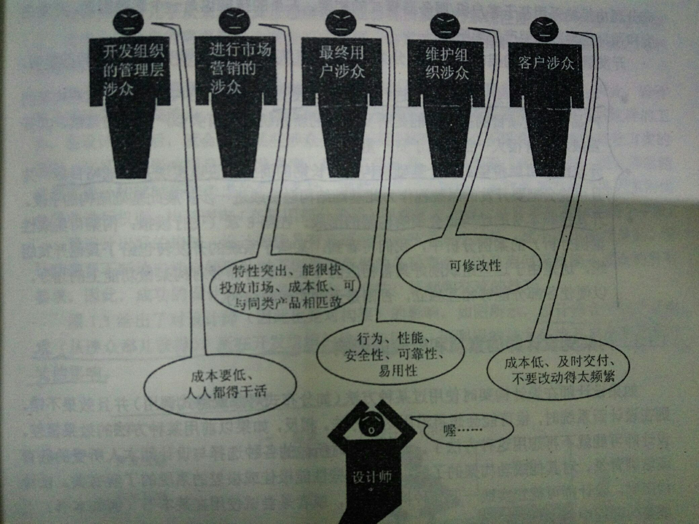

#### 2. 不同客户(开发组织)对软件构架的影响

- **直接影响：** 如直接进行商业投资，希望向产品线发展
- **长远影响：** 如行业布局
- **组织结构的影响：** 如软件外包
- **间接影响：** 开发组织的开发团队的经验对设计师有影响

#### 3. 构架受设计师的素质和经验的影响 

#### 4. 构架受技术环境的影响 

#### 5. 构架受设计的沟通能力的影响

> **设计师会受到产品需求（从涉众获得）、所在开发组织的结构和目标、可利用的技术环境及自身素质和经验的影响**

**软件架构的影响：**（下图）

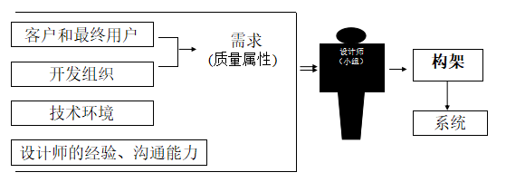

## 4. 软件架构对影响的反作用

**软件架构的商业周期：**（下图）

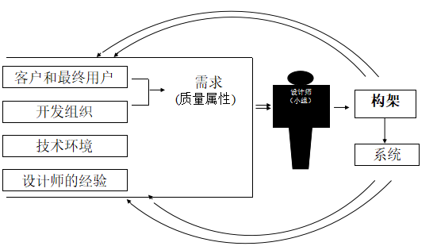

该商业周期的运作：

- 软件架构**影响开发组织的内部结构和经营目标**
- 构架**影响开发组织的目标**
- 软件架构可能会**影响客户对下个系统的需求**
- 软件架构的过程丰富了整个开发团队的经验，从而**影响设计师对后继系统的设计**
- 有些系统甚至会**影响并实际改变软件工程的发展，以及开发人员学习和实践的技术环境**

## 5. 软件过程

> **软件过程：对软件开发活动的组织、规范和管理**

软件过程中涉及的活动：

- **为系统构建商业案例：**问题的解决必须要有系统设计师的参与
- **理解系统需求：** a. 要先了解已有系统的特性，b. 创建原型
- **创建或选择构架：** **概念完整性是成功设计系统的关键**，只有通过以小组的形式共同设计系统构架才能真正实现概念完整性
- **构架的交流：**
  - **开发人员**必须理解构架对他们的要求
  - **测试人员**必须清楚自己所面临的任务
  - **管理层**必须明确构架要求做出什么样的规划
- **构架的分析和评审：**
  - 基于**质量属性**的评估：确保满足该构架的系统**满足涉众的需求**
  - 基于**场景技巧**的评估：是**对构架最有效、最通用的方法（如：ATAM）**
- **实现基于构架的系统：**
- **使构架符合原来的表述：**当架构创建完毕并投入使用后，开发就进入维护阶段

## 6. 软件架构的重要性

- **风险承担者(涉众)之间的交流**： 有关各方可借助它表达和协商各自的需求，并理性找到解决方案

- **早期设计决策**

  - 构架明确了对系统实现的约束条件
  - 构架决定了开发组织的组织结构
  - 构架阻止或支持系统的质量属性的实现
  - 通过研究构架来预测系统质量
  - 构架使推理判断和控制更改更简单
  - 构架有助于循序渐进的原型设计
  - 可以通过构架进行更准确的成本和进度估计

- **可传递、可重用的系统抽象**

  - 产品线共享一个公共的构架

  - 系统开发可以使用大型的、由其他组织开发的元素

  - 少就是多：限制选择范围值得

    > **优点：重用程度更高、更易于理解和交流的简单规范的设计、更为透彻的分析、更短的选择时间、更强的可互操作性**

  - 构架使基于模板的开发成为可能

  - 构架作为培训的基础

# 二、质量属性

- **构架是实现质量需求的软件创建中的第一个阶段**
- **构架是软件功能到软件结构的映射**
- **软件结构确定了构架对质量属性的支持**

## 1. 概念

软件系统的质量属性是指**系统在整个生命周期中所具有的特征**

## 2. 需求分析与架构的关系

> **需求是架构设计的基础，但在需求阶段是无法弄清全部需求的，因此需求和架构设计之间的迭代是必要和有意义的**

**需求包括三要素**

- **功能：**指系统能够完成所期望的工作的能力（**功能性和质量属性是正交的**）
- 质量
- 限制条件

## 3. 功能和架构的关系

> **功能是构架设计的必要条件，因为不同架构具有相同的功能，它们的差别在于质量**

- **功能：** 功能是指系统所能完成的工作

构架设计主要考虑如何满足质量上的要求，但软件构架会限制各模块的功能划分，**功能对架构设计有间接的影响**

## 4. 构架和质量属性的关系

> **质量属性：** 系统在其生命周期过程中所表现出的各种特征
>
> **必须在从设计、实现、部署的整个过程中考虑质量属性的实现**

- **架构和质量属性的关系** 
  - 架构是获取许多质量属性的基础，即不能独自实现质量属性
  - 质量属性既和架构有关，也和具体实现有关
- **质量属性之间的关系** 
  - 一个质量属性的获取对其他质量属性可能产生正面或负面的影响
  - 任何质量属性都不可能在不考虑其他属性情况下单独获取

## 5. 质量属性及其场景描述

#### 1. 质量属性的类别

- **运行时可见属性** 

  - **可用性：** **系统正常运行时间的比例**，是通过两次故障之间的时间长度或在系统崩溃情况下能够恢复正常运行的速度来衡量的

    > **可靠性是指系统能够保持正常运行的能力，通常用平均无故障工作时间来衡量**

    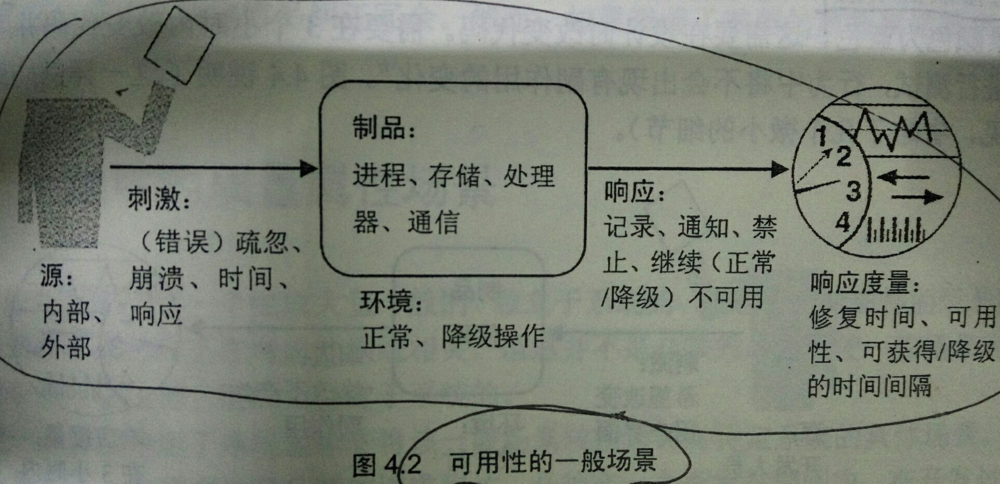

  - **性能：** 指**系统的响应能力**——即对外部刺激（事件）做出反应时所需要的时间或在某段时间内所处理的事件个数

    - 服务请求的到达速率
    - 处理时间
    - 队列大小
    - 延迟时间长短

    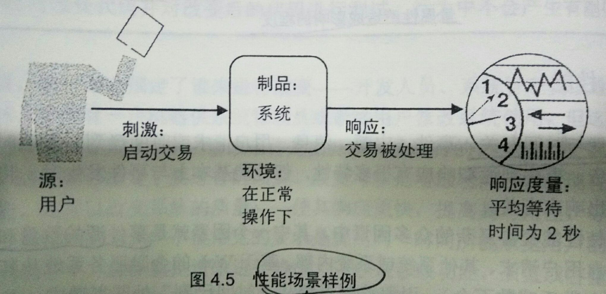

  - **安全性：** 衡量系统在向合法用户正常提供服务的情况下，**阻止非授权使用和抗拒拒绝服务攻击的能力**

    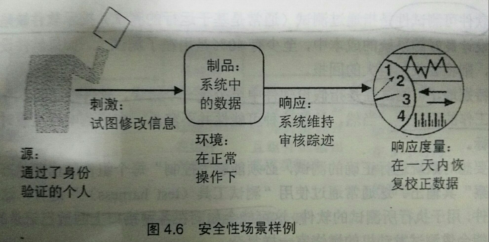

  - **易用性：** 

    - 可学习性
    - 可记忆性 
    - 错误避免 
    - 错误处理 
    - 满意度

    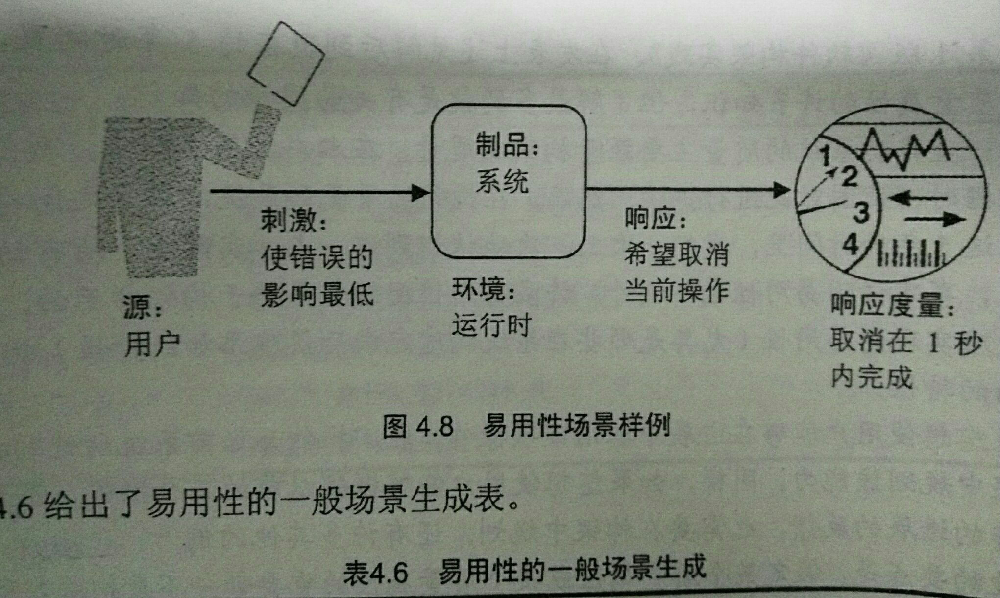

- **维护时可见属性** 

  - **可修改性：** 进行**快速修改并使修改代价尽可能低的能力**，这种能力直接受到构架的限制

    - 涉及一个组件的修改 
    -  涉及几个组件的修改
    -  涉及整个构架的修改

    **更改由于商业目的的变化：**

    - 功能的扩展或改变 
    - 删除不需要的功能
    - 适应新的操作环境
    - 结构的重新调整

    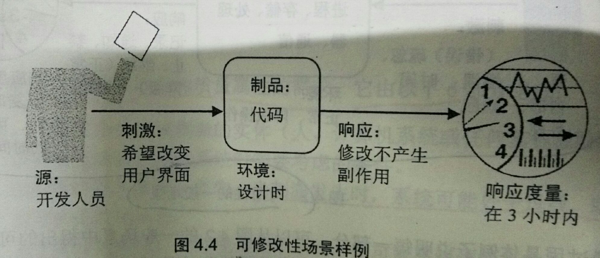

  - **可测试性：** 指**通过测试（通常是基于运行的测试）揭示软件缺陷的容易程度**

    > **可测试性**：指假设软件中至少有一个错误，软件在”下次“测试运行时不能正常工作的可能性

    

  - **可移植性：** 系统能够在**不同计算环境下运行的能力**， 这里所说的环境可能是硬件、软件或两者的组合

  - **可重用性：**指要合理地设计系统，使系统的结构或其某些组件能够在以后的**应用开发中重复使用**

  - **可集成性：** **使独立开发的系统组件能够协同运行的能力**

    > **可集成性**表明了一个系统内各个组件之间相互协作的能力
    >
    > **互操作性**衡量的则是一个系统与另一个系统的协作能力

    - 组件的外部复杂性
    - 组件之间的交互机制和协议
    - 组件功能划分的清晰程度
    - 组件接口的定义是否完整、合理

#### 2. 质量属性场景描述及场景图

> **质量属性场景就是通过对某个实体与系统的一次交互的简要描述说明一个有关质量属性的特定需求**

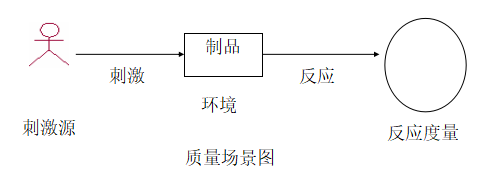

- **刺激源**：可以是风险承担者、计算机系统等
- **刺激**：可以看作是一个事件
- **环境：**系统当前的状态
- **制品：**系统中对事件作出反应的部分，可以是整个系统或系统的某一部分
- **反应：**事件到达后系统的相关行为
- **反应度量：**对反应结果提供某种形式的衡量

**生成质量属性场景的目的和意义：**

- 帮助构架师**生成有意义的质量属性需求**
- **使质量属性需求的描述规范化**
- 某一场景是一类场景的代表，系统将以完全相同的方式对这些场景做出反应

**质量场景创建的参与人员：**

- 负责软件执行的人员—— **最终用户**
-  负责管理系统的人员—— **系统管理员**
- 负责更改系统运行时功能的人员—— **维护人员**
- 负责系统规划的单位 —— **客户**
- 负责项目实施的单位 —— **开发组织**

## 5. 限制条件

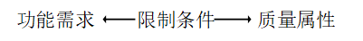

- **商业限制**（构架的商业属性）： 
  - **投放市场时间**
  - **成本和收益**
  - **预计的系统生命周期的长短**
  - **目标市场**
  - **推出计划**
  - **遗留系统集成**
- **技术限制**
- **法律限制**
- **社会限制**

## 6. 架构本身的质量属性

- **一致性（概念完整性）：**

  -  构架应该以类似的方式做类似的事情
  - 迈向一致性的最重要一步是有一个系统构架师

- **正确性和完整性：**构架能够满足系统的各种需求及运行时的资源要求

- **可构建性：**保证能够由指定的开发小组在规定时间完成，并允许在开发过程中做某些更改

  > **指的是构建某个所期望的系统难易程度**

## 7. 构架的商业属性

- **上市时间**
- **成本和收益**
- **所希望的系统生命周期的长短**
- **目标市场**
- **推出计划**
- **与老系统的集成**

# 三、软件架构的样式与框架

- **样式即模式**

## 1. 软件架构样式的概念

> **是对各组件类型和运行控制/数据传送模式的描述**

**从四个方面理解构架样式：**

-  一组在系统**运行时执行一定功能的组件类型**
- 能够表明在**系统运行时组件的相互关系的拓扑结构**
- 一组**语义约束条件的集合**
- 一组**连接件的集合**，这些连接件为组件之间的通信提供中介

## 2. 软件架构样式的种类

#### 1. 以数据为中心的样式

- **优点**： 客户端相对独立
- **缺点**： 数据中心的性能要高，响应速度要快，并且要有灾难备份等

#### 2. 数据流样式

> - **目标** 是实现**可重用性和可更改性**
> - **特点** 是把系统看作是对相继输入数据的一系列变换

- **成批顺序式**：**顺序执行，各个步骤之间，数据是作为一个整体传送**
- **管道—过滤式** ：**管道负责数据传递，过滤器对数据进行渐进的转换**

#### 3. 虚拟机样式

> 目标是实现**可移植性**

#### 4. 调用--返回样式

> - **大型软件系统的主流构架样式**
> - 目标是实现系统的**可更改性和可扩展性**

- 主程序-子程序构架        
- 远过程调用构架        
- 面向对象构架        
- 分层构架

#### 5. 独立组件样式

> 通过解除各运算部分之间的耦合实现**可更改性**

- **事件系统样式**
- **通讯进程样式**

#### 6. C/S样式

- **二层C/S结构：** 

  **局限：**

  - 二层C/S结构是单一服务器且以局域网为中心的，所以难以扩展至大型企业广域网或Internet
  - 软、硬件的组合及集成能力有限
  - 服务器的负荷太重，难以管理大量的客户机，系统的性能容易变坏
  - 数据安全性不好

- **三层C/S结构：** 

  - **表示层**： 用户接口部分
  - **业务层**： 应用的本体
  - **数据层**： 数据库管理系统，负责管理对数据库数据的读写

  **优点：** 

  - 允许**合理地划分三层结构**的功能，使之在逻辑上保持相对独立性，从而使整个系统的逻辑结构更为清晰，能**提高系统的可维护性和可扩展性**
  - 允许更灵活有效地选用相应的软硬件平台，使之在处理能力和处理特性上分别适应于结构清晰的三层；并且这些平台和各个组成部分可以**具有良好的可升级性和开放性**
  - 三层C/S结构中，**各层可以并行开发**，可以选择各自最适合的开发语言，维护也会更容易些
  - 允许充分利用业务层有效地隔离开表示层与数据层，未授权的用户难以绕过业务层而利用数据库工具或黑客手段去非法地访问数据层，这就为严格的**安全管理**奠定了坚实的基础；整个系统的管理层次也**更加合理和可控制**

#### 7. C2样式

> **基于构件和消息的体系结构模式，用于构建灵活的、可伸缩的软件系统**

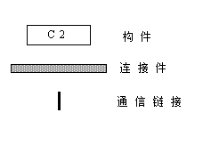

- **设计规则：** **构件和连接件**

  > - 构件的“顶域”与连接件的“底域”相连接
  > - 构件的“底域”与连接件的“顶域”相连接
  > - 对连接到某一个连接件上的构件数量没有限制，但构件与构件之间不能直接相连

- **通信规则： ** **所有构件间的通信必须通过消息来实现**

- **最重要的特征：** **底层无关性**，以**连接件为中介**的异步消息交换机制来实现

- **体系结构风格： ** 通过连接件绑定在一起的按照一组规则运作的并行构件网络

- **特点：** 

  - 系统中的构件可实现应用需求，并能将任意复杂度的功能封装在一起
  - 所有构件之间的通讯是通过以连接件为中介的异步消息交换机制来实现的
  - 构件相对独立，构件之间依赖性较少，系统中不存在某些构件将在同一地址空间内执行，或某些构件共享特定控制线程之类的相关性假设

#### 8. 正交体系结构

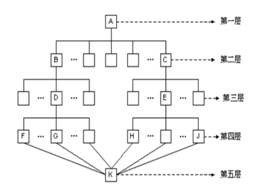

> **由层和线索的构件构成**

- **层**： 是由一组具有相同抽象级别的构件构成
- **线索**： 是子系统的特例，它是由完成不同层次功能的构件组成（通过相互调用来关联），每一条线索完成整个系统中相对独立的一部分功能

**主要特征：**

- 正交软件体系结构**由完成不同功能的n（n > 1）个线索（子系统）组成**
- 系统具有**m（m > 1）个不同抽象级别的层**
- 线索之间是**相互独立**的（正交的）
- 系统有一个**公共驱动层**（一般为最高层）和**公共数据结构**（一般为最低层）

**优点：**

- 结构清晰，易于理解
- 易修改，可维护性强
- 可移植性强，重用粒度大

#### 9. 构架的异质性

- 局部异质 
- 层次异质
- 并行异质

## 3. 构架模式、参考模型与参考构架

- **构架模式** —— 是对元素和关系类型以及一组对其使用方式的限制的描述
- **参考模型** —— 是一种考虑**数据流的功能划分**，是对已知问题的标准分解，分解所得的各个部分相互协作，构成问题的解决方案
- **参考构架** —— 是**映射到软件组件及组件之间数据流上的参考模型** ，即将功能划分与系统分解对应起来，这种对应不一定是一一映射

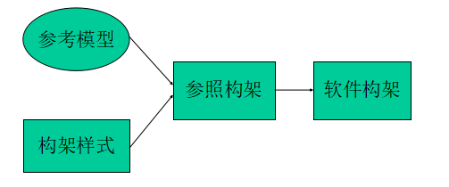

> **构架模式，参考模型和参考构架都不是构架，但都是早期设计决策的产物，都对构架设计有帮助**

## 4. 软件架构、框架和设计模式

- **定义：** 软件框架是**提取特定领域软件的共性部分**形成的体系结构，不同领域的软件项目有着不同的框架类型
- **作用：** 开发过程中代码不需要从头编写，**提高软件的质量，降低成本，缩短开发时间，形成良性循环**

#### 1. 框架和平台的关系：

- **平台**在应用层面主要指**提供特定服务的系统软件**
- **框架**更**侧重设计和开发过程**，框架可通过调用平台提供的服务而起的作用

#### 2. 框架和类库的关系：

- 框架构成了通用的、具有一般性的系统主体部分
- 二次开发人员根据具体业务，完成特定应用系统中与众不同的特殊部分

#### 3. 框架和架构的关系：

- **构架**确定了**系统整体结构、层次划分、不同部分之间的协作等设计考虑**
- **框架**更**偏重于技术**，确定框架后，其所对应的架构也随之确定，但在一个系统架构中可以集成多种框架

#### 4. 框架和设计模式的关系：

- **设计模式**研究的是**一个设计问题的解决方法，一个模式可应用于不同的框架和被不同的语言所实现**
- **框架**则是**一个应用的体系结构，是一种或多种设计模式和代码的混合体**

**共性：** **共同致力于使人们的设计可以被重用**（计模式的思想可以在框架设计中进行应用）

**区别：**

- **从应用领域上分**，框架给出的是整个应用的体系结构；而设计模式则给出了单一设计问题的解决方案
- **从内容上分**，设计模式仅是一个单纯的设计；而框架则是设计和代码的一个混合体
- **设计模式比框架更容易移植**

# 四、实现质量属性的战术

## 1. 战术介绍 

- **战术是对质量属性的控制产生影响的设计决策**
- **架构策略**是架构中所采用的**战术的集合**

**特点：**

- **根据一种战术可以求精其他战术**，并可以组织成层次的形式
- **模式可以把战术打包**，如冗余战术通常还会使用同步战术

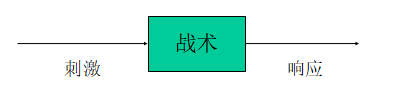

## 2. 可用性的战术

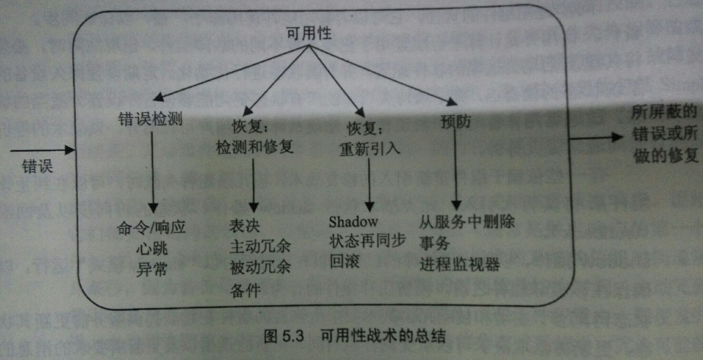

#### 1. 错误检测

-  **砰/回声**
- **心跳**
- **异常**

> **砰/回声和心跳战术用来检测另一个进程的错误，异常是进程本身的错误处理**

#### 2. 错误恢复

- **表决**
- **主动冗余**
- **被动冗余** 
- **备件**
- **shadow操作**           
-  **Windows的安全模式** 
- **状态再同步**
- **检查点/回滚**

#### 3. 错误预防

- **进程监视器**
- **从服务中删除** 
- **事务**

## 3. 可修改性的战术

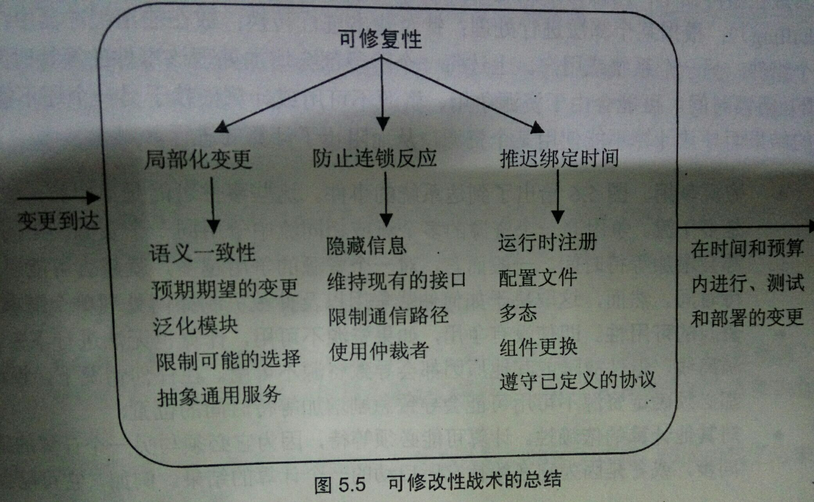

#### 1. 局部化修改

> **是在设计期间为模块分配责任，以把预期的变更限制在一定的范围内，以降低修改成本**

- 维持语义的一致性
- 预期期望的变更
- 泛化模块
- 限制可能的选择

#### 2. 防止连锁反应

> **修改没有直接影响到的模块也需要改变，这是由于模块间存在依赖关系**

**依赖关系有：**

- **语法**
- **语义**
- **顺序**

**防止连锁反应的战术有：**

- 信息隐藏
-  维持现有的接口
  -  添加接口 
  - 添加适配器  
  - 提供一个占位程序A

#### 3. 推迟绑定时间

> **可以允许非开发人员进行修改，也可以延迟部署时间**

- **运行时注册** —— 支持即插即用
- **配置文件** —— 启动时设置参数
- **多态** —— 允许方法调用的后期绑定
- **组件更换**  —— 允许载入时间绑定
- **遵守已定义的协议** —— 允许独立进程的运行时绑定

## 4. 性能的战术

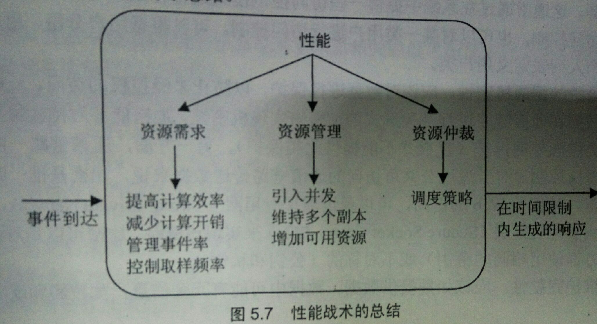

#### 1. 影响响应时间的两个基本因素

-  **资源消耗**
- **阻塞时间**
  - 资源争用 
  -  资源的可用性 
  -  对其他计算的依赖性

#### 2. 控制对资源需求

- **减少处理一个事件所需要的资源**：
  - 提高计算效率 
  - 减少计算开销
- **减少需要同时处理事件的数量**：
  -  管理事件率
  - 控制采样频率
- **控制资源的使用**：
  -  限制执行时间
  - 限制队列的大小

#### 3. 资源管理

- **引入并发**
- **维持数据或计算的多个副本**
- **增加可用资源**

#### 4. 资源仲裁

- **先进/先出** 
- **固定优先级** 
  - 语义重要性 
  -  时限时间单调 
  -  速率单调
- **动态优先级调度** 
  - 轮转  
  - 时限时间最早优先
- **静态调度**

## 5. 安全性的战术

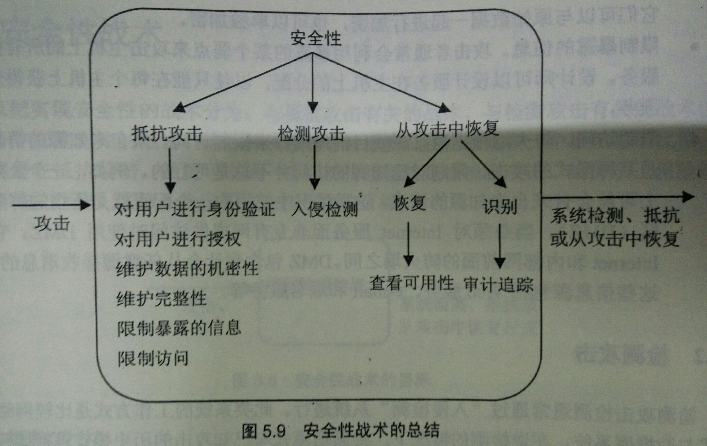

#### 1. 抵抗攻击

- 对用户进行身份验证
- 对用户进行授权
- 维护数据的机密性
- 维护完整性
- 限制暴露的信息
-  限制访问
- 在外部用户和提供服务的系统之间设置认证服务器
- 把要保护的系统置于通讯防火墙之后 
- 在某个可信内核的基础上构建系统，由该内核提供安全

### 2. 检测攻击

- **误用情况的检测**是把通信模式与已知攻击的历史模式进行比较
-  **异常情况的检测**是把通信模式与其本身的历史基线（情况）进行比较

#### 3. 从攻击中恢复

- 恢复状态 
- 识别攻击者

## 6. 易用性战术

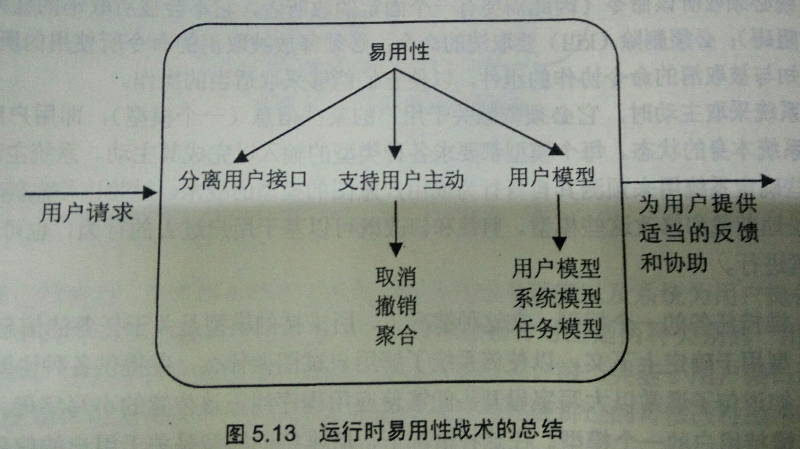

#### 1. 运行时战术

- 维持**任务**的一个模型
- 维持**用户**的一个模型
- 维持**系统**的一个模型

#### 2. 设计时战术

> **将用户接口与应用的其余部分分离开来**

- **模型-视图-控制器**
- **表示-抽象-控制**
- **Seeheim**
- **Arch/Slinky**

## 7. 软件架构样式与战术的关系

- **软件架构样式从战略层面解决质量问题**
- **战术是从具体部署上给出解决质量问题的局部策略**

## 8. 战术举例

| 采用战术              | 敏感点                                      | 有风险决策                           |
| ----------------- | ---------------------------------------- | ------------------------------- |
| 超出限制访问量的请求放在等待队列中 | 提高了系统的稳定性和可用性，减少了崩溃的可能                   | 会降低对打并发数目，使得用户的等待时间过长，可能造成用户不满  |
| 缓存                | 提高系统的访问速度和性能                             | 单服务器提供的缓存数目有限，并发用户数多的情况下，系统处理缓慢 |
| 每个IP每次只允许发出一个请求   | 合理的要求，避免了非法用户的恶意攻击                       | 可能降低了易用性，但系统的安全性提高了             |
| 数据库连接池            | 数据库连接池允许应用程序重复使用一个现有的数据库连接，而不是重新建立一个，提高应用系统的性能 |                                 |
| 容错性               | 能够对用户出现的误操作进行检测和处理，并给出相应的处理信息，提高系统的可用性   |                                 |
| 系统备份与恢复           | 增强系统的容错能力                                | 操作系统和数据库软件发生崩溃时，恢复时间较长          |

# 五、设计构架

## 1. 构架的设计

#### 1. **基于构架的开发步骤：**

- 为软件系统构建一个商业案例
- 弄清系统需求
- 构建或选用构架
- 正确表述此构架，并与有关各方进行交流
- 对此构架进行分析和评价
- 实现基于构架的系统并保证与构架相一致
- 系统维护时，构架文档应同步维护

#### 2. **何时开始设计**：

> **对需求有初步了解就可以开始设计**

#### 3. **构架驱动因素**的组成：

>  比较重要的**功能**、**质量属性**、**商业属性**

#### 4. **如何确定构架驱动因素**：

>  **业务目标优先级较高的要求**

## 2. 良好架构的评判原则

#### 1. **设计构架过程的建议：**

- 构架的设计应该**由一位设计师来完成**，或**在某位设计师领导下的小组来完成**
- 设计师应全面掌握对系统的技术需求，以及对各项定性指标**优先级的清单**
- **构架的文档完备**，**至少有一个静态视图和动态视图**，并采用所有人员认可的文档形式
- 构架设计方案应**让各风险承担者积极参与评估**
- 通过对构架分析，得出**明确的定性与定量指标**
- 构架设计应**有助于增量式实现**
- 允许构架带来一定的资源争用，并**给出可行的解决方案**

#### 2. 构架结构的建议：

- 构架**由定义良好的模块组成**
- **模块的划分应体现出信息隐藏和相互独立的原则**
- **采用特定于每个属性的众所周知的构架战术来实现质量属性**
- 构架**不依赖于某个特定版本**的商用产品或工具
- **产生数据的模块和使用数据的模块分离**
- **对并发系统，构架应采用定义良好的进程或任务**
- **任务或进程编写要考虑到与特定处理器的关系**，并容易改变关系
- 构架应**采用少量的、简单的设计模式**

## 3. 属性驱动的设计(ADD)

> **属性驱动的设计**(Attribute Driven Design, **ADD**)把一组质量属性场景作为输入，利用对质量属性实现与构架设计之间的关系的了解，对构架进行设计

#### **ADD构架设计的步骤如下：**

- **样本输入**
- **选择要分解的模块**
- 根据下列步骤**对模块进行求精**：     
  -  **从具体的质量场景和功能需求集合中选择构架驱动因素**
  - **选择满足构架驱动因素的构架模式**
  - **实例化模块并根据用例分配功能，使用多个视图进行表示**
  - **定义子模块的接口**
  -  **验证用例和质量场景并对其进行求精，使它们成为子模块的限制**
- 对需要进一步分解的每个模块**重复上述步骤**

## 4.  创建骨架系统 

> **创建骨架系统的思想是提供一种基本能力，以一种对项目有力的顺序实现系统的功能**

#### 1. **原因：**

- **提高开发效率**，鼓舞士气
- 能更早发现复杂的依赖关系
- 使开发人员更多关注在设想中最难以实现的部分
- 能够缩短系统集成时间，降低其成本，并使集成成本更明确
- 便于评审和测试

#### 2. **步骤：**

- **实现处理构架组件的执行和交互的软件部分**
- **实现规则引擎**（带有规则的原型集）以控制在基于规则的系统中规则的激发
- **逐步进行测试**

## 5. 团队结构的形成 

- 开发小组的结构反映了构架的模块结构
- 开发小组要做到松耦合，高内聚
- 开发组织对构架也会有影响

## 6. 架构师的职责

- 了解所在组织的业务目标，使架构更好地支持业务目标
-  规划产品的开发与演进
- 规划和建设架构级的重用，如产品线等
- 领导并负责架构设计，定义系统的高层结构和接口
-  为项目管理提供支持，如技术可行性、任务划分、人员招聘 
- 领导和协调项目组的主要技术活动，对主要技术产品负责实际参与架构原型的开发实现
- 讲解架构、指导详细设计和开发、协调冲突以实现既定的构架目标
- 规划和协助软件架构的评审
- 评估新技术并提出采用建议

# 六、构架评审的一般方法

## 1. 成本与收益 

#### 1. 成本

- 人员时间成本
- 构架评审部门的组织开销构
- 架评审部门要求高级设计人员参与的代价    

#### 2. 收益(优点)

- 及早发现现有构架中存在的问题
- 构架的改进
- 财务收益
- 强制为评审做准备
- 捕获构架设计的基本思想
- 验证需求的有效性

## 2. 评审的一般技巧

#### 1. 定性分析

>  **是指凭分析者的直觉、经验，凭分析对象过去和现在的延续状况及最新的信息资料，对分析对象的性质、特点、发展变化规律作出判断的一种方法**

**定性技巧**——**提问技巧**  

- 场景—描述风险承担者和系统之间的具体交互
- 评审清单—对同一领域的若干系统进行评估后提出的一组详细的问题
- 问卷—适用于所有构架的若干问题的清单

#### 2. 定量分析

>  **是依据实际统计数据，建立数学模型，并用数学模型计算出分析对象的各项指标及其数值的一种方法**

 **定量技巧**

- 指标—对构架可观察到的参数的量化解释
- 模拟、原型与实验

## 3. 评审实践 

#### 1. 评审前提

- **评审环境**—预先规划
- **项目代表**—风险承担者，子系统或组件负责人
- **评审小组**
  - 评审小组的人员公证、客观、受尊重
  - 成员必须专门从事评审工作
  - 有对构架相关问题熟悉的人，其领导具有设计、评价经验
  - 至少有一位该系统所属领域的专家
  - 有专人负责文档、后勤，办公地点离评审对象近，有学徒
- **组织的期望**—用合同明确
  - 构架评审结束时应向谁报告什么内容
  - 评审的标准是什么
  - 向评审小组提供那些资源及人力
  - 对评审小组和项目组以后的工作有什么期望
  - 预计评审持续的最长时间
- **评审的准备**—制定评审日程
  - 系统需求文档
  - 架构文档，包括架构描述及介绍构架决策思想的材料
  - 将系统的质量属性和功能要求按重要程度排序出前面3-5个

#### 2. 评审实施

- **按问题的重要性进行分类**
- 强调那些与构架相符或相悖的重要问题
-  必须记载评审中所提的每个问题

#### 3. 评审结果

- 对评审中的各个问题都要做出正式的阐述，同时也要对赖以确定这些问题的数据做出相应的说明

## 4. 总结

**构架评审的主要指导原则如下：**

- 把由独立部门实施的正规的构架评审作为项目开发周期规划的一部分
- 选择评审的最佳时间，尽早预审一次
- 选择恰当的评审技巧
- 签署评审合同
- 限制所要评审的质量属性的个数
- 要保证评审小组中有构架方面的专家、领域专家、资料员及后勤员
- 一定要有系统设计师
- 收集各种场景数据，并在此基础上形成评审清单

## 5. 评审（分析）软件架构的原因

- **架构师风险承担者交流的平台、是早期设计决策的体现、是可传递的系统抽象（架构级重用）**
- **系统的质量属性不可能在系统实现的最后阶段追加上去，必须在设计之初就考虑到**

# 七、架构权衡分析法(ATAM)

- **目标：** 
  - **用于获取系统以及构架的业务目标**
  - **用于使用这些目标和涉众参与来使评估人员把注意力放到对实现这些目标重要的构架部分上**

- **特点**是不仅可以**揭示出构架满足特定质量目标的情况**，而且可以使我们更清楚地**认识到质量目标之间的联系**
- **中心问题**是对用于**构架评估的有限时间进行管理**

## 1. ATAM的参与人员 

- **评估小组：**通常由3-5人组成，每个人要扮演多个角色
- **项目决策人 ：**客户、项目管理人员、委托进行评审的人
- **构架风险承担者（构架涉众）**

## 2. ATAM的结果

#### 1.  输入——用场景集合捕获的质量要求

#### 2. 输出——粗糙的评价

- 一个简洁的构架表述
- 表述清楚的业务目标
- 构架决策到质量需求的映射
- 所确定的敏感点和权衡点集合
- 有风险决策和无风险决策
-  风险主题的集合

## 3. ATAM的阶段

#### 1. 活动阶段

- **第0阶段（合作关系和准备）：**评估小组和项目决策者共同确定评估细节
- **第1阶段（评估阶段）：**评估小组收集信息和分析
- **第2阶段（评估阶段）：**风险承担者参与评估
- **第3阶段（后续阶段）：**评估小组自我检查和改进，提交书面报告

#### 2. 分析评估阶段(ATAM 方法)

- **ATAM方法的表述**

- **商业动机的表述**

  - 系统最重要的功能
  - 任何相关的技术、管理、经济和政治限制
  - 与该项目相关的商业目标和上下文
  -  主要的涉众
  - 构架的驱动因素

- **构架的表述**

  - 祥略适当，在有限时间内传达构架的本质
  - 技术约束条件

-  **对构架方法进行分类**

  - 说明构架中涉及的样式和战术对质量的影响

-  **生成质量属性效用树**

  - **效用树的作用是使质量属性需求具体化**，从而迫使设计师和客户代表准确地定义出他们的质量需求          
  - “效用”是效用树的根结点，表示系统的总体适宜性
  - **中间结点是质量属性及其求精**
  - **叶结点是与质量属性对应的场景**

  **属性效用树：**

  | 质量属性 |  属性求精   |                    场景                    |
  | :--: | :-----: | :--------------------------------------: |
  | 安全性  | 访问的安全性  | 在web服务中，应该有防火墙保护，防止网络上的非法数据请求**( M, H )** |
  | 安全性  | 数据的完整性  | 当出现异地订票点同时需要对通一张票请求操作时，系统必须保证数据库内数据的完整性**(H, L)** |
  | 可用性  | 异常检测和抛出 | 用户企图输入不符合系统条件的查询或者订购不存在的票务的时候，系统必须检测出，并且抛出相应的异常，转入挂起操作 |
  | 可修改性 |  信息管理   |  为了适应变化得票务数据，系统必须提供一个后台管理界面**( M, L )**  |
  |  性能  |  等待时间   | 用户在界面上进行票务查询或者进行订购操作的时候，系统必须在规定的时间内做出反应，不能出现用户无故长时间等待的情况。**( H, M )** |

- **分析构架方法**

- **集体讨论并确定场景优先级**

- **再次分析构架方法**

- **结果的表述**

#### 3. 有效利用有限的评估时间

- 业务目标被作为收集效用树场景的动机
- 划分场景优先级
- 自顶向下生成效用树场景，自底向上进行分析
- 仅分析优先级高和较难实现的场景

# 八、架构文档的写作

## 1. 架构编档的使用

> **最渴望使用架构文档的人是设计师**

- **构架编档的目的与作用：**让不同的风险承担者都能快速找到和理解他们所需要的信息
- **构架文档写作的基本规则是：** 就是从读者的角度出发

## 2. 选择相关视图

**选择项目视图的过程：**

- **产生一个候选视图列表**
- **组合视图**
- **划分优先级**

## 3. 视图编档

#### 1. 文档通常包括七部分内容

- 展示视图中的**组件和组件之间关系的主要表示****，常用**图形方式
- 组件目录祥述在**组件和组件之间的相互关系**，还包括组件的接口和行为
-  **系统与其环境相关的上下文图**
- **可变性指南**
  - 要在其中做出选择的选项
  - 做出选择的时间
- 解释**视图设计的构架背景**，包括：
  - 基本原理
  - 分析结果
  - 设计中所反映的假定
- 视图中所选择的**术语表**
- 其他信息，取决于组织的标准实现

#### 2. 对行为进行编档

- **结构仅提供了系统的组成信息**
- 行为描述可以提供元素间的交互顺序、并发机会以及交互的时间依赖性的信息
- **在UML中，顺序图和状态图用于行为描述**

#### 3. 对接口进行编档

> - 接口就是两个独立的实体相遇并进行交互或通信的边界
> - 组件接口就是其他组件可对该组件所做的假设

- **接口身份** 
- **所提供的资源**
  - 资源语法：资源的签名，包括资源名、参数的名称和逻辑数据类型
  - 资源语义：描述了调用该资源的结果
  - 资源使用限制
-  **数据类型定义**
-  **异常定义**
- **该接口提供的可变性**
- **接口的质量属性特征**
- **基本原理和设计问题**
- **使用指南**   

## 4. 跨视图的文档

#### 1. 构架概述

- **系统概述**
- **结视图之间的映射**
- **组件列表**
- **项目词汇**

#### 2. 构架基本原理

- **关于满足需求或满足限制条件的系统范围内设计决策的含义**
-  **预计可能的修改对构架的影响**
- **在实现解决方案中对开发人员的限制**
-  **拒绝采用的决策方案**

#### 3. 文档组织

- **结视图目录**
  - 视图的名称和它说明的样式
  - 视图中的组件类型、关系类型和属性的描述 
  - 视图目的的描述
  - 视图文档的管理信息
- **结视图模板**： 是视图的标准组织结构

